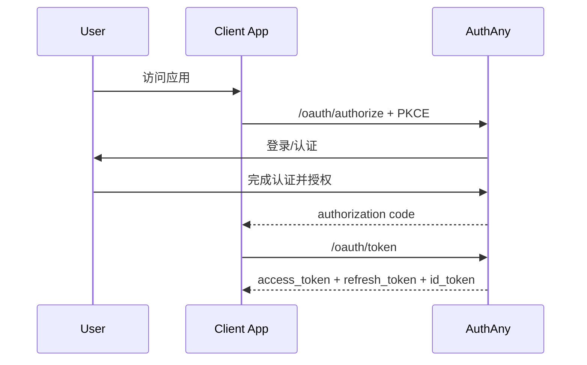
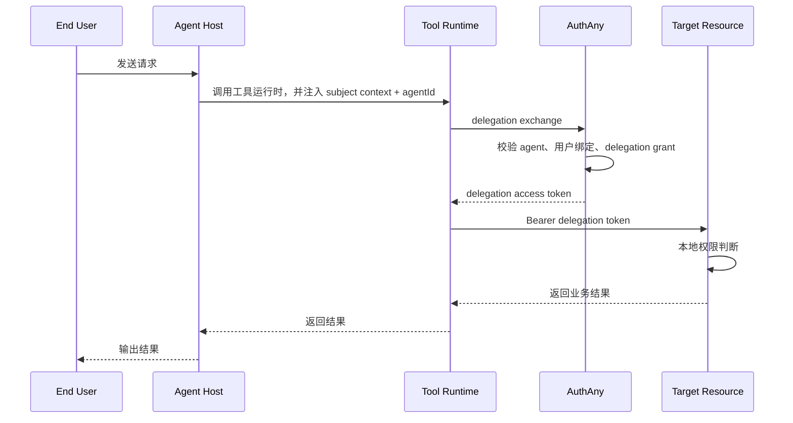
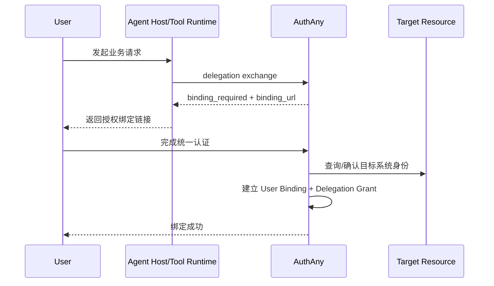

# AuthAny 可执行方案（V1 定稿）

> 本文档是 AuthAny V1 的统一执行方案、边界定义和验收基线。
>
> 目标不是一次把所有未来能力都做完，而是先把核心模型、扩展边界和实现范围定清楚，确保后面新增场景时不需要靠兼容代码堆出来。

---

## 1. 一句话定位

**AuthAny 是企业统一身份认证与授权平台。**

它负责：

- 统一登录
- 统一客户端注册与管理
- 标准 OAuth 2.0 / OIDC 协议能力
- 标准 token 签发与验签基础设施
- Agent 代表用户访问目标系统时的委托身份框架

它不负责：

- 目标系统内部的菜单权限
- 按钮权限
- 数据权限
- 业务角色体系
- 目标系统自己的资源 scope 语义

一句话区分：

- **AuthAny 管“你是谁、你能不能进系统”**
- **目标系统管“你进系统以后能做什么”**

---

## 2. 本次定稿结论

本方案按以下方向定稿：

| 主题 | 结论 |
|------|------|
| 用户来源 | 企业 SSO / 企业目录为主，本地账号作为兜底 |
| V1 重点场景 | 同时支持 Web/App 与 Agent 调用，但优先把 Agent 调用链路做对 |
| Agent 模型 | 标准 OAuth 场景使用 `OAuth Client + Agent Profile`；Agent delegation 场景允许 `Agent + Caller Credential` |
| 首次业务绑定 | 支持“管理员预绑定 + 用户自助绑定” |
| Token 内容 | 同时包含 `user + agent + delegation` 信息 |
| 权限边界 | 平台做粗粒度准入，目标系统做细粒度权限 |
| 委托协议 | V1 先做内部 delegation API，但结构尽量贴近标准 OAuth Token Exchange |
| 多租户 | V1 数据模型预留多租户字段，先按单租户运行 |

---

## 3. 当前草稿中需要修正的地方

### 3.1 需要保留的方向

- 标准 OAuth 2.0 / OIDC 能力是核心
- JWKS / RS256 / PKCE / Refresh Token Rotation 这些必须做
- 平台不直接管理目标系统的细粒度权限，这个方向是对的
- 多种 Agent 宿主、工具运行时和目标系统需要统一身份与委托访问框架，这个方向也是对的

### 3.2 需要移出平台核心的内容

以下内容不能作为 AuthAny 平台核心模型直接写死：

- 特定业务系统专用字段和专用表
- 某个聊天平台的 binding 作为唯一绑定模型
- `/api/cli/token/exchange` 写成仅面向单一运行时和单一业务系统的平台主接口
- 平台内直接承载业务权限码，例如 `dashboard:pending:read`
- 平台内维护所有目标系统的角色矩阵

这些应该改成：

- 平台提供 **通用身份映射与委托访问框架**
- 任意目标系统都应能按同一个模式接入

### 3.3 最大的结构性修正

旧文档把以下三层混在了一起：

1. 企业统一身份平台
2. Agent 代表用户执行的委托访问模型
3. 特定目标系统的接入细节

V1 必须拆开：

- **平台核心层**：AuthAny
- **调用方层**：Web App / Mobile App / Agent Host / Tool Runtime
- **业务接入层**：任意目标系统

---

## 4. V1 Scope

## 4.1 V1 必做

### 协议能力

- OIDC Discovery
- JWKS
- Authorization Code + PKCE
- Client Credentials
- Refresh Token
- Refresh Token Rotation
- Token Revocation
- Token Introspection

### 身份能力

- 企业用户身份接入框架
- 本地兜底账号
- 用户资料标准化
- 组织 / 部门基础字段
- 用户状态管理

### 客户端与 Agent 能力

- OAuth Client 注册与管理
- Agent Profile 注册与管理
- Agent 调用凭证管理
- Agent 调用目标系统时的身份声明模型

### 委托访问能力

- 通用用户绑定模型
- 通用 delegation exchange 接口
- 委托 token 签发
- token 防重放
- token 撤销
- 审计日志

补充原则：

- token 本体按不可变对象处理
- 提前失效通过撤销记录表达

### 运维与安全

- 配置管理
- 限流
- 健康检查
- Prometheus 指标
- 结构化审计日志
- 密钥轮换机制

## 4.2 V1 不做

- 统一业务权限中心
- 平台托管各目标系统按钮 / 菜单 / 数据权限
- 隐式授权
- 密码模式
- 一开始就做设备码
- 一开始就做复杂多租户运行时隔离
- 一开始拆成多个微服务
- 平台内置完整业务后台工作流

## 4.3 V1.1 预留但不实现

- 标准 RFC 8693 Token Exchange 完整兼容
- LDAP / AD / SAML / 飞书等企业身份源正式接入器
- 多租户正式隔离运行
- 策略引擎（OPA / Casbin）
- 服务账号细粒度授权策略
- 统一绑定门户

---

## 5. 设计原则

为了避免未来靠“兼容代码”演进，V1 需要遵守这些原则。

### 5.1 核心对象先建模，不先写业务特例

平台里先定义通用实体：

- User
- Identity Source
- OAuth Client
- Agent Profile
- Caller Credential
- User Binding
- Delegation Grant
- Access Token Metadata
- Audit Event

不要先定义：

- `ChannelBinding`
- `BusinessSpecificBinding`
- `RuntimeSpecificToken`

这些都应该是上层接入适配，不是核心领域对象。

### 5.2 Claim 设计要通用

V1 的 token claim 只放通用身份和委托信息，不放业务动作权限。

可以有：

- `iss`
- `sub`
- `aud`
- `exp`
- `iat`
- `jti`
- `tenant_id`
- `client_id`
- `agent_id`
- `actor`
- `delegation_type`
- `source`

不建议平台直接放：

- `dashboard:pending:read`
- `finance.export`
- `deal.approve`

### 5.3 平台只做粗粒度准入

平台可以判断：

- 这个 client 是否有效
- 这个 agent 是否允许代表用户访问某目标系统
- 这个用户是否允许被该 agent 代理
- 这个 token 是否可信

平台不判断：

- 这个人能不能看某个 branch 数据
- 这个人能不能点某个业务按钮
- 这个人能不能导出某张报表

### 5.4 API 先留标准形状

即使 V1 先做内部 delegation API，也要尽量保持未来可迁移：

- 输入参数贴近标准 token exchange
- 错误码贴近 OAuth 规范
- claim 结构贴近标准 JWT / OIDC 习惯

这样未来切到标准协议，不需要大面积重写接口语义。

---

## 6. 系统边界

## 6.1 AuthAny 负责什么

- 用户登录认证
- 客户端注册管理
- Agent 注册管理
- 签发标准 access token / refresh token / id token
- 签发 delegation token
- 用户与外部身份或目标系统身份的绑定关系
- 审计、撤销、验签基础设施

## 6.2 调用方负责什么

调用方包括：

- Web App
- Mobile App
- Agent Host
- Tool Runtime
- 自动化服务

它们负责：

- 发起 OAuth 授权
- 在运行时把上下文传给业务调用
- 持有短期 token
- 在 token 失效时重新换取

它们不负责：

- 长期保存业务用户的长期授权秘密
- 自己定义平台身份规则

## 6.3 目标系统负责什么

- 自己的用户体系映射
- 自己的角色权限
- 自己的数据权限
- 自己的资源 scope 语义
- 自己的业务审计

---

## 7. 核心领域模型

## 7.1 User

平台统一用户。

职责：

- 表示企业中的“人”
- 可以来自企业目录，也可以是本地兜底账号

关键字段建议：

- `user_id`
- `username`
- `display_name`
- `email`
- `mobile`
- `status`
- `source_type`
- `external_subject`
- `department_id`
- `tenant_id`

## 7.2 Identity Source

用户身份来源。

例如：

- local
- sso
- ldap
- conversation_channel

V1 先定义模型，不一定把所有接入器都做完。

## 7.3 OAuth Client

标准 OAuth 客户端。

适用于：

- Web App
- SPA
- Mobile App
- Service
- Tool Runtime Client

关键字段建议：

- `client_id`
- `client_secret_hash`
- `client_type`
- `redirect_uris`
- `allowed_grant_types`
- `status`
- `owner_type`
- `owner_id`

说明：

- 标准 OAuth 场景保留 `OAuth Client`
- Agent delegation 场景不强制要求单独暴露 `Client` 业务实体

## 7.4 Agent Profile

这是本方案的关键对象。

Agent 不是简单等于 OAuth Client，而是一个独立的业务执行身份。

建议字段：

- `agent_id`
- `name`
- `status`
- `owner_team`
- `description`

这样未来就能支持：

- 标准 OAuth 场景下，一个 client 关联一个或多个 agent
- Agent 场景下，agent 自带独立调用凭证
- agent 生命周期与调用凭证分开管理

## 7.4.1 Caller Credential

Caller Credential 表示 Agent Runtime 调用 AuthAny 时使用的机器凭证。

V1 固定使用：

- `agent_secret`

建议字段：

- `credential_id`
- `agent_id`
- `credential_type`
- `credential_hint`
- `status`
- `issued_at`
- `expires_at`

## 7.5 User Binding

通用用户绑定关系。

它表达的是：

**某个外部身份 / 渠道身份 / 业务身份，和平台用户或目标系统本地用户的绑定关系。**

建议至少支持：

- `binding_type`
- `subject_type`
- `subject_value`
- `provider`
- `agent_id`
- `platform_user_id`
- `target_resource`
- `target_user_id`
- `status`
- `expires_at`

例子：

- `provider = conversation_channel`
- `subject_type = channel_user_id`
- `subject_value = subject_xxx`
- `target_resource = finance_system`
- `target_user_id = local_user_123`

未来换成别的聊天渠道、别的入口或别的目标系统，也不用改核心表结构。

## 7.6 Delegation Grant

表示“哪个 Agent 可以代表哪个用户访问哪个目标系统”。

建议字段：

- `grant_id`
- `agent_id`
- `platform_user_id`
- `target_resource`
- `status`
- `grant_mode`
- `granted_by`
- `granted_at`
- `expires_at`

这个对象比单纯 binding 更适合表达企业授权关系。

---

## 8. Token 模型

## 8.1 平台标准 token

AuthAny 需要签发：

- Access Token
- Refresh Token
- ID Token

这部分标准 OAuth / OIDC 即可。

## 8.2 委托访问 token

这是给 Agent 委托访问场景用的。

建议叫：

- `delegation access token`

不要叫：

- `business token`

因为后者容易把平台和具体目标系统耦合死。

Token 生命周期的正确理解是：

- token 本体只被创建
- refresh 的结果是签发一个新 token
- 提前失效通过撤销记录表达
- 不以“更新 token 本体”作为主模型

## 8.3 Delegation Token 建议 claim

```json
{
  "iss": "https://authany.company.com",
  "sub": "user:1288912691548817920",
  "aud": "target_resource_code",
  "azp": "client_runtime_prod",
  "jti": "uuid",
  "iat": 1760000000,
  "exp": 1760003600,
  "tenant_id": "default",
  "agent_id": "agent_finance_report_v2",
  "delegation_type": "agent_on_behalf_of_user",
  "source": "conversation_channel",
  "actor": {
    "type": "agent",
    "id": "agent_finance_report_v2"
  },
  "context": {
    "channel_user_id": "subject_xxx"
  }
}
```

说明：

- `sub` 表示最终代表的用户
- `actor` / `agent_id` 表示是谁在代执行
- `context` 只是上下文，不等于平台主身份
- `aud` 应该是目标系统标识

## 8.4 平台不直接塞业务权限

平台 token 中不直接声明业务按钮权限。

目标系统收到 token 后自己做：

1. 验签
2. 识别 `sub`
3. 识别 `agent_id`
4. 查本地权限系统
5. 执行自己的授权判断

---

## 9. 关键流程

## 9.1 Web / App 标准登录流程



## 9.2 Agent 代表用户访问目标系统



## 9.3 首次绑定流程



---

## 10. API 范围（V1）

## 10.1 标准协议 API

- `GET /.well-known/openid-configuration`
- `GET /.well-known/jwks.json`
- `GET /oauth/authorize`
- `POST /oauth/token`
- `POST /oauth/revoke`
- `POST /oauth/introspect`
- `GET /oauth/userinfo`

## 10.2 平台管理 API

- Client 管理
- Agent 管理
- User 管理
- Binding 管理
- Delegation Grant 管理
- Audit 查询

## 10.3 委托访问 API

V1 建议命名为：

- `POST /api/delegation/token`

不建议继续写死成：

- `POST /api/cli/token/exchange`

因为后面不仅某一种运行时会用，Agent Host、Tool Runtime、网关、自动化服务都可能会用。

### 建议请求结构

```json
{
  "grant_type": "urn:authany:params:oauth:grant-type:delegation",
  "client_id": "client_runtime_prod",
  "agent_id": "agent_finance_report_v2",
  "target_resource": "target_resource_code",
  "subject_context": {
    "source": "conversation_channel",
    "subject_type": "channel_user_id",
    "subject_value": "subject_xxx"
  }
}
```

### 建议响应结构

```json
{
  "access_token": "jwt",
  "token_type": "Bearer",
  "expires_in": 3600,
  "issued_token_type": "urn:ietf:params:oauth:token-type:access_token",
  "scope": []
}
```

如果未绑定：

```json
{
  "error": "binding_required",
  "error_description": "User binding is required before delegation can be issued.",
  "binding_url": "https://authany.company.com/bind/xxx"
}
```

---

## 11. 数据库设计原则

这里只定原则，不在 V1 方案文档里把每张表字段一次性写死。

原因：

- 当前草稿里的表结构还带较强业务预设
- 现在先把领域对象和关系定清楚更重要

V1 至少需要这些实体表：

- `users`
- `identity_sources`
- `user_identities`
- `oauth_clients`
- `oauth_client_secrets`
- `agent_profiles`
- `user_bindings`
- `delegation_grants`
- `oauth_authorization_codes`
- `oauth_refresh_tokens`
- `token_revocations`
- `audit_events`

关键要求：

- 所有主键统一风格
- 所有表预留 `tenant_id`
- 所有状态字段使用枚举
- 所有外部 subject 建唯一约束
- 所有 token / code 相关表要支持撤销和过期查询

---

## 12. 安全设计

## 12.1 签名与密钥

- 统一使用非对称签名
- V1 默认 `RS256`
- 提供 JWKS
- 支持 `kid`
- 必须支持密钥轮换

## 12.2 Token 生命周期

- Access Token：60 分钟左右
- Refresh Token：7-30 天，按客户端类型可配置
- Delegation Token：30-60 分钟优先

原则：

- 委托 token 应该比用户直接登录 token 更短
- Agent 调用失败后允许重新换取，不要求用户频繁重新授权

## 12.3 防重放

对 delegation token 签发前的关键请求做防重放：

- 请求唯一 ID
- `jti`
- Redis 短期缓存
- 幂等窗口

## 12.4 审计

至少记录：

- 谁发起
- 通过哪个 client
- 由哪个 agent 执行
- 目标系统是什么
- 是否成功
- 失败原因
- 请求时间

## 12.5 平台和目标系统的安全分工

平台负责：

- 签名可信
- token 生命周期
- client / agent / binding / grant 合法性

目标系统负责：

- 资源级授权
- 数据范围控制
- 业务行为审计

---

## 13. Agent Host / Tool Runtime 接入原则

本方案要兼容未来不止某一个 Agent 产品或某一种运行时。

所以接入原则必须抽象成：

### 13.1 调用方只传上下文，不持有长期业务秘密

例如：

- `agent_id`
- `subject_context`
- `session_id`
- `source`

调用 AuthAny 时，运行时还必须带上：

- `caller_credential`

### 13.2 Tool Runtime 不做最终授权决策

Tool Runtime 只做：

1. 读取上下文
2. 读取自己的调用凭证
3. 调 AuthAny 换 delegation token
4. 带 token 调目标系统

### 13.3 不把平台能力写死在某个 Agent 宿主里

任意 Agent Host 只是一个调用方。

未来换成：

- Claude Code
- Opencode
- MCP Host
- 企业内部 Agent 平台

都应该还能复用 AuthAny。

---

## 14. 可扩展性设计要求

这是本次定稿里最重要的一部分。

目标不是“支持未来”，而是“未来加能力时不用回头重写核心结构”。

### 14.1 以插件化思维设计 identity source

本地账号只是一个 source。

后续新增：

- LDAP
- AD
- 飞书
- 企业微信
- 钉钉

时，不应该修改 User 主表语义。

### 14.2 以通用 subject binding 设计外部身份映射

不要把绑定模型写死成某个特定聊天平台字段。

未来可能是：

- `lark.open_id`
- `wechat.user_id`
- `slack.user_id`
- `email`
- `employee_no`

统一抽象成：

- `provider`
- `subject_type`
- `subject_value`

### 14.3 Agent 生命周期和 OAuth Client 生命周期分离

否则以后会遇到这些问题：

- client secret 轮换导致 agent 身份变了
- agent 停用但 client 还在
- 同一个 agent 未来要支持多个入口 client

### 14.4 Delegation API 与目标系统解耦

API 应只接收：

- 谁来调用
- 代表谁
- 要访问哪个系统

而不是：

- 某个特定目标系统的业务 scope 列表
- 某个业务命令名
- 某个业务模块名

---

## 15. 推荐的实现阶段

## Phase 0：方案冻结

产出：

- 本文档确认
- 领域模型确认
- API 边界确认
- 安全边界确认

## Phase 1：平台核心

实现：

- 用户模型
- OAuth Client
- Agent Profile
- 标准 OAuth/OIDC 端点
- JWKS
- 基础审计

## Phase 2：委托访问核心

实现：

- User Binding
- Delegation Grant
- `POST /api/delegation/token`
- Delegation Token 签发
- 防重放

## Phase 3：业务接入样板

实现：

- 任意目标系统都应能作为接入样板
- 接入示例中间件
- 验签与本地用户映射示例

## Phase 4：控制台与运维增强

实现：

- Client 管理
- Agent 管理
- Binding 管理
- Delegation 审计查询

---

## 16. 验收标准

## 16.1 产品边界验收

- AuthAny 不内置任何特定目标系统的专用业务权限码
- AuthAny 不承担目标系统的细粒度权限决策
- AuthAny 的 delegation API 不以某一种 Tool Runtime 为唯一调用方
- AuthAny 的核心模型不写死某个聊天平台

## 16.2 协议验收

- 标准 OAuth 2.0 / OIDC 端点可用
- Authorization Code + PKCE 端到端成功
- Client Credentials 端到端成功
- Refresh Token Rotation 生效
- Revocation / Introspection 可用
- JWKS 可被目标系统远程验签使用

## 16.3 委托访问验收

- 能用 `client_id + agent_id + subject_context + target_resource` 换到 delegation token
- 未绑定时返回标准化 `binding_required`
- 已绑定时能稳定签发短期 token
- token 中能区分最终用户和执行 agent
- 目标系统能仅靠 token + 本地权限系统完成授权

## 16.4 安全验收

- 所有 token 使用非对称签名
- 具备 `kid` 和密钥轮换能力
- 委托 token TTL 可配置
- delegation exchange 具备防重放
- delegation exchange 具备限流
- 审计日志能追踪 client、agent、user、target_resource
- token 本体不可变，refresh 与 revoke 语义清晰

## 16.5 扩展性验收

- 后续新增一个 identity source 不需要重构 User 主模型
- 后续新增一个新目标系统不需要修改 delegation 核心协议
- 后续新增一个新聊天渠道不需要新增新的“专用 binding 表”
- 后续替换 Agent Host、交互渠道或 Tool Runtime，不需要修改 AuthAny 核心模型

## 16.6 工程验收

- 文档与实现边界一致
- 环境变量、密钥、部署方式有明确约束
- 关键接口有 OpenAPI 文档
- 核心流程有自动化测试覆盖
- 监控、健康检查、审计最小可用

---

## 17. 下一步建议

本次先不写代码，下一步建议按这个顺序继续：

1. 基于本文档，继续细化状态机与 API contract
2. 再确定数据库实体与状态流转
3. 最后再开始项目脚手架与代码实现

如果继续推进，我建议下一份文档先写：

- `14-state-machines.md`
- `15-acceptance-checklist.md`

这样可以直接进入实现前评审。
