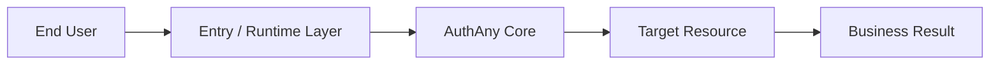
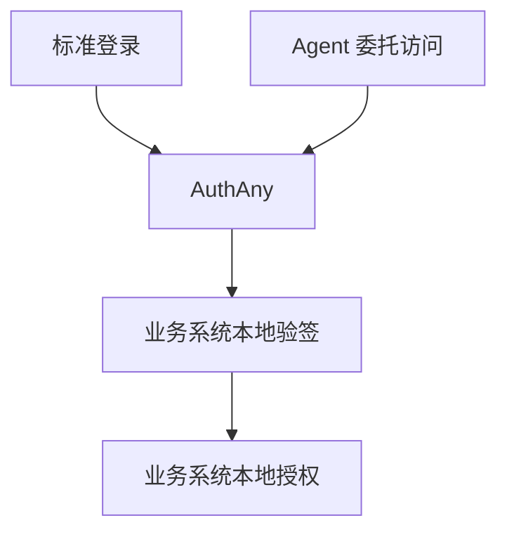

# 01 - 项目概述与架构设计

> AuthAny V1 总览文档

---

## 1. 项目定位

AuthAny 的定位是：

**企业统一身份认证与授权平台。**

它负责：

- 企业统一登录
- OAuth 2.0 / OIDC 标准协议能力
- 客户端注册与管理
- Agent 身份注册与管理
- 委托访问场景下的统一身份与 token 签发
- 审计、验签、撤销、密钥轮换等基础设施

它不负责：

- 业务系统自己的角色权限
- 菜单、按钮、数据权限
- 业务系统内部 scope 语义
- 具体业务系统的专用身份模型

一句话：

- **AuthAny 管“身份可信、令牌可信、准入可信”**
- **业务系统管“资源访问是否允许”**

---

## 2. V1 目标

AuthAny V1 的目标不是一次做成“大而全 IAM 平台”，而是先建立一套可持续扩展的统一基础设施。

V1 重点解决三类问题：

1. 标准 Web / App 登录接入
2. Agent 代表用户访问业务系统
3. 业务系统如何在不放弃现有权限体系的前提下接入统一身份

---

## 3. 设计原则

### 3.1 平台核心必须通用

平台核心模型不能绑定单一业务系统，也不能绑定单一消息渠道。

因此核心模型中不应直接出现：

- `EBFX`
- `LarkBinding`
- `OpenClawToken`

平台核心应该只定义通用对象：

- User
- Identity Source
- OAuth Client
- Agent Profile
- User Binding
- Delegation Grant
- Audit Event

### 3.2 平台负责粗粒度准入

平台可以判断：

- 这个 client 是否有效
- 这个 agent 是否有效
- 这个 agent 是否允许代表某用户访问某系统
- 当前 token 是否可信

平台不判断：

- 某用户能否查看某张业务报表
- 某用户能否操作某笔交易
- 某用户能否导出某个业务数据集

### 3.3 先做单体分模块，后续再演进

V1 先采用：

- 单仓库
- 单服务进程
- 清晰模块边界

原因：

- 现在最重要的是统一身份与委托模型正确
- 不是一开始做微服务拆分
- 未来拆分时依赖的是模块边界，而不是现在先拆服务数量

### 3.4 接口语义尽量贴近标准

V1 即使存在内部 delegation API，也要尽量靠近标准 OAuth 语义设计。

这样未来如果升级到标准 Token Exchange，不需要推倒重来。

---

## 4. 架构分层

```text
┌─────────────────────────────────────────────┐
│          Entry / Runtime Layer              │
│ Web / App / Agent Host / Tool Runtime      │
└─────────────────────────────────────────────┘
                      │
                      ▼
┌─────────────────────────────────────────────┐
│                AuthAny Core                 │
│ Auth / OAuth / OIDC / Client / Agent       │
│ Binding / Delegation / Audit / Security    │
└─────────────────────────────────────────────┘
                      │
                      ▼
┌─────────────────────────────────────────────┐
│            Business Systems Layer           │
│ Any Target Resource                           │
└─────────────────────────────────────────────┘
```

分层职责：

- Entry / Runtime Layer：发起认证、请求 token、携带上下文
- AuthAny Core：完成身份认证、委托验证、签发 token
- Business Systems Layer：完成本地资源授权和业务处理

### 4.1 总体交互流程图



---

## 5. V1 范围

### 5.1 V1 必做

- OIDC Discovery
- JWKS
- Authorization Code + PKCE
- Client Credentials
- Refresh Token + Rotation
- Token Revocation
- Token Introspection
- 用户基础管理
- OAuth Client 管理
- Agent Profile 管理
- User Binding 管理
- Delegation Grant 管理
- Delegation Token 签发
- 审计日志
- 限流、防重放、密钥轮换

### 5.2 V1 不做

- 统一业务权限中心
- 业务系统内的细粒度权限托管
- 隐式授权
- 密码模式
- 复杂多租户运行时隔离
- 业务系统专属功能写进平台核心

### 5.3 V1.1 预留

- 标准 RFC 8693 Token Exchange
- 企业目录正式接入器
- 多租户正式隔离
- 策略引擎
- 统一绑定门户增强

---

## 6. 核心场景

### 6.1 标准登录场景

用户通过 Web / App 使用标准 OAuth 2.0 / OIDC 登录业务系统。

### 6.2 Agent 代用户访问场景

用户通过聊天、页面、自动化、命令或其他入口触发 Agent，Agent 通过 AuthAny 获取 delegation token，再访问业务系统。

### 6.3 业务系统接入场景

业务系统接收 AuthAny token，完成本地验签、用户映射和本地权限判断。

### 6.4 核心场景关系图



---

## 7. 技术选型原则

V1 技术栈可以继续沿用当前初步设想：

- NestJS
- TypeScript
- MySQL
- Redis
- jose
- OpenAPI
- Prometheus

但技术选型不是本阶段重点。

本阶段重点是：

- 模型是否清晰
- 边界是否正确
- token 语义是否稳定
- 扩展点是否留好

---

## 8. 成功标准

AuthAny V1 完成时，应满足以下结果：

1. 标准 OAuth / OIDC 登录流程可用
2. Agent 代表用户访问业务系统的委托链路可用
3. 平台不需要接管业务系统权限，也能完成统一身份接入
4. 新增业务系统接入时不需要修改平台核心模型
5. 新增交互渠道、Agent 宿主或工具运行时，不需要重写委托协议

---

## 9. 本文档与其他文档关系

- [00-authany-executable-plan.md](/Users/wrr/work/authany/demand/00-authany-executable-plan.md)：总执行方案
- `02`：领域数据模型
- `03`：OAuth / OIDC 协议核心
- `04`：安全架构
- `05`：API 契约
- `06-10`：模块职责与接入说明
