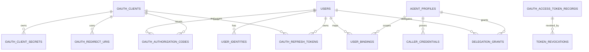
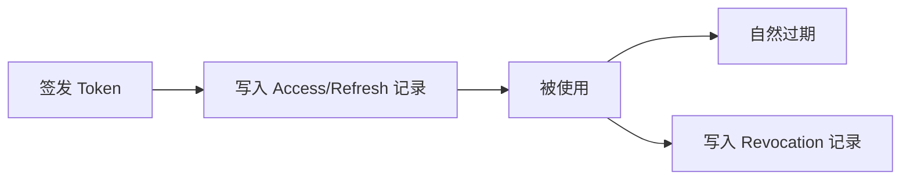

# 02 - 数据模型与数据库设计

> AuthAny V1 领域模型、表边界与建模原则

---

## 1. 设计目标

本阶段数据库设计的目标不是一次把所有表写成最终形态，而是先把核心领域对象和它们的关系固定下来。

重点是：

- 支持标准 OAuth / OIDC
- 支持 Agent 委托访问
- 支持多种身份来源扩展
- 支持多业务系统接入
- 避免把平台核心表设计成某个业务系统的专用结构

---

## 2. 核心实体

V1 至少需要以下核心实体：

### 2.1 用户身份域

- `users`
- `identity_sources`
- `user_identities`

### 2.2 OAuth / Client 域

- `oauth_clients`
- `oauth_client_secrets`
- `oauth_redirect_uris`
- `oauth_authorization_codes`
- `oauth_refresh_tokens`
- `oauth_access_token_records`
- `token_revocations`

说明：

- token 记录建议按不可变对象建模
- token 本体只记录签发事实
- token 提前失效通过单独的 `token_revocations` 记录表达

### 2.3 Agent / Delegation 域

- `agent_profiles`
- `caller_credentials`
- `user_bindings`
- `delegation_grants`

### 2.4 平台治理域

- `audit_events`
- `system_configs`
- `key_rotation_records`

---

## 3. 领域对象说明

## 3.1 users

表示平台统一用户。

这个用户可以来自：

- 本地账号
- 企业 SSO
- LDAP / AD
- 飞书等未来身份源

关键要求：

- 用户主身份统一
- 外部身份和内部用户主键解耦
- 用户状态标准化

建议字段：

- `id`
- `tenant_id`
- `username`
- `display_name`
- `email`
- `mobile`
- `status`
- `primary_identity_source`
- `created_at`
- `updated_at`

## 3.2 identity_sources

表示身份来源类型配置。

示例：

- `local`
- `enterprise_sso`
- `ldap`
- `conversation_channel`

用途：

- 统一扩展入口
- 不把外部登录方式写死到用户表

## 3.3 user_identities

表示用户与外部身份之间的映射关系。

建议字段：

- `id`
- `tenant_id`
- `user_id`
- `source_id`
- `subject_type`
- `subject_value`
- `status`
- `metadata`

示例：

- `source = conversation_channel`
- `subject_type = open_id`
- `subject_value = ou_xxx`

这样未来新增渠道时不需要新增一张专用表。

## 3.4 oauth_clients

表示 OAuth 客户端。

可能的 client 类型：

- web
- spa
- mobile
- service
- cli

建议字段：

- `id`
- `tenant_id`
- `client_id`
- `client_type`
- `name`
- `status`
- `allowed_grant_types`
- `allowed_response_types`
- `allowed_scopes`
- `owner_type`
- `owner_id`

## 3.5 oauth_client_secrets

单独拆出 client secret 记录。

原因：

- 便于轮换
- 便于保留历史
- 便于灰度切换

关键要求：

- 只存哈希
- 支持多条有效 secret 过渡
- 支持过期与撤销

## 3.6 agent_profiles

表示 Agent 身份。

Agent 不是简单等于 client。

建议字段：

- `id`
- `tenant_id`
- `agent_id`
- `name`
- `status`
- `description`

这样后续支持：

- 调用凭证轮换但 agent 身份不变
- 同一个 agent 未来扩展多个入口
- Agent 生命周期与调用凭证分离

## 3.6.1 caller_credentials

表示 Agent Runtime 调用 AuthAny 时使用的机器凭证。

建议字段：

- `id`
- `tenant_id`
- `agent_id`
- `credential_type`
- `credential_hint`
- `status`
- `issued_at`
- `expires_at`

说明：

- V1 `credential_type` 固定为 `agent_secret`
- 该对象用于证明“调用方就是这个 Agent”
- 它不是业务权限对象

## 3.7 user_bindings

表示用户在外部上下文或目标系统中的绑定关系。

这是 V1 的关键抽象。

不要做成：

- `lark_bindings`
- `ebfx_bindings`

建议字段：

- `id`
- `tenant_id`
- `provider`
- `subject_type`
- `subject_value`
- `agent_id`
- `platform_user_id`
- `target_resource`
- `target_user_id`
- `status`
- `bound_at`
- `expires_at`

说明：

- `provider`：身份来源或上下文来源
- `subject_*`：外部上下文身份，例如 senderId
- `target_resource`：目标系统标识，例如 `finance_system`
- `target_user_id`：业务系统中的用户标识

## 3.8 delegation_grants

表示一个 agent 是否被允许代表某个用户访问某个业务系统。

建议字段：

- `id`
- `tenant_id`
- `agent_id`
- `platform_user_id`
- `target_resource`
- `grant_mode`
- `status`
- `granted_by`
- `granted_at`
- `expires_at`

这个对象比 binding 更偏“授权关系”。

## 3.9 audit_events

平台级审计日志。

至少要覆盖：

- 登录
- 授权
- token 签发
- token 刷新
- token 撤销
- delegation exchange
- binding 创建 / 变更 / 撤销
- client / agent 管理操作

### token 建模补充说明

V1 推荐把 token 当作不可变对象处理。

也就是说：

- token 被签发后，不修改 token 内容
- 刷新不是“更新旧 token”，而是“签发新 token”
- 提前失效不是“修改 token 本体”，而是新增撤销记录

---

## 4. 实体关系



```text
users 1 --- N user_identities
oauth_clients 1 --- N oauth_client_secrets
oauth_clients 1 --- N oauth_redirect_uris
oauth_clients 1 --- N oauth_authorization_codes
users 1 --- N oauth_authorization_codes
users 1 --- N oauth_refresh_tokens
oauth_clients 1 --- N oauth_refresh_tokens
agent_profiles 1 --- N caller_credentials
users 1 --- N user_bindings
agent_profiles 1 --- N user_bindings
users 1 --- N delegation_grants
agent_profiles 1 --- N delegation_grants
```

---

## 5. 状态字段规范

所有核心实体都应有明确状态字段，不使用模糊布尔值拼业务状态。

建议：

- User：`active / suspended / inactive`
- Client：`active / inactive / pending_review / revoked`
- Agent：`active / inactive / suspended`
- Binding：`active / inactive / expired / revoked`
- Grant：`active / inactive / expired / revoked`
- Secret：`active / retired / revoked`

---

## 6. 多租户预留

V1 先按单租户运行，但所有核心表建议预留：

- `tenant_id`

原因：

- 后续多租户不是简单加字段就结束
- 但现在不预留，后面迁移成本会更高

V1 对 `tenant_id` 的要求：

- 字段必须存在
- 唯一索引应考虑 `tenant_id`
- 运行时默认单租户值即可

---

## 7. 索引原则

### 必须索引的字段

- `client_id`
- `agent_id`
- `user_id`
- `subject_value`
- `target_resource`
- `status`
- `expires_at`
- `jti`
- `created_at`

### 必须唯一约束的组合

- `oauth_clients.client_id`
- `agent_profiles.agent_id`
- `user_identities(source_id, subject_type, subject_value, tenant_id)`
- `user_bindings(provider, subject_type, subject_value, agent_id, target_resource, tenant_id)`

---

## 8. 数据建模红线

以下做法禁止进入 V1 设计：

- 在平台核心表直接写 `ebfx_user_id` 这种业务耦合字段
- 直接建 `lark_bindings` 作为唯一绑定模型
- 把业务权限码存成平台主授权对象
- 将 Agent 与 Client 做成完全同一个实体

### 8.1 Token 不可变建模图



---

## 9. 数据库验收标准

### 结构验收

- 核心模型支持多身份源扩展
- 核心模型支持多业务系统接入
- 核心模型支持 Agent 代表用户访问

### 扩展验收

- 新增一个身份源不需要重构 `users`
- 新增一个业务系统不需要新增一套专用绑定主模型
- 新增一个渠道上下文身份不需要新增一张专用映射表

### 安全验收

- client secret 不存明文
- token / code / revocation 相关记录支持过期与撤销查询
- token 本体按不可变对象处理
- 关键关系支持审计追踪
