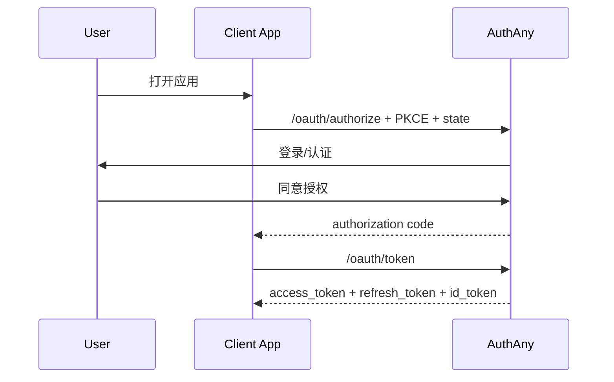
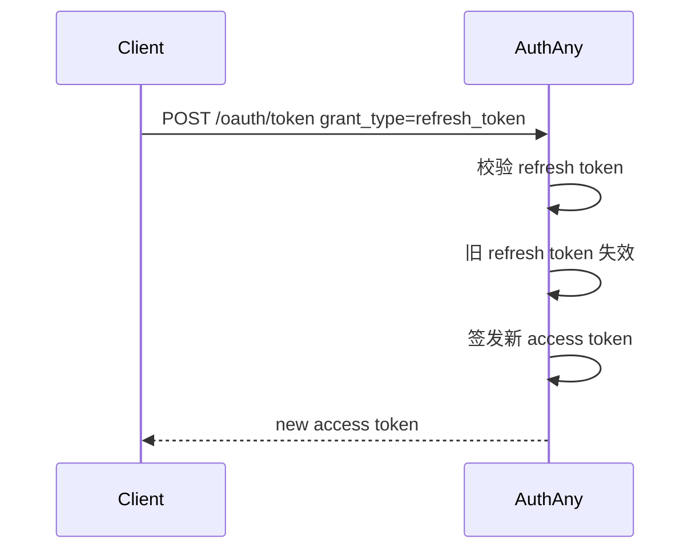
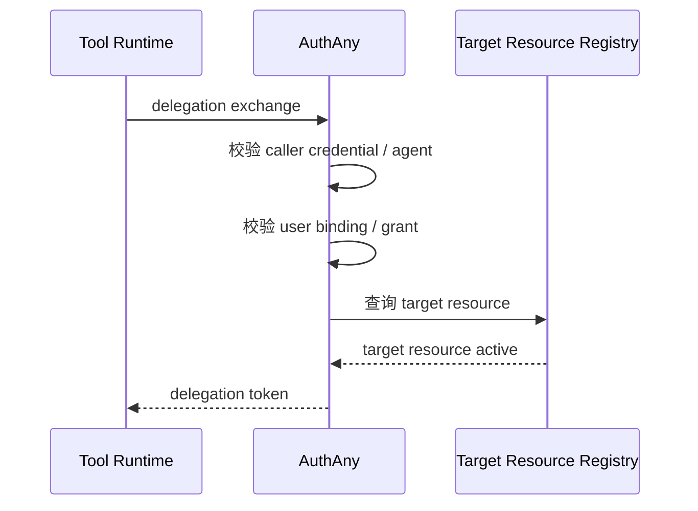

# 03 - OAuth 2.0 / OIDC 核心协议设计

> AuthAny V1 协议能力范围与 token 语义

---

## 1. V1 协议目标

AuthAny V1 需要同时服务两类场景：

1. 标准 Web / App 登录
2. Agent 的委托访问

因此协议设计分两层：

- 标准 OAuth 2.0 / OIDC 协议层
- 平台内部 delegation 协议层

其中：

- 标准协议层优先遵循规范
- delegation 层尽量向标准 token exchange 靠拢

---

## 2. V1 支持的标准能力

### 2.1 必须支持

| 能力 | 状态 | 说明 |
|------|------|------|
| Authorization Code | 支持 | 标准登录主流程 |
| PKCE | 强制支持 | Web / SPA / Mobile 默认要求 |
| Client Credentials | 支持 | 服务到服务调用 |
| Refresh Token | 支持 | 长会话续期 |
| Refresh Rotation | 支持 | 提升安全性 |
| Revocation | 支持 | 令牌撤销 |
| Introspection | 支持 | 业务系统按需查询 |
| UserInfo | 支持 | 标准 OIDC 用户信息 |
| OIDC Discovery | 支持 | 元数据发现 |
| JWKS | 支持 | 公钥分发 |

### 2.2 V1 不支持

| 能力 | 状态 | 原因 |
|------|------|------|
| Implicit | 不支持 | 已不推荐 |
| Password Grant | 不支持 | 高风险、与统一身份方向冲突 |
| Device Code | 暂不支持 | 非 V1 核心场景 |

---

## 3. 标准登录流程要求

V1 的标准登录流程采用：

- Authorization Code
- PKCE
- 可选 OIDC ID Token

关键要求：

- 所有公开客户端默认使用 PKCE
- `state` 必须校验
- `redirect_uri` 必须严格匹配
- authorization code 一次性使用
- refresh token 支持 rotation

### 3.1 Authorization Code + PKCE 流程图



---

## 4. Token 类型

V1 平台需要定义四类 token 或 token 记录：

### 4.1 Access Token

用于标准 OAuth 访问。

适用：

- Web / App 访问平台 API
- 业务系统接入时的统一身份 token

### 4.2 Refresh Token

用于续期 access token。

要求：

- 支持 rotation
- 支持撤销
- 支持 client 绑定校验

说明：

- refresh 不是修改旧 access token
- refresh 的语义是“基于 refresh token 再签发一张新的 access token”

### 4.3 ID Token

用于 OIDC 登录后身份声明。

适用：

- 前端应用识别当前登录用户
- 与标准 OIDC 客户端兼容

### 4.4 Delegation Access Token

用于 Agent 代表用户访问目标业务系统。

这是 AuthAny V1 的重点扩展能力。

---

## 5. 标准 Token Claim 原则

标准 token 内建议只放通用身份信息，不放业务系统内部权限语义。

### 5.1 Access Token 建议 claim

- `iss`
- `sub`
- `aud`
- `exp`
- `iat`
- `jti`
- `scope`
- `client_id`
- `tenant_id`

### 5.2 ID Token 建议 claim

- `iss`
- `sub`
- `aud`
- `exp`
- `iat`
- `auth_time`
- `nonce`
- `name`
- `preferred_username`
- `email`

注意：

- `name`、`email` 之类是身份属性
- 不应直接写业务角色或业务权限码

---

## 6. Delegation Token 语义

Delegation Token 表达的不是“业务权限已经决定”，而是：

**平台确认该 Agent 可以在当前上下文下代表该用户访问目标业务系统。**

业务系统收到后，仍需做本地授权判断。

### 6.1 建议 claim

```json
{
  "iss": "https://authany.company.com",
  "sub": "user:1288912691548817920",
  "aud": "target_resource_code",
  "azp": "client_runtime_prod",
  "jti": "uuid",
  "iat": 1760000000,
  "exp": 1760003600,
  "tenant_id": "default",
  "agent_id": "agent_finance_report_v2",
  "delegation_type": "agent_on_behalf_of_user",
  "source": "conversation_channel",
  "actor": {
    "type": "agent",
    "id": "agent_finance_report_v2"
  },
  "context": {
    "channel_user_id": "subject_xxx"
  }
}
```

### 6.2 语义要求

- `sub` 是最终代表的用户
- `aud` 是目标业务系统
- `agent_id` / `actor` 表示执行主体
- `context` 只表示运行时上下文，不等于主身份对象

---

## 7. Scope 处理原则

这是 V1 的关键边界。

### 7.1 平台 scope

平台只管理自己的协议 scope 或粗粒度接入 scope。

例如：

- `openid`
- `profile`
- `email`
- `delegation`
- `system:target_resource`

### 7.2 业务 scope

业务系统自己的资源 scope 或权限码，应该由业务系统自己定义和解释。

例如：

- `dashboard:pending:read`
- `deal:approve`
- `finance.export`

AuthAny 不应该把这些业务含义当成平台核心授权模型。

### 7.3 委托访问与 scope

V1 delegation token 不强依赖“业务 scope 作为平台裁决依据”。

平台只负责：

- 目标系统准入
- 委托关系合法
- token 合法

业务系统再决定具体资源访问。

---

## 8. 关键协议要求

### 8.1 Authorization Code

- code 一次性使用
- code 有效期短
- 与 client、redirect_uri、PKCE 参数绑定

### 8.2 Refresh Token

- refresh token rotation
- 旧 refresh token 使用后立即失效
- 支持整条链路撤销

这里的正确理解是：

- 刷新动作会签发新 token
- 旧 token 不是被“修改”
- 旧 token 要么自然过期，要么被记录为已撤销



### 8.3 Delegation Exchange

- 必须校验 client
- 必须校验 agent
- 必须校验 user binding
- 必须校验 delegation grant
- 必须校验 target resource
- 必须支持防重放



---

## 9. 业务系统使用方式

业务系统应优先采用本地验签模式：

1. 拉取 AuthAny JWKS
2. 验证签名
3. 验证 `iss`
4. 验证 `aud`
5. 读取 `sub`
6. 读取 `agent_id`
7. 执行本地授权

只有在必要时才调用 introspection。

---

## 10. 协议验收标准

### 标准能力验收

- Web / App 可完成 Authorization Code + PKCE 登录
- Refresh Token Rotation 正常工作
- JWKS 可被业务系统使用
- OIDC Discovery 可被标准客户端读取
- refresh 体现为新 token 签发，而不是旧 token 更新

### 委托能力验收

- Agent / Tool Runtime 可通过 delegation API 获取 delegation token
- token 能表达 user + agent + target_resource 的关系
- 未绑定或未授权时返回标准化错误

### 边界验收

- 平台 token 不内置业务权限模型
- 平台 scope 与业务权限 scope 不混用
