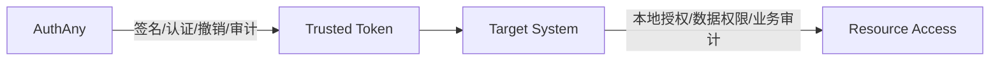
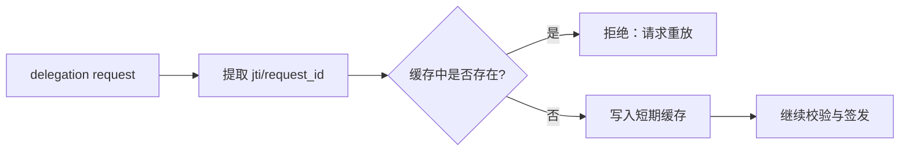

# 04 - 安全架构设计

> AuthAny V1 安全边界、风险控制与验收要求

---

## 1. 安全目标

AuthAny 是企业统一身份平台，因此安全目标不是“接口能用”就够，而是至少要做到：

- token 可信
- 身份可信
- 委托关系可信
- client / agent 不可伪造
- 关键操作可审计

---

## 2. 安全边界

### 平台负责的安全

- 用户认证安全
- 客户端认证安全
- Agent 身份真实性
- token 签名与生命周期
- 撤销与轮换
- delegation 请求合法性
- 审计与风控

### 业务系统负责的安全

- 本地资源授权
- 数据范围限制
- 本地业务审计
- 业务操作审批与风控

平台和业务系统都要做安全，但职责不同。

### 2.1 安全边界图

---

## 3. 基础安全策略

### 3.1 签名算法

V1 统一采用：

- `RS256`

要求：

- 私钥只在平台侧持有
- 公钥通过 JWKS 分发
- 所有 JWT 包含 `kid`

### 3.2 密钥轮换

必须支持：

- 新旧 key 共存一段时间
- 按 `kid` 验签
- 客户端和业务系统无感切换

V1 即使不接入 HSM，也必须把轮换模型设计好。

### 3.3 Token 生命周期

建议：

- Access Token：60 分钟左右
- Refresh Token：7-30 天
- Delegation Token：30-60 分钟

原则：

- delegation token 比普通登录 token 更短
- 用户已经授权过时，不应因为短 token 过期而频繁要求重新授权
- token 本体按不可变对象处理
- 提前失效通过撤销记录表达，不通过修改 token 内容表达

---

## 4. 委托访问安全

这是 V1 的重点风险区域。

### 4.1 平台必须校验的对象

- client 是否有效
- agent 是否有效
- client 与 agent 是否匹配
- 用户绑定是否存在
- delegation grant 是否有效
- target system 是否允许

### 4.2 防重放

delegation exchange 需要具备防重放能力。

建议机制：

- `jti`
- 请求唯一标识
- Redis 短期缓存
- 幂等窗口

### 4.3 限流

建议至少支持以下维度：

- 按 IP
- 按 client_id
- 按 agent_id
- 按 user / subject

重点保护端点：

- `/oauth/token`
- `/api/delegation/token`
- 登录接口

---

## 5. 用户认证安全

如果 V1 支持本地兜底账号，则至少要求：

- 密码哈希
- 登录失败计数
- 账户锁定
- 风险审计

推荐：

- `bcrypt`
- 失败次数阈值
- 短时间锁定策略

如后续接企业 SSO，则企业主认证策略由上游承担，但平台仍需记录审计结果。

---

## 6. 审计安全

平台级审计必须覆盖：

- 登录成功 / 失败
- 授权成功 / 拒绝
- token 签发
- token 刷新
- token 撤销
- delegation exchange
- binding 创建 / 失效 / 撤销
- client / agent 配置变更

这里的 `token 刷新` 指：

- 通过 refresh token 再签发一张新的 access token

不是：

- 修改旧 token 本体

关键字段至少包括：

- `tenant_id`
- `client_id`
- `agent_id`
- `platform_user_id`
- `target_system`
- `ip`
- `user_agent`
- `result`
- `error_code`
- `occurred_at`

---

## 7. 数据安全

### 7.1 不能明文存储

- client secret
- refresh token 原始值
- 敏感认证凭证

如需保存 token 相关记录，建议保存：

- 签发事实
- token 标识
- 过期时间
- 撤销记录

### 7.2 可加密存储

如需保存敏感外部凭证或映射元数据，必须支持：

- 静态加密
- 密钥可轮换
- 最小暴露

V1 如果不保存此类敏感外部凭证，可以不实现复杂密文存储模块，但模型上应留出能力。

---

## 8. 平台与调用方分工

### Agent Host / Tool Runtime 不应该做的事

- 长期保存业务用户秘密
- 自己定义平台授权规则
- 伪造用户身份

### 调用方应该做的事

- 传递运行时上下文
- 持有短期 token
- token 过期后重新换取
- 把业务访问建立在平台签发的 delegation token 上

---

## 9. 风险清单

V1 需要明确识别的主要风险：

### 风险 1：平台侵入业务权限

后果：

- 平台越来越重
- 接入成本越来越高
- 业务系统权限无法自治

控制方式：

- 平台只做粗粒度准入
- 业务系统自己做本地授权

### 风险 2：Agent 与 Client 混为一体

后果：

- client 轮换导致 agent 身份不稳定
- 难以表达“谁在执行”

控制方式：

- 标准 OAuth 场景采用 `OAuth Client + Agent Profile`
- Agent delegation 场景采用 `Agent + Caller Credential`

### 风险 3：绑定模型写死渠道

后果：

- 以后每加一个渠道就新增一套专用表和专用逻辑

控制方式：

- 采用通用 `provider + subject_type + subject_value`

### 风险 4：token 里塞业务权限

后果：

- 平台与业务系统强耦合
- 变更成本高

控制方式：

- token 只放通用身份与委托信息

---

## 10. 安全验收标准

### Token 安全验收

- 所有 JWT 使用非对称签名
- 支持 `kid`
- 支持密钥轮换
- 支持 token 撤销

### 委托安全验收

- delegation exchange 具备防重放
- delegation token TTL 可配置
- delegation exchange 具备限流
- 未绑定、无 grant、agent 不匹配时明确拒绝

### 审计验收

- 平台可以追踪 client、agent、user、target_system
- 所有关键失败路径都可查询

### 架构验收

- 平台不接管业务系统细粒度权限
- 平台不写死单一渠道和单一业务系统
