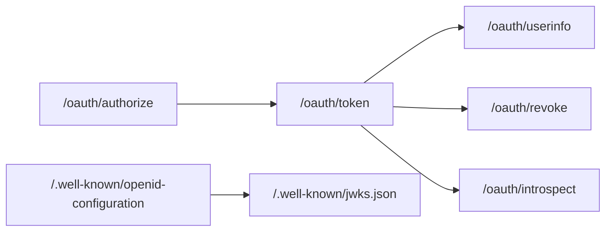
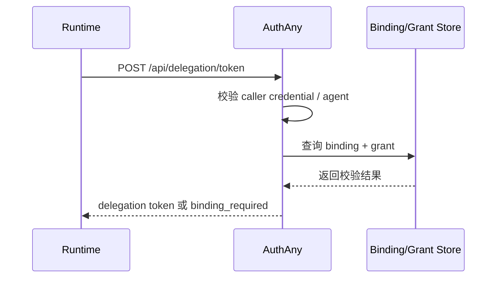

# 05 - API 契约设计

> AuthAny V1 API 范围、命名和响应规范

---

## 1. API 设计原则

V1 API 设计遵循以下原则：

- 标准 OAuth / OIDC 端点遵循标准
- 平台管理 API 保持资源化
- delegation API 保持通用，不绑定某个业务系统或某种调用方式
- 错误码优先标准化，便于接入方统一处理

---

## 2. 标准协议 API

### 2.0 标准端点关系图



### 2.1 OIDC Discovery

- `GET /.well-known/openid-configuration`

用途：

- 提供 issuer、token endpoint、jwks_uri 等元数据

### 2.2 JWKS

- `GET /.well-known/jwks.json`

用途：

- 对外提供公钥集合
- 供业务系统本地验签

### 2.3 Authorization Endpoint

- `GET /oauth/authorize`

用途：

- Authorization Code + PKCE 授权入口

### 2.4 Token Endpoint

- `POST /oauth/token`

V1 支持：

- `authorization_code`
- `refresh_token`
- `client_credentials`

补充语义：

- `grant_type=refresh_token` 的结果是签发新的 access token
- 不是更新旧 access token

### 2.5 Revocation Endpoint

- `POST /oauth/revoke`

补充语义：

- revoke 表示让某个 token 提前失效
- revoke 不等于物理删除 token 记录
- 平台建议通过撤销记录表达失效事实

### 2.6 Introspection Endpoint

- `POST /oauth/introspect`

### 2.7 UserInfo Endpoint

- `GET /oauth/userinfo`

---

## 3. 平台管理 API

V1 平台管理 API 分为以下几类：

### 3.1 用户管理

- `GET /api/users`
- `GET /api/users/:id`
- `POST /api/users`
- `PATCH /api/users/:id`
- `PATCH /api/users/:id/status`

### 3.2 身份源与身份映射管理

- `GET /api/identity-sources`
- `GET /api/users/:id/identities`
- `POST /api/users/:id/identities`
- `PATCH /api/users/:id/identities/:identityId`

### 3.3 OAuth Client 管理

- `GET /api/clients`
- `GET /api/clients/:id`
- `POST /api/clients`
- `PATCH /api/clients/:id`
- `POST /api/clients/:id/rotate-secret`
- `PATCH /api/clients/:id/status`

### 3.4 Agent 管理

- `GET /api/agents`
- `GET /api/agents/:id`
- `POST /api/agents`
- `PATCH /api/agents/:id`
- `PATCH /api/agents/:id/status`

### 3.5 Binding 管理

- `GET /api/bindings`
- `GET /api/bindings/:id`
- `POST /api/bindings`
- `PATCH /api/bindings/:id`
- `PATCH /api/bindings/:id/status`

### 3.6 Delegation Grant 管理

- `GET /api/delegation-grants`
- `GET /api/delegation-grants/:id`
- `POST /api/delegation-grants`
- `PATCH /api/delegation-grants/:id`
- `PATCH /api/delegation-grants/:id/status`

### 3.7 Audit 管理

- `GET /api/audit-events`
- `GET /api/audit-events/:id`
- `GET /api/audit-events/export`

---

## 4. Delegation API

这是 V1 的关键扩展接口。

### 4.1 建议端点

- `POST /api/delegation/token`

不建议使用：

- `/api/cli/token/exchange`

原因：

- 调用方不一定是 CLI
- 后面可能是任意 Agent Host、Tool Runtime、网关或自动化服务

### 4.2 接口职责

该接口负责：

- 接收 client / agent / subject context / target resource
- 校验 binding 和 delegation grant
- 返回 delegation token 或绑定引导结果

该接口不负责：

- 代替业务系统做资源授权判断
- 解释某个业务系统内部权限码

### 4.2.1 Delegation API 流程图



### 4.3 建议请求结构

```json
{
  "grant_type": "urn:authany:params:oauth:grant-type:delegation",
  "client_id": "client_runtime_prod",
  "client_assertion": "optional-if-used",
  "agent_id": "agent_finance_report_v2",
  "target_resource": "target_resource_code",
  "subject_context": {
    "source": "conversation_channel",
    "subject_type": "channel_user_id",
    "subject_value": "subject_xxx"
  },
  "runtime_context": {
    "session_id": "optional",
    "request_id": "optional"
  }
}
```

### 4.4 处理逻辑要求

1. 校验 client 身份
2. 校验 agent 身份
3. 校验 client 与 agent 绑定关系
4. 查找 subject context 对应的用户绑定
5. 校验 delegation grant 是否存在且有效
6. 校验 target resource 是否允许
7. 签发 delegation token
8. 记录审计日志

### 4.5 成功响应

```json
{
  "access_token": "jwt",
  "token_type": "Bearer",
  "expires_in": 3600,
  "issued_token_type": "urn:ietf:params:oauth:token-type:access_token"
}
```

### 4.6 未绑定响应

```json
{
  "error": "binding_required",
  "error_description": "User binding is required before delegation can be issued.",
  "binding_url": "https://authany.company.com/bind/xxx"
}
```

### 4.7 拒绝场景

| 场景 | HTTP | 错误码 |
|------|------|--------|
| client 无效 | 401 | `invalid_client` |
| agent 无效 | 403 | `invalid_agent` |
| agent 与 client 不匹配 | 403 | `agent_client_mismatch` |
| binding 不存在 | 403 | `binding_required` |
| binding 已失效 | 403 | `binding_inactive` |
| delegation grant 不存在 | 403 | `delegation_not_allowed` |
| target resource 不允许 | 403 | `invalid_target_resource` |
| 请求重放 | 401 | `request_replayed` |
| 触发限流 | 429 | `rate_limited` |

---

## 5. 响应规范

### 5.1 OAuth 标准端点

标准 OAuth 错误优先返回规范形态：

```json
{
  "error": "invalid_grant",
  "error_description": "The provided authorization grant is invalid."
}
```

### 5.2 平台管理 API

平台管理 API 建议统一包装：

```json
{
  "code": 200,
  "message": "success",
  "data": {}
}
```

### 5.3 Delegation API

Delegation API 建议优先贴近 OAuth 错误风格，便于调用方统一处理。

---

## 6. 命名规范

### 6.1 资源命名

统一使用复数名词资源：

- `users`
- `clients`
- `agents`
- `bindings`
- `delegation-grants`

### 6.2 避免业务耦合命名

不建议直接把业务系统名写进平台主 API：

- 不建议：`/api/ebfx/...`
- 不建议：`/api/lark/...`

如果需要业务接入支持，更适合放：

- 接入文档
- 示例适配器
- 扩展模块

---

## 7. API 扩展要求

V1 API 需要支持未来这些扩展，而不破坏主契约：

- 新增一种 identity source
- 新增一个 target resource
- 新增一个新的 Agent 宿主
- 从内部 delegation API 升级到标准 token exchange

因此：

- 请求里必须显式有 `target_resource`
- 外部上下文要抽象成 `subject_context`
- Agent 不能通过业务专用参数硬编码

---

## 8. API 验收标准

### 协议验收

- 标准 OAuth / OIDC 端点完整可用
- 错误响应可被标准客户端识别

### 管理验收

- 用户、client、agent、binding、grant 均有清晰管理接口

### 委托验收

- Delegation API 不绑定某个业务系统
- Delegation API 不绑定某个调用方
- Delegation API 返回结构稳定
