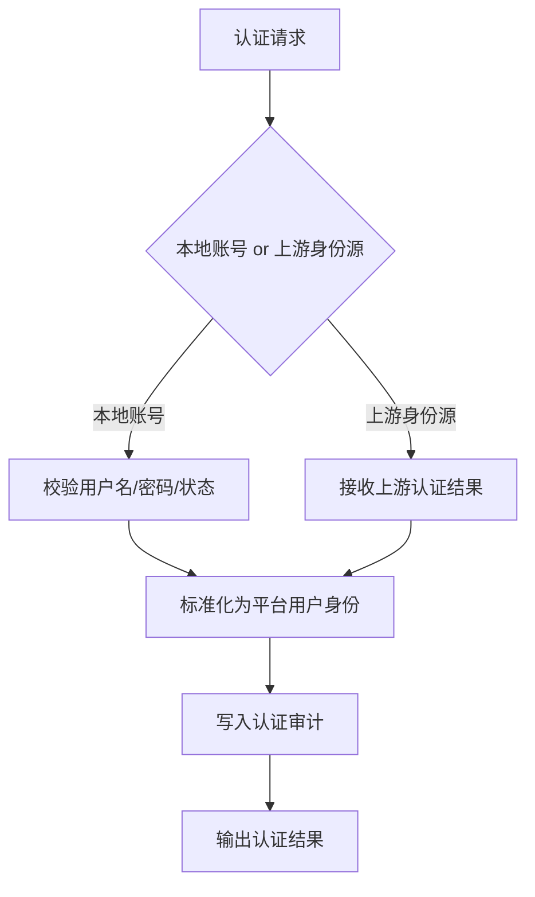

# 06 - 认证模块

> Auth 模块职责范围与实现要求

---

## 1. 模块职责

Auth 模块负责：

- 用户认证入口
- 本地兜底账号认证
- 与上游身份源对接后的认证结果接入
- 登录会话与认证态管理
- 认证相关审计

Auth 模块不负责：

- OAuth 授权码与 token 协议流转
- client 管理
- agent 管理
- delegation grant 判断

这些属于其他模块。

---

## 2. V1 范围

### 2.1 必做

- 本地账号登录能力
- 认证态标准化
- 登录失败计数与锁定
- 登出
- 认证审计

### 2.2 可选预留

- MFA 扩展点
- 企业 SSO 回调接入
- LDAP / AD / 企业聊天平台等身份源接入器

V1 可以先不完整实现所有上游身份源，但模型和流程上要能承接。

---

## 3. 模块边界

### Auth 模块输入

- 用户名密码
- 上游身份源认证结果
- 会话上下文

### Auth 模块输出

- 平台统一用户身份
- 认证成功 / 失败结果
- 认证审计事件

Auth 模块不直接签发业务 delegation token。

---

## 4. 认证方式

### 4.1 本地账号

作为 V1 兜底能力保留。

场景：

- 管理员紧急登录
- 开发、测试、运维环境
- 上游企业身份源不可用时的受控兜底

### 4.2 企业身份源

V1 先把接入模型定好。

后续支持：

- 企业 SSO
- LDAP / AD
- 飞书等企业身份平台

原则：

- 上游负责主认证
- AuthAny 负责接收认证结果并落地统一用户身份

### 4.3 认证模块流程图

---

## 5. 状态与失败路径

认证模块至少要覆盖以下状态：

- 账号不存在
- 账号禁用
- 密码错误
- 账号暂时锁定
- 身份源认证失败
- 身份映射失败

这些失败都必须具备：

- 明确错误分类
- 审计记录
- 可观察性

---

## 6. 安全要求

- 密码必须哈希存储
- 登录失败次数必须可控
- 短时间内暴力尝试必须受限
- 不在日志中输出敏感口令
- 用户状态变化必须影响认证结果

---

## 7. 验收标准

- 本地账号登录可用
- 登出可用
- 锁定与失败计数可用
- 上游身份源接入模型清晰
- 模块边界与 OAuth / delegation 模块不混用
