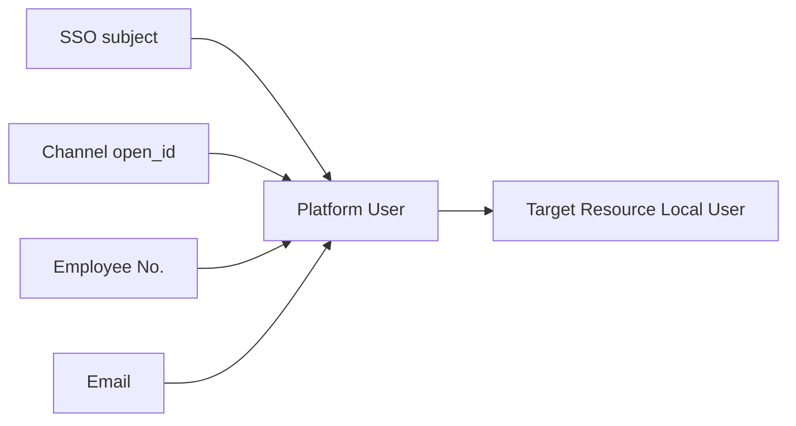

# 07 - 用户与身份模块

> 平台用户、外部身份映射与平台治理边界

---

## 1. 模块职责

用户与身份模块负责：

- 平台统一用户管理
- 用户状态管理
- 外部身份映射管理
- 平台级组织与基础资料字段

它不负责：

- 业务系统内部角色权限
- 业务系统菜单权限
- 业务系统数据权限

---

## 2. 用户模型定位

平台用户表示企业中的“人”。

它是：

- 平台认证和审计的统一主体
- OIDC `sub` 的基础来源
- delegation token 中最终被代表对象的基础来源

它不是：

- 每个业务系统的本地用户实体替代品

业务系统仍然可以有自己的本地用户和本地权限模型。

---

## 3. 外部身份映射

这是 V1 的重点。

平台必须支持：

- 一个用户对应多个外部身份
- 不同来源的 subject 映射到同一平台用户
- 外部身份状态可单独管理

例如：

- 企业 SSO subject
- 某聊天平台 open_id
- 内部员工号
- 邮箱

### 3.1 用户与外部身份映射图

---

## 4. 平台权限边界

当前草稿中“平台内置完整 RBAC 权限矩阵”的方向需要收敛。

V1 应拆成两层：

### 4.1 平台治理权限

平台内部自己仍然需要管理权限，例如：

- 谁能管理用户
- 谁能管理 client
- 谁能管理 agent
- 谁能查看 audit

这部分是平台后台治理权限，可以保留平台级 RBAC。

### 4.2 业务系统权限

业务系统自己的角色、按钮、菜单、数据权限不进入平台核心模型。

例如：

- `finance.export`
- `dashboard.pending.read`
- `deal.approve`

这类权限应由业务系统自治。

---

## 5. 模块输出

本模块对外提供的核心能力应包括：

- 统一用户查询
- 用户状态判断
- 外部身份解析
- 用户身份标准化数据

这样其他模块可依赖它：

- OAuth 模块
- Delegation 模块
- 审计模块

---

## 6. 验收标准

- 平台用户模型与业务系统本地用户模型解耦
- 同一用户可挂接多个外部身份
- 平台 RBAC 仅用于平台治理权限
- 业务权限不进入平台主模型
