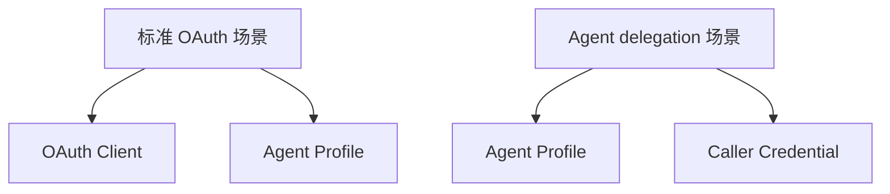
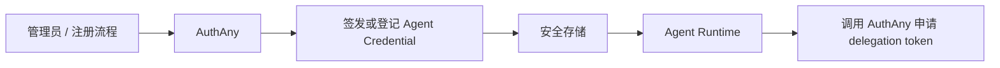

# 08 - Client、Agent 与调用凭证模块

> 标准 OAuth Client、Agent Profile 与 Agent 调用凭证模型

---

## 1. 模块定位

这是 AuthAny V1 的关键模块之一。

本模块需要同时覆盖两类场景：

### 1.1 标准 OAuth 场景

这里保留：

- `OAuth Client`
- `Agent Profile`

原因：

- client 是标准 OAuth 协议对象
- agent 是业务执行身份
- 两者生命周期不同

### 1.2 Agent delegation 场景

这里不强制要求单独存在一个 `OAuth Client` 业务实体。

核心对象变成：

- `Agent Profile`
- `Caller Credential`

也就是说：

- 标准 OAuth 场景强调 `Client`
- Agent delegation 场景强调 `Agent + Caller Credential`

### 1.3 两种接入模式对照图

---

## 2. Client 的职责

Client 表示协议接入方。

例如：

- Web App
- SPA
- Mobile App
- Service
- Tool Runtime Client

Client 负责：

- 参与 OAuth 协议
- 持有 client 凭证
- 声明支持哪些 grant type

说明：

- 这部分主要适用于标准 Web / App / Service OAuth 场景
- 在 Agent delegation 场景里，`Client` 可以降级为可选实现

---

## 3. Agent 的职责

Agent 表示“谁在执行”。

例如：

- 某个 Agent Host 里的业务 Agent
- 某个内部自动化执行体
- 某个 Tool Runtime 代表的业务角色

Agent 负责：

- 表达业务执行主体
- 参与 delegation 场景
- 与用户、目标系统之间形成 grant 关系

---

## 4. Caller Credential 的职责

Caller Credential 表示：

**Agent 运行时拿什么来向 AuthAny 证明“我就是这个 Agent”。**

它可以是：

- `agent_secret`
- API Key
- 私钥签名凭证
- mTLS 证书

它不是业务权限本身，而是调用 AuthAny 的机器凭证。

---

## 5. 为什么不能只保留 Client

如果 Agent 直接等于 Client，会出现这些问题：

- client secret 轮换时执行主体被迫变化
- 无法表达“一个 agent 多入口”
- 无法表达“同一个 client 下不同 agent 能力不同”

所以 V1 必须保留 Agent Profile 独立实体。

---

## 6. 为什么 Agent 场景不一定要单独建 Client

因为在 Agent delegation 场景里，真正必须有的是：

- 一个可验证的 Agent 身份
- 一套可验证的调用凭证

不一定必须额外抽出一个独立 OAuth Client 管理对象。

也就是说：

- 标准 OAuth 登录场景，`Client` 是核心对象
- Agent delegation 场景，`Agent + Caller Credential` 就可以成立

---

## 7. 模块能力

### 7.1 Client 能力

- 注册
- 更新
- 启停
- secret 轮换
- redirect URI 管理
- allowed grant type 管理

### 7.2 Agent 能力

- 注册
- 更新
- 启停
- 具备独立调用凭证
- 声明目标系统准入范围
- 参与 delegation grant

### 7.3 Caller Credential 能力

- 生成
- 轮换
- 启停
- 撤销
- 安全存储

---

## 8. “具备独立调用凭证”是什么意思

这里不是说 Agent 运行时临时从用户那里拿凭证。

而是：

1. Agent 在注册时由平台预先生成或登记一套机器凭证
2. 这套凭证被存放到安全位置
3. 运行时从安全位置读取
4. 再用它调用 AuthAny 申请 delegation token

常见存放位置：

- 环境变量
- Secret Manager
- 受控配置文件
- 机器证书 / 私钥文件

---

## 9. 调用凭证来源图

---

## 10. 平台授权边界

平台在 Client / Agent / Credential 层只做粗粒度判断。

例如：

- 这个 client 是否可用
- 这个 agent 是否可用
- 这个 caller credential 是否有效
- 这个 agent 是否允许访问某个目标系统

平台不在这里做：

- `dashboard pending` 是否可查
- `deal approve` 是否可执行

这些仍由业务系统判断。

---

## 11. 验收标准

- 标准 OAuth 场景下，client 与 agent 为两个独立对象
- Agent delegation 场景下，Agent 可独立持有调用凭证
- 调用凭证轮换不破坏 agent 身份
- agent 可参与 delegation 场景
- client / agent / credential 模型不绑定单一宿主平台
