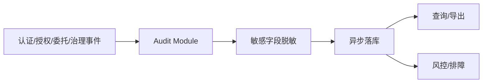

# 09 - 审计与可观测性模块

> 平台级审计、查询与安全追踪要求

---

## 1. 模块职责

审计模块负责：

- 平台关键行为留痕
- 安全事件追踪
- 审计查询与导出
- 为风控和排障提供统一证据

它不负责：

- 业务系统内部业务操作审计

业务系统仍需保留自己的业务审计。

---

## 2. V1 必须覆盖的事件

### 2.1 认证事件

- 登录成功
- 登录失败
- 登出

### 2.2 协议事件

- authorization 请求
- token 签发
- token 刷新
- token 撤销
- introspection 请求

说明：

- `token 刷新` 记录的是“新 token 被签发”的事件
- 不是“旧 token 被更新”的事件

### 2.3 委托事件

- delegation exchange 成功
- delegation exchange 拒绝
- binding_required
- binding 失效
- grant 不允许

### 2.4 治理事件

- client 创建 / 更新 / 启停 / secret 轮换
- agent 创建 / 更新 / 启停
- binding 创建 / 变更 / 撤销
- delegation grant 创建 / 变更 / 撤销

---

## 3. 审计最小字段

每条关键事件至少应包含：

- `event_id`
- `tenant_id`
- `event_type`
- `client_id`
- `agent_id`
- `platform_user_id`
- `target_system`
- `ip_address`
- `user_agent`
- `result`
- `error_code`
- `occurred_at`
- `trace_id` 或 `request_id`

---

## 4. 审计使用原则

### 4.1 审计优先异步落地

不能因为审计写入抖动而阻塞核心鉴权流程。

### 4.2 敏感字段脱敏

日志中不得输出：

- 明文密码
- 明文 client secret
- 明文 refresh token
- 完整长期凭证

### 4.3 查询维度必须够用

至少支持：

- 按时间范围查
- 按 user 查
- 按 client 查
- 按 agent 查
- 按 target system 查
- 按结果查

### 4.4 审计流水图

---

## 5. 与业务系统的关系

平台审计回答的是：

- 谁登录了
- 谁申请了授权
- 哪个 client / agent 换取了 token
- 平台为什么放行或拒绝

业务系统审计回答的是：

- 用户查了什么数据
- 执行了什么业务操作
- 修改了什么业务记录

两者互补，不能互相替代。

---

## 6. 验收标准

- 平台关键事件可追踪
- 委托访问路径可完整回溯
- 敏感字段已脱敏
- 审计与业务审计边界清晰
