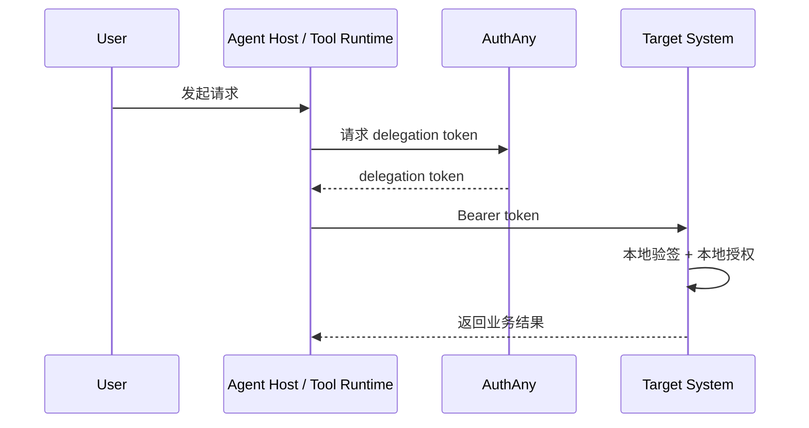
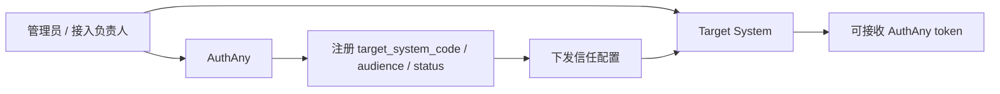

# 10 - 目标系统接入样板

> 本文档描述任意目标业务系统如何按 AuthAny V1 模型接入。`EBFX`、`CRM`、财务系统、报表系统都只是示例。

---

## 1. 文档定位

这份文档不描述平台核心逻辑，而是描述：

**任意目标系统（Target System）如何接入 AuthAny。**

你可以把它理解为：

- 平台核心是通用的
- 目标系统接入方式也是通用的
- `EBFX` 只是一个例子，不是模型本体

---

## 2. 接入目标

任意目标系统接入 AuthAny 后，应实现：

1. 用户可以通过统一身份完成接入
2. Agent 可以代表用户访问目标系统
3. 目标系统保留自己的业务权限体系
4. 目标系统不需要把业务权限迁移到 AuthAny

---

## 3. 目标系统在链路中的角色

目标系统是：

- target system
- resource server
- 本地业务权限决策方

目标系统不是：

- 统一身份平台
- delegation 关系的主裁决方

---

## 4. 接入流程

### 4.1 标准用户登录接入

用户通过标准 OAuth / OIDC 登录目标系统。

目标系统负责：

- 验证 AuthAny token
- 读取统一用户标识
- 查本地映射表
- 建立本地登录态

### 4.2 Agent 委托访问接入

任意 Agent Host / Tool Runtime 场景下：

1. 调用方向 AuthAny 请求 delegation token
2. 拿到 delegation token 后调用目标系统
3. 目标系统验证 token
4. 目标系统根据 `sub + agent_id + aud` 做本地授权

说明：

- `Agent Host` 可能是 OpenClaw、Claude Code、Opencode、自研 Agent 平台
- `Tool Runtime` 可能是 CLI、MCP Server、HTTP Gateway、内部服务适配器

### 4.3 目标系统接入总流程图

### 4.4 Target System 注册流程图

---

## 5. 目标系统本地需要做什么

### 5.1 用户映射

目标系统需要维护：

- 平台用户到目标系统本地用户的映射

### 5.2 本地权限判断

目标系统继续保留自己的：

- 角色
- 菜单权限
- 数据权限
- 业务流程权限

### 5.3 token 验签

目标系统需要：

- 获取 AuthAny JWKS
- 校验 `iss`
- 校验 `aud`
- 识别 `sub`
- 识别 `agent_id`

---

## 6. 目标系统与平台的边界

平台负责：

- 判断当前 delegation 是否成立
- 签发可信 token

目标系统负责：

- 判断当前用户是否真的能访问某个业务资源

例如：

- 平台可以放行“该 agent 可以代表该用户访问目标系统”
- 但目标系统仍可拒绝“该用户不能访问具体业务资源”

---

## 7. 对目标系统的实现要求

接入完成后，目标系统应满足：

- 不依赖平台内置业务权限
- 可通过本地 JWKS 验签
- 可根据平台用户和本地映射完成业务授权
- 可以拒绝没有本地权限的请求

---

## 8. 示例说明

以下都只是 target system 的例子：

- `ebfx`
- `crm`
- `finance`
- `reporting`

这些名字可以作为：

- `aud`
- `target_system`

但它们不应写死在平台核心模型中。

---

## 9. 验收标准

- 任意目标系统可按统一方式接入
- 平台不内置任何特定业务系统权限模型
- delegation token 可被目标系统正确消费
- 目标系统自治权限模型保持不变
