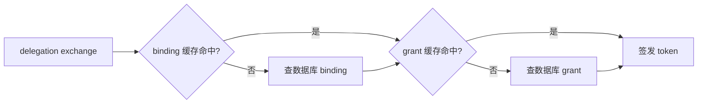

# 11 - 缓存、性能与降级设计

> AuthAny V1 缓存边界与性能目标

---

## 1. 设计目标

缓存的目标不是“把所有东西都塞进 Redis”，而是：

- 降低 delegation exchange 延迟
- 降低防重放和撤销检查成本
- 让关键读路径稳定

---

## 2. 建议缓存对象

### 2.1 防重放记录

用于：

- delegation exchange
- 一次性 code / request id 防重放

### 2.2 token 撤销记录

用于：

- 被撤销 token 的快速判断

建议理解为：

- token 本体保持不可变
- 撤销缓存只记录“哪些 token 已不可再用”
- 不把“修改 token 记录状态”当作主实现方式

### 2.3 绑定与 grant 的短期缓存

可缓存：

- binding 查询结果
- delegation grant 查询结果

注意：

- 缓存只是性能优化
- 真正权威数据仍在数据库

### 2.4 JWKS / 公钥缓存

对于外部接入方：

- 业务系统可以缓存 JWKS
- 平台自身也可缓存必要的 key metadata

### 2.5 delegation 查询链路缓存图

---

## 3. 不建议缓存的对象

V1 不建议将以下内容当作平台主缓存模型：

- 业务权限结果
- 业务系统用户权限快照
- 平台替业务系统做的权限决策

这些会导致平台侵入业务域。

---

## 4. 性能目标

V1 可参考以下目标：

- delegation exchange：未命中缓存时维持可接受延迟
- delegation exchange：命中缓存时显著降低延迟
- JWKS 拉取：可缓存，避免重复成本
- token 验签：足够轻量，适合业务系统本地完成

这里强调的是稳定性和边界正确，不是盲目追求极限 QPS 数字。

---

## 5. 降级策略

### 5.1 Redis 不可用

平台仍应尽量保持核心能力：

- 可以回退到数据库校验
- 但防重放与限流能力会变弱

### 5.2 绑定缓存失效

- 重新查数据库
- 不应影响正确性

### 5.3 业务系统不可用

- 平台正常返回 token 签发结果
- 业务调用是否成功由业务系统侧决定

---

## 6. 缓存边界验收

- 缓存只做性能优化，不改变授权语义
- 不缓存业务系统细粒度权限裁决
- 缓存失效不会导致安全策略绕过
