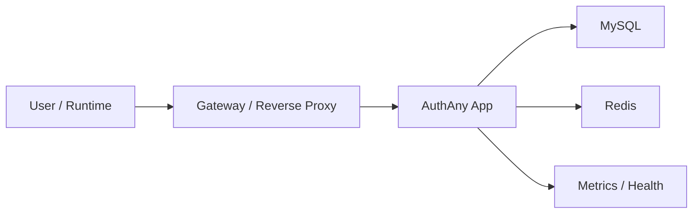

# 12 - 部署与运维要求

> AuthAny V1 部署、配置、健康检查与运维边界

---

## 1. V1 部署原则

V1 先按单体模块化服务部署。

原因：

- 当前优先级是把身份与 delegation 模型做对
- 不是一开始就拆微服务

V1 建议最小部署组件：

- AuthAny 应用服务
- MySQL
- Redis
- 反向代理 / 网关

### 1.1 部署拓扑图

---

## 2. 环境要求

至少区分：

- local
- dev
- staging
- production

关键要求：

- 不同环境使用独立密钥与配置
- 非生产环境不得共用生产签名材料

---

## 3. 密钥与配置管理

V1 即使先不接 HSM，也必须满足：

- 私钥不能进代码仓库
- 私钥配置来源清晰
- 支持 `kid`
- 支持轮换流程

环境变量和密钥文件都可以作为过渡方案，但必须有明确规范。

---

## 4. 健康检查

V1 至少提供：

- 服务健康检查
- 数据库连通性检查
- Redis 连通性检查
- metrics 导出

注意：

- 健康检查是运维契约
- 不是业务授权正确性的替代判断

---

## 5. 监控要求

V1 至少监控以下维度：

- token 签发量
- token 失败量
- delegation exchange 成功 / 失败量
- 登录成功 / 失败量
- 限流命中数
- 请求时延
- 数据库错误
- Redis 错误

---

## 6. 运维边界

平台运维要回答的是：

- 平台服务是否健康
- token 是否正常签发
- delegation 是否正常放行或拒绝
- 配置和密钥是否可控

业务系统运维回答的是：

- 业务服务是否健康
- 业务接口是否正常
- 本地权限判断是否正确

---

## 7. 验收标准

- 单体模块化部署可行
- 密钥与配置边界清晰
- 健康检查和 metrics 可用
- 监控指标覆盖认证与 delegation 核心路径
