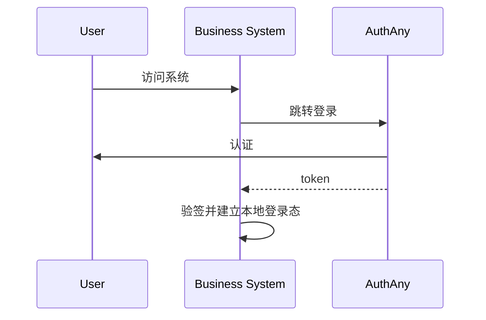
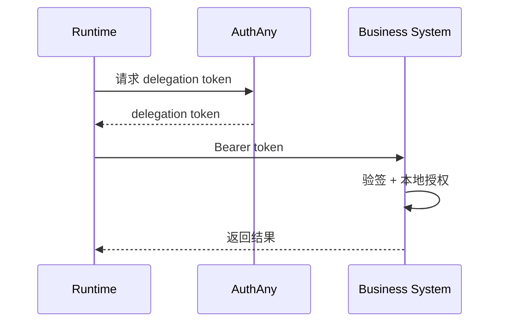

# 13 - 业务系统接入规范

> 业务系统如何接入 AuthAny，而不丢失自己的权限体系

---

## 1. 核心原则

业务系统接入 AuthAny 时，必须遵循：

- AuthAny 负责身份可信
- 业务系统负责资源授权

接入 AuthAny 不意味着：

- 迁移掉业务系统原有权限系统
- 把所有业务权限交给平台
- 把本地用户体系完全删除

---

## 2. 业务系统接入后的最小改造

业务系统通常只需要补三类能力：

### 2.1 token 验签

- 读取 AuthAny JWKS
- 校验 JWT 签名
- 校验 `iss`
- 校验 `aud`

### 2.2 用户映射

- 将平台用户映射到本地业务用户
- 或将 delegation token 中的上下文与本地用户建立关系

### 2.3 本地权限判断

- 继续沿用原有角色权限与数据权限逻辑

---

## 3. 标准接入模式

### 模式 A：标准登录接入

适用：

- Web 后台
- 业务门户
- App

流程：

1. 业务系统跳转 AuthAny 登录
2. 用户完成认证
3. 业务系统拿到 token
4. 验签并建立本地登录态

### 模式 B：Agent 委托访问接入

适用：

- Agent Host
- Tool Runtime
- 自动化服务

流程：

1. 调用方向 AuthAny 请求 delegation token
2. 拿 token 调业务系统
3. 业务系统验签
4. 业务系统执行本地授权

---

## 4. 业务系统接入时不应该做的事

- 不要把业务权限解释交给 AuthAny
- 不要依赖平台内置某个业务权限码
- 不要假设所有调用都来自某个特定 Agent 宿主

---

## 5. 对接 Agent Host / Tool Runtime 的建议

对于任意 Agent Host / Tool Runtime 接入：

- 调用方只负责传上下文
- AuthAny 负责签发 delegation token
- 业务系统只信任 AuthAny 的 token

因此：

- Agent Host 不需要内置业务权限
- Tool Runtime 不需要长期保存业务用户密钥

---

## 6. 接入验收标准

- 业务系统能本地验签 AuthAny token
- 业务系统能完成平台用户到本地用户的映射
- 业务系统能继续使用原有本地权限体系
- 新增一个业务系统接入时不需要修改 AuthAny 核心模型
