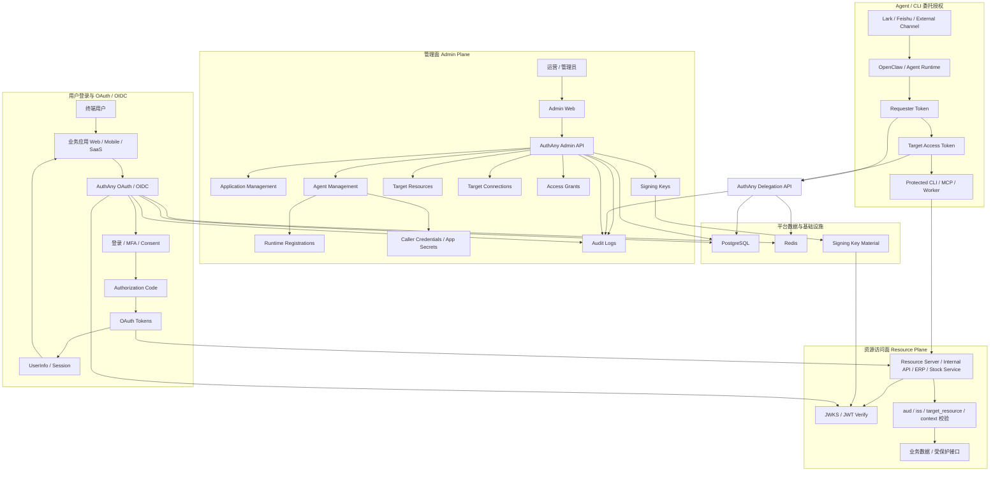
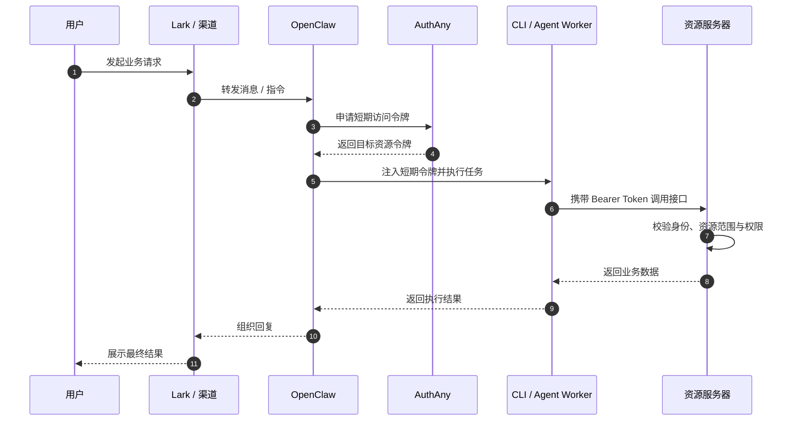
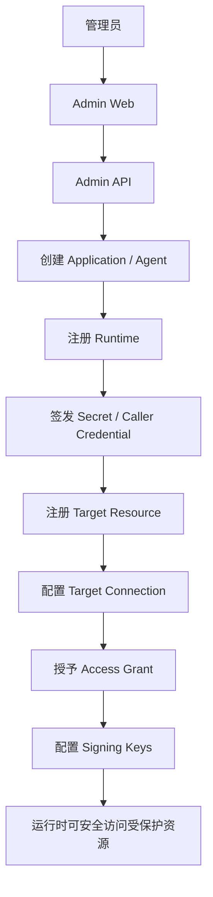
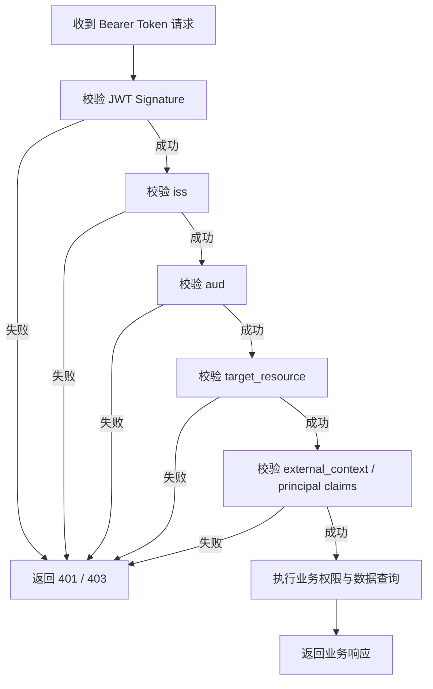

# AuthAny 功能流程图

## 全景流程图

```mermaid
flowchart TD
  subgraph AdminPlane["管理面 Admin Plane"]
    OP["运营 / 管理员"]
    AW["Admin Web"]
    AA["AuthAny Admin API"]
    APP["Application Management"]
    AG["Agent Management"]
    RT["Runtime Registrations"]
    CC["Caller Credentials / App Secrets"]
    TR["Target Resources"]
    TC["Target Connections"]
    GR["Access Grants"]
    SK["Signing Keys"]
    AU["Audit Logs"]

    OP --> AW
    AW --> AA
    AA --> APP
    AA --> AG
    AG --> RT
    AG --> CC
    AA --> TR
    AA --> TC
    AA --> GR
    AA --> SK
    AA --> AU
  end

  subgraph OAuthPlane["用户登录与 OAuth / OIDC"]
    EU["终端用户"]
    BIZ["业务应用 Web / Mobile / SaaS"]
    AUTH["AuthAny OAuth / OIDC"]
    LOGIN["登录 / MFA / Consent"]
    CODE["Authorization Code"]
    TOK["OAuth Tokens"]
    UI["UserInfo / Session"]

    EU --> BIZ
    BIZ --> AUTH
    AUTH --> LOGIN
    LOGIN --> CODE
    CODE --> TOK
    TOK --> UI
    UI --> BIZ
  end

  subgraph DelegationPlane["Agent / CLI 委托授权"]
    LARK["Lark / Feishu / External Channel"]
    OCLAW["OpenClaw / Agent Runtime"]
    CLI["Protected CLI / MCP / Worker"]
    REQ["Requester Token"]
    TAT["Target Access Token"]

    LARK --> OCLAW
    OCLAW --> REQ
    REQ --> TAT
    TAT --> CLI
  end

  subgraph ResourcePlane["资源访问面 Resource Plane"]
    RS["Resource Server / Internal API / ERP / Stock Service"]
    JWKS["JWKS / JWT Verify"]
    POL["aud / iss / target_resource / context 校验"]
    DATA["业务数据 / 受保护接口"]

    CLI --> RS
    TOK --> RS
    RS --> JWKS
    RS --> POL
    POL --> DATA
  end

  subgraph DataPlane["平台数据与基础设施"]
    DB["PostgreSQL"]
    REDIS["Redis"]
    KEYS["Signing Key Material"]
  end

  AA --> DB
  AUTH --> DB
  AUTH --> REDIS
  REQ --> AUTHX["AuthAny Delegation API"]
  TAT --> AUTHX
  AUTHX --> DB
  AUTHX --> REDIS
  SK --> KEYS
  KEYS --> JWKS
  AUTH --> JWKS
  AUTHX --> AU
  AUTH --> AU
  AA --> AU
```

## Agent / CLI 委托授权流程图

```mermaid
flowchart LR
  U["用户 / 渠道消息"]
  O["OpenClaw / Agent Runtime"]
  P["AuthAny Host Credential"]
  R1["POST /api/requester-token"]
  JT["Requester Token"]
  R2["POST /api/target-token"]
  AT["Target Access Token"]
  C["CLI / MCP / Worker"]
  S["Resource Server"]
  D["业务数据"]

  U --> O
  O --> P
  P --> R1
  R1 --> JT
  JT --> R2
  R2 --> AT
  AT --> C
  C --> S
  S --> D
```

## 精简版高管视角时序图

```mermaid
sequenceDiagram
  autonumber
  participant U as 用户
  participant L as Lark / 渠道
  participant O as OpenClaw
  participant A as AuthAny
  participant C as CLI / Agent Worker
  participant R as 资源服务器

  U->>L: 发起业务请求
  L->>O: 转发消息 / 指令
  O->>A: 申请短期访问令牌
  A-->>O: 返回目标资源令牌
  O->>C: 注入短期令牌并执行任务
  C->>R: 携带 Bearer Token 调用接口
  R->>R: 校验身份、资源范围与权限
  R-->>C: 返回业务数据
  C-->>O: 返回执行结果
  O-->>L: 组织回复
  L-->>U: 展示最终结果
```

## Admin 配置到生效流程图

```mermaid
flowchart TD
  OP["管理员"]
  UI["Admin Web"]
  API["Admin API"]
  A1["创建 Application / Agent"]
  A2["注册 Runtime"]
  A3["签发 Secret / Caller Credential"]
  A4["注册 Target Resource"]
  A5["配置 Target Connection"]
  A6["授予 Access Grant"]
  A7["配置 Signing Keys"]
  READY["运行时可安全访问受保护资源"]

  OP --> UI
  UI --> API
  API --> A1
  A1 --> A2
  A2 --> A3
  A3 --> A4
  A4 --> A5
  A5 --> A6
  A6 --> A7
  A7 --> READY
```

## Resource Server 验证流程图

```mermaid
flowchart TD
  REQ["收到 Bearer Token 请求"]
  SIG["校验 JWT Signature"]
  ISS["校验 iss"]
  AUD["校验 aud"]
  TR["校验 target_resource"]
  CTX["校验 external_context / principal claims"]
  BIZ["执行业务权限与数据查询"]
  OK["返回业务响应"]
  FAIL["返回 401 / 403"]

  REQ --> SIG
  SIG -- "失败" --> FAIL
  SIG -- "成功" --> ISS
  ISS -- "失败" --> FAIL
  ISS -- "成功" --> AUD
  AUD -- "失败" --> FAIL
  AUD -- "成功" --> TR
  TR -- "失败" --> FAIL
  TR -- "成功" --> CTX
  CTX -- "失败" --> FAIL
  CTX -- "成功" --> BIZ
  BIZ --> OK
```
