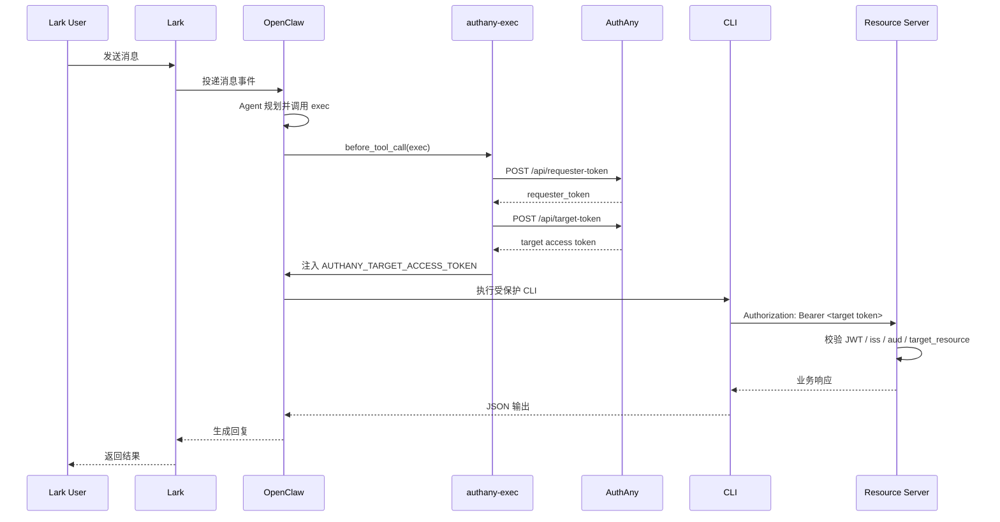
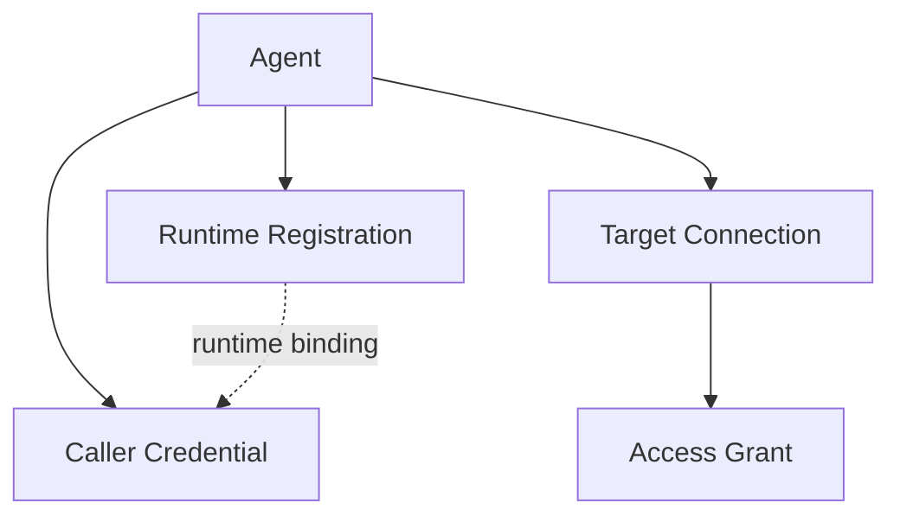

# Lark -> OpenClaw -> CLI -> AuthAny -> Resource Server 技术文档

## 1. 文档目标

本文档描述如何实现一条完整的企业级受保护调用链：

```text
Lark -> OpenClaw -> Protected CLI -> AuthAny -> Resource Server
```

目标是让 Lark 中的用户消息，经过 OpenClaw 触发受保护的 CLI，再由 AuthAny 为该次调用签发短期目标访问令牌，最后由资源服务器基于该令牌完成鉴权与业务访问。

本文档同时覆盖：

- 架构角色
- 安全边界
- 端到端时序
- 当前仓库中的落地实现
- 配置方法
- 联调方式
- 常见故障与排查

## 2. 适用范围

适用于以下场景：

- Lark / 飞书里的 AI 助手调用内部 CLI
- OpenClaw 作为 Agent Runtime 和 Tool Orchestrator
- CLI 不持有长期凭证，只消费短期目标令牌
- AuthAny 负责 Agent / Runtime 到 Target Resource 的委托授权
- 资源服务器只信任 AuthAny 签发的 Target Access Token

本文档不覆盖：

- 纯浏览器 OAuth 登录链路
- 用户直接访问资源服务器的传统 Web 鉴权
- CLI 自己持有 `caller credential` 并自行向 AuthAny 换 token 的模式

## 3. 目标架构

### 3.1 总体架构

```mermaid
flowchart LR
  U["Lark User"]
  B["Lark Bot"]
  CA["OpenClaw Channel Adapter"]
  S["OpenClaw Session / Agent"]
  E["exec tool"]
  P["authany-exec plugin<br/>before_tool_call"]
  RT["AuthAny<br/>/api/requester-token"]
  TT["AuthAny<br/>/api/target-token"]
  C["Protected CLI<br/>authany-stock"]
  R["Resource Server<br/>target-service"]
  J["Business JSON Response"]

  U --> B
  B --> CA
  CA --> S
  S --> E
  E --> P
  P --> RT
  RT --> TT
  TT -->|inject AUTHANY_TARGET_ACCESS_TOKEN| C
  C --> R
  R --> J
  J --> S
  S --> B
  B --> U
```



### 3.2 关键设计原则

- OpenClaw 持有长期凭证，CLI 不持有长期凭证
- CLI 只消费 `AUTHANY_TARGET_ACCESS_TOKEN`
- Target Access Token 必须按目标资源隔离
- 资源服务器只基于 JWT claims 鉴权，不信任 `OPENCLAW_*` 环境变量
- 授权失败必须 fail-closed

## 4. 角色与职责

### 4.1 Lark

职责：

- 提供最终用户入口
- 产生 sender identity
- 把消息发送给 OpenClaw

典型身份字段：

- `senderId`
- channel/account 信息

### 4.2 OpenClaw

职责：

- 承接 Lark 消息
- 维护 Agent 会话
- 调用 `exec` 工具执行 CLI
- 在 `before_tool_call` 阶段由插件完成 AuthAny 令牌交换

在本链路中，OpenClaw 是长期凭证边界。

### 4.3 authany-exec Plugin

职责：

- 识别受保护命令前缀
- 读取 OpenClaw 主进程中的 AuthAny 配置
- 向 AuthAny 发起两跳 token exchange
- 仅把短期 `AUTHANY_TARGET_ACCESS_TOKEN` 注入 CLI 子进程环境
- 移除长期敏感变量，避免泄漏到 CLI

### 4.4 Protected CLI

职责：

- 读取 `AUTHANY_TARGET_ACCESS_TOKEN`
- 调用 Resource Server
- 输出业务 JSON

禁止行为：

- 不应持有 `AUTHANY_CALLER_CREDENTIAL`
- 不应直接调用 `/api/requester-token`
- 不应把 `OPENCLAW_*` 作为鉴权凭证

### 4.5 AuthAny

职责：

- 校验 caller credential / app secret
- 校验 Agent、Runtime、Target Connection、Access Grant
- 签发 Requester Token
- 把 Requester Token 交换成 Target Access Token
- 将 `external_context` 写入目标 token claims

### 4.6 Resource Server

职责：

- 验证 AuthAny JWT
- 校验 `iss`
- 校验 `aud`
- 校验 `target_resource`
- 按 claims 继续做业务授权

## 5. 安全边界

### 5.1 长期凭证只存在于 OpenClaw Host

只能存在于 OpenClaw 主环境中的变量：

- `AUTHANY_CALLER_CREDENTIAL`
- `AUTHANY_AGENT_ID`
- `AUTHANY_APP_ID`
- `AUTHANY_RUNTIME_ID`
- `AUTHANY_ISSUER`
- `AUTHANY_PRINCIPAL_TYPE`
- `AUTHANY_TARGET_RESOURCE`

这些变量不应该进入 CLI 子进程。

### 5.2 CLI 只接收短期令牌

CLI 子进程只应该接收：

- `AUTHANY_TARGET_ACCESS_TOKEN`
- 非敏感 `OPENCLAW_*` 元数据

### 5.3 资源服务器的信任边界

资源服务器应该只信任：

- JWT 签名
- `iss`
- `aud`
- `target_resource`
- `agent_id` / `app_id`
- `external_context`

资源服务器不应信任：

- CLI 自报身份
- `OPENCLAW_SENDER_ID`
- `OPENCLAW_AGENT_ID`
- 任意本地环境变量中的业务标记

## 6. 端到端时序

### 6.0 完整流程图


### 6.1 正常调用时序



### 6.2 两跳交换的意义

第一跳：

- 输入：长期 caller credential
- 输出：短期 Requester Token

第二跳：

- 输入：短期 Requester Token
- 输出：面向具体资源的 Target Access Token

这样做的好处：

- 下游服务拿不到长期凭证
- Token 天然带 audience / target_resource 隔离
- 可以在 AuthAny 里基于 Connection / Grant 做中心化授权

## 7. 当前仓库中的实际落地

### 7.1 对应组件

- OpenClaw 插件：
  [/Users/wrr/work/openclaw/extensions/authany-exec/index.ts](/Users/wrr/work/openclaw/extensions/authany-exec/index.ts)
- OpenClaw 插件说明：
  [/Users/wrr/work/openclaw/extensions/authany-exec/README.md](/Users/wrr/work/openclaw/extensions/authany-exec/README.md)
- 示例 CLI：
  [/Users/wrr/work/authany/example/openclaw-cli-test](/Users/wrr/work/authany/example/openclaw-cli-test)
- CLI skill：
  [/Users/wrr/work/authany/example/openclaw-cli-test/skills/SKILL.md](/Users/wrr/work/authany/example/openclaw-cli-test/skills/SKILL.md)
- AuthAny SDK：
  [/Users/wrr/work/authany/packages/sdk/src/exchange-client.ts](/Users/wrr/work/authany/packages/sdk/src/exchange-client.ts)
- AuthAny 请求者令牌服务：
  [/Users/wrr/work/authany/server/src/modules/delegation/requester-token.service.ts](/Users/wrr/work/authany/server/src/modules/delegation/requester-token.service.ts)
- AuthAny 调用凭证校验：
  [/Users/wrr/work/authany/server/src/modules/delegation/caller-credential.service.ts](/Users/wrr/work/authany/server/src/modules/delegation/caller-credential.service.ts)
- AuthAny 授权策略：
  [/Users/wrr/work/authany/server/src/modules/delegation/delegation-policy.service.ts](/Users/wrr/work/authany/server/src/modules/delegation/delegation-policy.service.ts)
- 示例资源服务器：
  [/Users/wrr/work/authany/example/target-service](/Users/wrr/work/authany/example/target-service)

### 7.2 当前 CLI 模式

当前 `authany-stock` 已经改成单模式：

- 只支持 `AUTHANY_TARGET_ACCESS_TOKEN`
- 不再依赖 `@authany/sdk`
- 不再自行执行 token exchange

这是推荐生产模式。

### 7.3 当前资源标识

当前 `http://127.0.0.1:3006` 上的股票资源服务实际资源标识是：

- `target_resource = ebfx_test_01`
- `audience = ebfx_test_01_xxxxxxxx`

因此 OpenClaw plugin 中配置的 `targetResource` 必须和资源服务器保持一致。

## 8. 实现步骤

### 8.1 在 AuthAny 中准备基础数据

必须先准备：

- Agent
- Runtime Registration
- Caller Credential
- Target Resource Registration
- Target Connection
- Access Grant

其中关系如下：



### 8.2 在 OpenClaw Host 中配置 AuthAny 环境

示例：

```bash
AUTHANY_ISSUER=http://127.0.0.1:3000
AUTHANY_CALLER_CREDENTIAL=cc_live_xxx
AUTHANY_PRINCIPAL_TYPE=agent
AUTHANY_AGENT_ID=agt_live_xxx
AUTHANY_RUNTIME_ID=rt_live_xxx
AUTHANY_TOKEN_ENV_NAME=AUTHANY_TARGET_ACCESS_TOKEN
```

说明：

- 如果配置了 `AUTHANY_RUNTIME_ID`，则 caller credential 最好也绑定同一个 runtime
- 如果 credential 没绑 runtime，而请求里传了 runtime，服务端会按 runtime 维度查找 credential

### 8.3 在 OpenClaw Plugin 中配置目标资源

示例：

```json
{
  "enabled": true,
  "config": {
    "commandPrefixes": ["authany-stock"],
    "targetResource": "ebfx_test_01",
    "requireSenderId": false,
    "injectOpenClawMetadata": true,
    "injectAgentId": true,
    "defaultAgentId": "admin"
  }
}
```

关键点：

- `commandPrefixes` 决定哪些 `exec` 命令会被拦截
- `targetResource` 必须和资源服务器一致
- Lark 场景建议开启 `requireSenderId`

### 8.4 Protected CLI 读取短期令牌

CLI 只读：

```bash
AUTHANY_TARGET_ACCESS_TOKEN
```

调用资源服务器时：

```http
Authorization: Bearer <AUTHANY_TARGET_ACCESS_TOKEN>
```

### 8.5 资源服务器校验 JWT

资源服务器必须校验：

- `iss == AUTHANY_ISSUER`
- `aud == TARGET_SERVICE_AUDIENCE`
- `target_resource == TARGET_RESOURCE_CODE`

当前示例服务环境变量：

```bash
AUTHANY_ISSUER=http://127.0.0.1:3000
TARGET_SERVICE_AUDIENCE=ebfx_test_01_xxxxxxxx
TARGET_RESOURCE_CODE=ebfx_test_01
```

## 9. OpenClaw 到 AuthAny 的 external context 设计

插件会把上下文映射为：

```json
{
  "provider": "lark",
  "subject_type": "sender_id",
  "subject_value": "ou_xxx",
  "openclaw_agent_id": "admin",
  "openclaw_session_key": "agent:admin:main",
  "openclaw_run_id": "run_xxx",
  "openclaw_tool_call_id": "toolcall_xxx"
}
```

在真实实现里，`provider` 可能出现：

- `lark`
- `feishu`
- `openclaw`

因此 Target Connection 的 `allowed_context_providers_json` 应与实际运行时保持一致。

推荐值：

```json
["lark", "feishu", "openclaw"]
```

## 10. 核心数据一致性要求

要保证以下几组数据完全对齐。

### 10.1 Runtime 对齐

- `AUTHANY_RUNTIME_ID`
- `runtime_registrations.runtime_id`
- `caller_credentials.runtime_registration_id`

### 10.2 目标资源对齐

- OpenClaw plugin `targetResource`
- AuthAny `target_resource_registrations.target_resource_code`
- CLI 命中的 Resource Server
- Resource Server 的 `TARGET_RESOURCE_CODE`
- AuthAny 交换出的 token `target_resource`

### 10.3 Audience 对齐

- AuthAny target resource `audience`
- Resource Server `TARGET_SERVICE_AUDIENCE`
- Target Access Token `aud`

### 10.4 external context provider 对齐

- OpenClaw plugin 发送的 `externalContext.provider`
- Target Connection `allowed_context_providers_json`

## 11. 常见故障与根因

### 11.1 `invalid_caller_credential`

表现：

- `/api/requester-token` 返回 401

常见根因：

- `AUTHANY_CALLER_CREDENTIAL` 明文不对
- credential 已撤销
- credential 与 `AUTHANY_RUNTIME_ID` 绑定关系不一致

排查：

1. 查 `caller_credentials`
2. 查 `runtime_registrations`
3. 确认是否传了 `runtime_id`

### 11.2 `connection_not_allowed`

表现：

- `/api/target-token` 返回 403

根因：

- Agent 没有到该 `targetResource` 的 Target Connection
- 有 Connection 但没有 active allow Grant

排查：

1. 查 `target_connections`
2. 查 `access_grants`
3. 确认 `principal_type / principal_id / target_resource`

### 11.3 `invalid_external_context`

表现：

- `/api/requester-token` 或 `/api/target-token` 返回 400

根因：

- `external_context.provider` 不在 allow list 中
- 连接要求 external context，但请求没有带
- context 结构过大或过深

### 11.4 资源服务器返回 `invalid_token`

表现：

- CLI 已拿到 token，但 Resource Server 返回 401

根因：

- token 的 `aud` 与资源服务器配置不一致
- token 的 `target_resource` 与资源服务器配置不一致
- 资源服务器信任的 `issuer` 不一致

### 11.5 OpenClaw 页面看起来像“没返回”

表现：

- Web UI 会话卡住
- 会话不断重连
- 后台日志出现 `embedded_run_failover_decision`

根因方向：

- 模型调用超时
- 前端 websocket 重连
- 不是 AuthAny 或 CLI 鉴权问题

排查：

1. 查 OpenClaw gateway 日志
2. 先确认 token exchange 是否成功
3. 再区分是模型问题还是工具问题

## 12. 推荐联调顺序

建议按以下顺序联调。

### 12.1 验证 Resource Server

先验证公开探活：

```bash
authany-stock healthz
```

### 12.2 直接验证 AuthAny SDK 换 token

在 Host 环境下验证：

1. `caller credential -> requester token`
2. `requester token -> target token`

### 12.3 带 token 直接跑 CLI

```bash
AUTHANY_TARGET_ACCESS_TOKEN=<token> authany-stock market overview
```

### 12.4 再验证 OpenClaw plugin 注入

确认：

- 匹配命令被拦截
- 子进程只收到短期 token
- 长期凭证没有泄漏

### 12.5 最后从 Lark 端到端验证

确认：

- senderId 正常传入
- external context provider 正常
- 最终业务响应能回到 Lark

## 13. 当前仓库的最小可运行配置

### 13.1 AuthAny

服务：

- `http://127.0.0.1:3000`

### 13.2 Resource Server

服务：

- `http://127.0.0.1:3006`

当前资源：

- `target_resource = ebfx_test_01`
- `audience = ebfx_test_01_xxxxxxxx`

### 13.3 Protected CLI

命令：

```bash
authany-stock market overview
```

### 13.4 OpenClaw Plugin

受保护前缀：

```text
authany-stock
```

## 14. 生产建议

### 14.1 环境变量管理

- `AUTHANY_CALLER_CREDENTIAL` 放在 OpenClaw Host Secret Store
- 不要写入 CLI `.env`
- 不要透传到子进程

### 14.2 运行时隔离

- 每个 OpenClaw 运行环境使用独立 Runtime Registration
- 每个 Runtime 使用独立 Caller Credential

### 14.3 资源隔离

- 每类业务资源使用独立 `target_resource`
- 不要把多个后端混在同一个 audience 下

### 14.4 审计

建议在 AuthAny 中保留以下可关联字段：

- `agent_id`
- `runtime_id`
- `target_resource`
- `run_id`
- `tool_call_id`
- `subject_value`

## 15. 推荐验收清单

- Lark 发消息后，OpenClaw 能命中受保护命令
- `authany-exec` 能成功注入 `AUTHANY_TARGET_ACCESS_TOKEN`
- CLI 子进程中看不到 `AUTHANY_CALLER_CREDENTIAL`
- AuthAny 能成功完成两跳 exchange
- Resource Server 能正确校验 `iss / aud / target_resource`
- 业务 JSON 能返回到 OpenClaw
- OpenClaw 能把结果回复给 Lark
- Target Connection / Access Grant / Runtime / Credential 关系一致
- `external_context.provider` 与 allow list 一致

## 16. 结论

这条链路的关键不是“CLI 能不能访问后端”，而是要把下面四层边界做对：

- 长期凭证边界：只留在 OpenClaw Host
- 授权边界：只在 AuthAny 中判断
- 令牌边界：CLI 只消费短期 Target Token
- 资源边界：Resource Server 只信任 JWT claims

只要把 Runtime、Target Resource、Audience、Connection、Grant、External Context 六组数据对齐，这套 `Lark -> OpenClaw -> CLI -> AuthAny -> Resource Server` 链路就能稳定上线。
