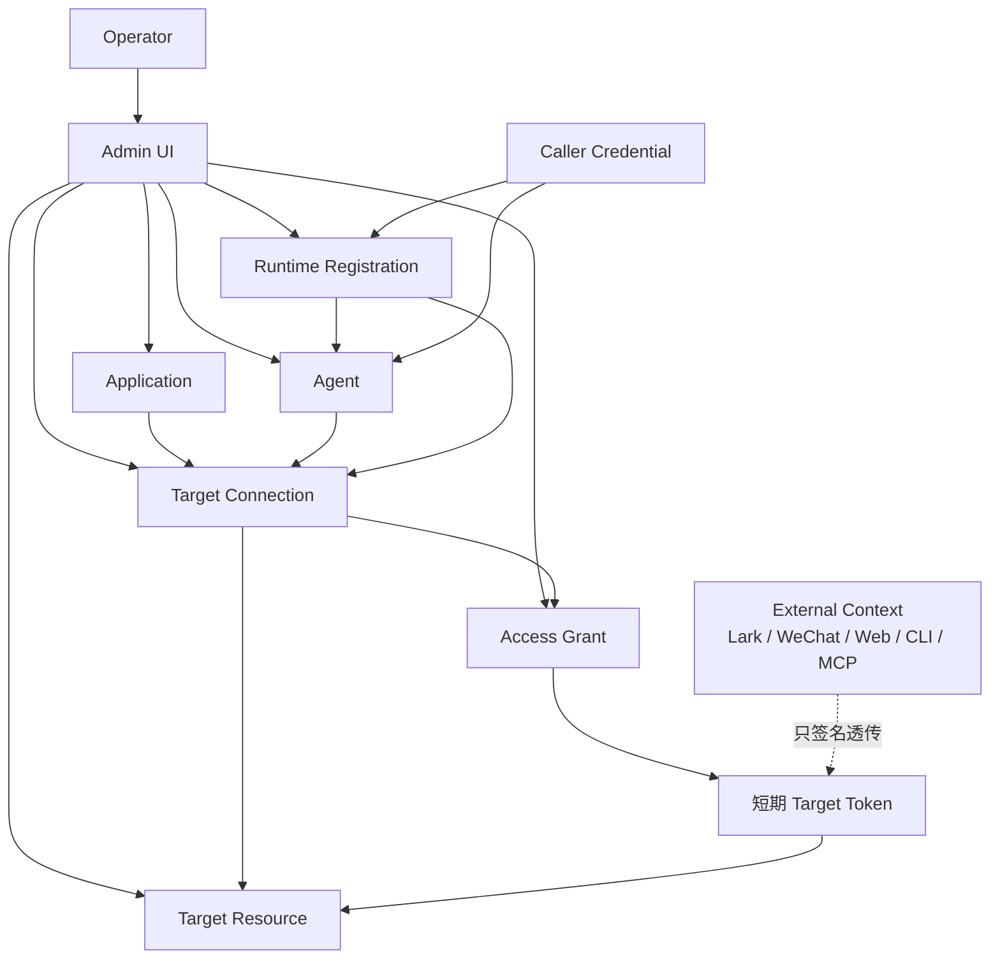
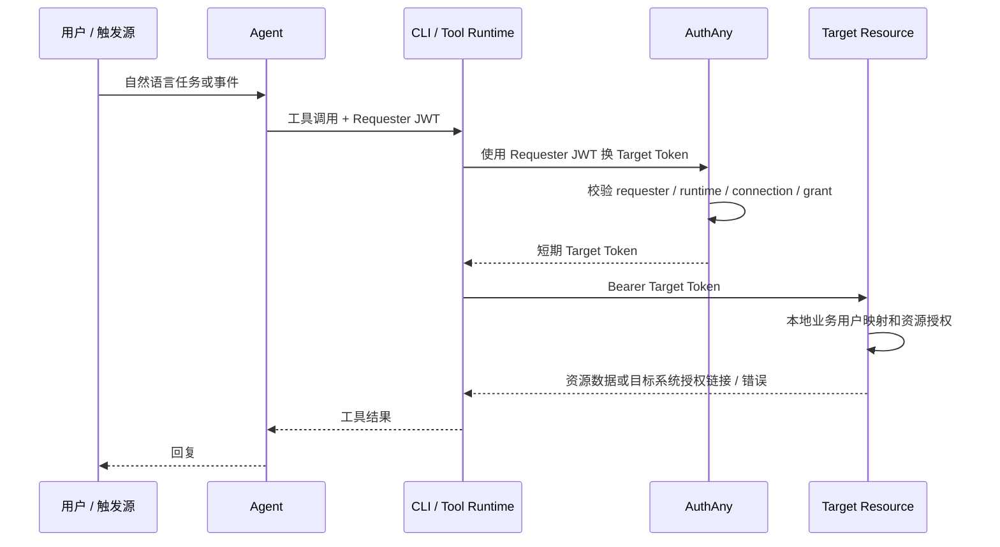

# 00 - 产品需求

> AuthAny V1 是遵循 OAuth 2.1 安全原则的企业授权控制平面，面向 Application、Agent、Runtime 和 Target Resource。AuthAny 不是 Auth0 克隆，不是业务用户中心，也不拥有目标系统的用户绑定或资源权限。

---

## 1. 产品定位

AuthAny 回答五个问题：

- 哪个 Application、Agent 或 Runtime 正在调用？
- 它被允许访问哪个 Target Resource？
- 在什么平台级约束下可以签发短期访问令牌？
- Target Resource 如何验证令牌，并继续执行自己的本地业务授权？
- 哪些已签名的请求上下文应该透传给 Target Resource，但不被 AuthAny 解释为业务用户？

AuthAny 不回答这些问题：

- 这个 Lark、微信或 Web 用户在 EBFX 里是谁？
- 这个用户能访问哪个分支、dealer、角色、菜单、按钮或数据资源？
- 某个业务动作是否应该被批准？

这些问题属于 Target Resource 或其接入的企业身份系统。

---

## 2. P0 范围

P0 必须实现：

- Application 管理，系统生成 App ID 和 App Secret。
- Agent 管理，系统生成 Agent ID。
- Runtime Registration 管理，用于描述 Agent 的运行环境。
- Caller Credential 生命周期管理。
- Target Resource 注册，包含 issuer、audience、JWKS 和令牌验证元数据。
- Target Connection 管理，连接 Application / Agent / Runtime 与 Target Resource。
- Access Grant 管理，对 Target Connection 做平台级放行。
- 为 Application 和 Agent 签发访问 Target Resource 的短期令牌。
- 校验 Application / Agent / Runtime 请求方的 Requester JWT。
- 可选 `external_context` 签名透传。
- Token Broker 缓存可复用的短期令牌。
- 密钥轮换、审计事件、限流、健康检查和指标。
- 覆盖全部 P0 管理面的 Admin UI。

---

## 3. 明确不做

P0 不实现：

- Auth0 式通用用户注册、社交登录或消费者身份平台能力。
- 业务用户管理。
- `Lark open_id -> AuthAny User -> Target User` 绑定。
- Target Resource 用户映射。
- Target Resource 业务角色、scope、分支权限、dealer 权限、菜单权限或资源权限。
- 最终用户自助授权 / 绑定门户。
- AuthAny 级 `binding_required` 错误。
- 长期保存业务系统用户 token。
- 旧 User Binding 模型的兼容层。

AuthAny 可以有 Operator 用于 Admin UI 登录，但 Operator 不是业务用户，也不能作为 Target Resource 的业务主体。

---

## 4. 核心角色

| 角色 | 含义 |
|------|------|
| Operator | AuthAny 自身的管理员。 |
| Application | 注册到 AuthAny 的软件客户端，使用 App ID / App Secret 标识。 |
| Agent | AI 或自动化执行身份，使用 Agent ID 标识。 |
| Runtime Registration | Agent 的具体运行环境，例如 OpenClaw Lark 生产环境、Claude Code 本地环境、MCP Server。 |
| Caller Credential | Agent / Runtime 调用 AuthAny 时使用的高敏凭证。 |
| Target Resource | 被访问的业务资源服务，例如 EBFX、CRM、OA、财务系统、报表系统。 |
| Target Connection | Application / Agent / Runtime 到 Target Resource 的平台级连接。 |
| Access Grant | 对 Target Connection 的平台级允许规则。 |
| External Context | 可选的不透明上下文，例如 Lark open_id，会被签进 token，但不被 AuthAny 解释。 |

身份与密钥规则：

- `app_id`、`agent_id`、`runtime_id` 是公开标识。
- `app_secret` 和 Caller Credential 是高敏凭证。
- Secret 只能保存到服务端、可信 Runtime 或受控密钥系统。
- Secret 绝不能发送到 Target Resource、浏览器、聊天消息、日志、URL 或本地未加密存储。
- 跨系统访问应使用短期 JWT。Secret 只用于证明请求方身份或生成请求方断言。

---

## 5. 目标架构



---

## 6. 关键产品流程

### 6.1 Agent / Runtime 访问

1. Runtime 收到用户或任务触发，构造短期 Requester JWT，包含 `agent_id`、可选 `runtime_id`、`target_resource`、`request_id` 和可选 `external_context`。
2. Runtime 使用 Requester JWT 调用 AuthAny。
3. AuthAny 校验 Requester JWT、Caller Credential 绑定、Agent、Runtime、Target Resource、Target Connection、Access Grant、防重放和限流。
4. AuthAny 返回短期 Target Token，`sub=agent:<agent_id>`。
5. Runtime 使用 Target Token 调用 Target Resource。
6. Target Resource 验证 token，并执行本地身份映射和本地权限判断。

### 6.2 Application 访问

1. Application 后端使用服务端凭证构造短期 Requester JWT。
2. Application 使用 Requester JWT 和 `target_resource` 调用 AuthAny。
3. AuthAny 校验 Application、Target Connection、Access Grant、防重放和限流。
4. AuthAny 返回短期 Target Token，`sub=app:<app_id>`。
5. Application 使用 Target Token 调用 Target Resource。

### 6.3 用户上下文透传

如果调用由聊天、Web、CLI、MCP、Webhook、Workflow、IoT 或 RPA 触发，请求方可以发送：

```json
{
  "external_context": {
    "provider": "lark",
    "subject_type": "open_id",
    "subject_value": "ou_xxx"
  }
}
```

AuthAny 只校验形状、大小和 provider 策略，然后把它签进 token，不映射为 AuthAny 用户。

### 6.4 User -> Agent -> CLI -> Resource



---

## 7. P1 / P2 范围

P1：

- Operator 登录接入企业 IdP。
- 更高级的 Target Connection 策略约束。
- Admin UI 搜索、批量操作和审计筛选增强。
- 静态 Access Grant 不够时接入策略引擎。

P2：

- 多租户隔离强化。
- 在有价值时兼容 RFC 8693。
- 高风险 Target Resource 使用 token introspection。
- 外部 SIEM 和治理系统集成。

---

## 8. 验收基线

P0 完成条件：

- Application 可以通过已配置的 Target Connection 和 Access Grant 获取 Target Resource token。
- Agent 和 Runtime 可以通过 Requester JWT 获取 Target Resource token。
- 可选外部用户上下文可以被签名透传，且 AuthAny 不拥有用户绑定。
- Target Resource 可以通过 JWKS 验证 RS256 JWT，并继续做本地授权决策。
- Admin UI 可以管理 Application、Agent、Runtime、Caller Credential、Target Resource、Target Connection、Access Grant、Key 和 Audit。
- 测试覆盖成功路径、拒绝路径、防重放、非 active 实体、过期 grant、缓存行为和非法 external context。
