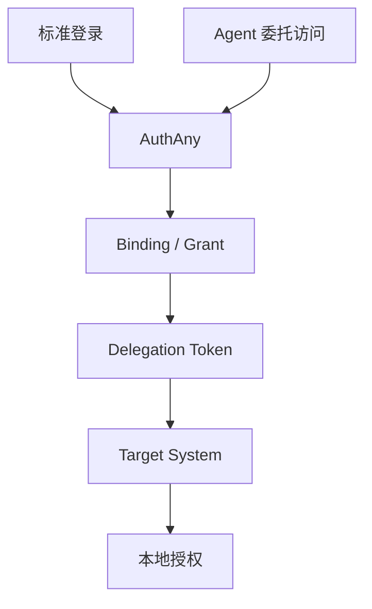

# AuthAny - 产品需求文档

> AuthAny 是企业统一身份认证与授权平台。本文件定义项目定位、范围、角色、分期、功能边界和总体验收基线。

---

## 1. 项目定位

AuthAny 的定位是：

**企业统一身份认证与授权平台。**

它要解决的问题不是“某一个 Agent 产品如何接某一个业务系统”，而是：

- 企业如何统一管理用户身份
- 企业如何统一管理 Agent 机器身份
- 任意 Agent 宿主和工具运行时如何安全调用任意目标系统
- 在不接管业务系统权限模型的前提下，如何完成可信委托访问

一句话：

- **AuthAny 管身份可信、令牌可信、准入可信**
- **目标系统管资源授权、数据权限、业务行为**

---

## 2. 产品目标

AuthAny V1 的目标是建立一套可持续扩展的统一基础设施，优先支持以下能力：

1. 标准 Web / App 的统一登录
2. Agent 代表用户或以服务主体身份访问目标系统
3. Target System 在保留本地权限体系的前提下接入统一身份
4. 让接入方不依赖某个具体 Agent 产品、聊天平台、CLI 或 MCP 实现

---

## 3. 非目标

V1 明确不做：

- 统一业务权限中心
- 托管目标系统菜单权限、按钮权限、数据权限
- 业务流程审批引擎
- 团队/组织协作产品功能
- 付费/订阅/计费系统
- 实时多人协作
- 一开始拆分成多微服务

---

## 4. 角色定义

## 4.1 人类角色

### 平台超级管理员

负责：

- 平台初始化配置
- 核心安全策略
- 密钥与环境治理
- 高权限审计

### 接入管理员

负责：

- Target System 注册
- Agent 注册审批
- 调用凭证生命周期管理

### 业务系统管理员

负责：

- 平台主体到本地主体映射
- 目标系统本地权限与资源授权

### 最终用户

负责：

- 登录
- 首次授权/绑定
- 使用 Agent 访问目标系统

## 4.2 系统角色

### AuthAny

企业统一身份认证与授权平台。

### Agent Host

负责承载 Agent 的产品或平台。

例如：

- OpenClaw
- Claude Code
- Opencode
- 自研 Agent 平台

### Tool Runtime

负责真正执行调用的运行时。

例如：

- CLI
- MCP Server
- HTTP Gateway
- 内部服务适配器

### Target System

最终被访问的目标业务系统。

例如：

- EBFX
- CRM
- 财务系统
- 报表系统

---

## 5. P0 / P1 / P2 范围

## 5.1 P0 - 核心范围

### 身份与认证

- 本地兜底账号
- 企业身份源接入模型
- 标准 OAuth 2.0 / OIDC 登录
- 用户统一身份模型

### Agent 与调用凭证

- Agent Profile 注册
- Runtime Registration 注册
- Caller Credential 签发 / 登记
- Caller Credential 轮换
- Caller Credential 撤销

### Target System 接入

- Target System 注册
- audience / issuer / JWKS 信任配置
- 平台主体到目标系统本地主体映射模型

### 委托访问

- User Binding
- Delegation Grant
- Service Subject
- Delegation Token 签发
- replay protection
- token revocation

### 治理与运维

- 平台级审计
- 基础监控
- 健康检查
- 关键告警

## 5.2 P1 - 增强范围

- 更多企业身份源正式接入器
- 管理后台增强
- 更细的审计检索能力
- 更完善的 Target System 自助接入能力
- 统一绑定门户增强

## 5.3 P2 - 后续范围

- 多租户正式隔离
- 标准 RFC 8693 Token Exchange 完整兼容
- 策略引擎
- 更复杂的服务账号授权策略

---

## 6. 核心功能清单

### F1. 标准登录

- 用户可通过 Web/App 使用标准 OAuth 2.0 / OIDC 登录
- 支持 Authorization Code + PKCE
- 支持 refresh token rotation

### F2. Agent 注册与管理

- 平台可注册 Agent
- 平台可注册 Runtime，并定义其是 `stateless` 还是 `stateful`
- Agent 可拥有独立调用凭证
- 凭证可轮换、停用、撤销

### F3. Target System 注册与信任建立

- 平台可注册 Target System
- Target System 获得 audience / issuer / JWKS 信任配置
- 平台可决定哪些 Agent 可访问哪些 Target System

### F4. 首次授权与绑定

- 最终用户首次访问时可完成授权绑定
- 平台建立 User Binding
- 平台建立 Delegation Grant
- 首次 binding 页面或等价入口属于 P0 交付范围

### F5. 委托访问

- Agent Runtime 携带 caller credential 向 AuthAny 请求 delegation token
- 平台校验 binding、grant、agent、credential、target system
- 目标系统消费 delegation token 并做本地授权
- 对于无最终用户的系统任务，平台支持服务主体执行模型

### F6. token 生命周期管理

- token 签发
- refresh 签发新 token
- revoke 记录提前失效事实
- token 本体不可变

### F7. 审计与治理

- 认证审计
- 委托访问审计
- 管理操作审计
- 基础查询与导出

---

## 7. 不做的事

V1 不做以下内容：

- 将业务系统本地权限迁入 AuthAny
- 在 token 中内置业务按钮/菜单权限
- 假设接入方一定是某个 Agent 平台
- 假设调用一定来自某个聊天平台
- 假设运行时一定是 CLI 或 MCP

---

## 8. 核心业务流程总览

---

## 9. 核心设计原则

- 平台核心必须通用，不绑定特定产品
- 平台只做粗粒度准入，不做目标系统细粒度资源授权
- token 本体不可变
- refresh 语义是签发新 token
- revoke 语义是记录提前失效
- Agent 场景不强制要求独立 OAuth Client 业务对象
- Target System 以注册和信任配置方式接入
- 标准 OAuth 会话 token 与 delegation token 的生命周期策略允许不同
- 只有被注册为 `stateful` 的可信 Runtime 才允许申请 delegation refresh token

---

## 10. 交付边界

V1 的交付边界包括：

- 文档规格
- 核心接口
- 核心领域对象
- 核心流程
- 核心安全要求
- 运维与验收标准

V1 的交付边界不包括：

- 所有未来身份源的一次性实现
- 所有目标系统的一次性接入
- 复杂多租户运行时隔离

---

## 11. 总体验收标准

AuthAny V1 被视为完成，至少要满足：

1. 标准 OAuth / OIDC 登录可用
2. Agent delegation 链路可用
3. 系统任务可通过服务主体模型访问 Target System
4. Target System 能在不改本地权限体系前提下接入
5. token 生命周期语义正确
6. 审计、健康检查、基础监控可用
7. 文档、接口、实现边界一致

详细验收标准见：

- [13-ACCEPTANCE-CRITERIA.md](/Users/wrr/work/authany/specs/13-ACCEPTANCE-CRITERIA.md)

---

## 12. 依赖与约束

- 需要至少一种可用身份源
- 需要可用的 PostgreSQL / Redis 等基础设施
- 需要明确的密钥与凭证管理方式
- 需要 Target System 配合完成 trust config 和本地映射

### 12.1 V1 实现技术栈决议

AuthAny V1 当前已确定的参考实现技术栈如下：

- 核心服务框架：`NestJS`
- HTTP 适配器：`Fastify`
- 持久化数据库：`PostgreSQL`
- 缓存、防重放、短期状态：`Redis`
- ORM：`Prisma`
- JWT / JWKS / OIDC 实现库：`jose`
- 管理端交付方式：先 `API First`，后续再补 `Next.js` 管理后台

说明：

- 这组技术选型用于约束 V1 工程实现
- 不改变协议语义、数据模型和验收标准
- 如果后续要更换技术栈，应先更新正式规格再进入实现阶段

---

## 13. 风险与开放问题

高风险点：

- Agent 与 Client 模型混淆
- Binding 与 Grant 模型混淆
- Target System 注册和用户绑定混淆
- 将 revoke 误做成 delete
- 平台侵入目标系统本地权限

完整问题清单见：

- [14-OPEN-QUESTIONS-AND-RISKS.md](/Users/wrr/work/authany/specs/14-OPEN-QUESTIONS-AND-RISKS.md)

---

## 14. 文档导航

后续阅读建议：

1. [01-ARCHITECTURE.md](/Users/wrr/work/authany/specs/01-ARCHITECTURE.md)
2. [02-DOMAIN-MODEL.md](/Users/wrr/work/authany/specs/02-DOMAIN-MODEL.md)
3. [03-PROTOCOLS-AND-TOKENS.md](/Users/wrr/work/authany/specs/03-PROTOCOLS-AND-TOKENS.md)
4. [04-STATE-MACHINES.md](/Users/wrr/work/authany/specs/04-STATE-MACHINES.md)
