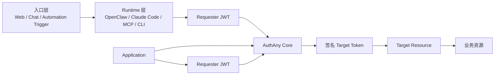
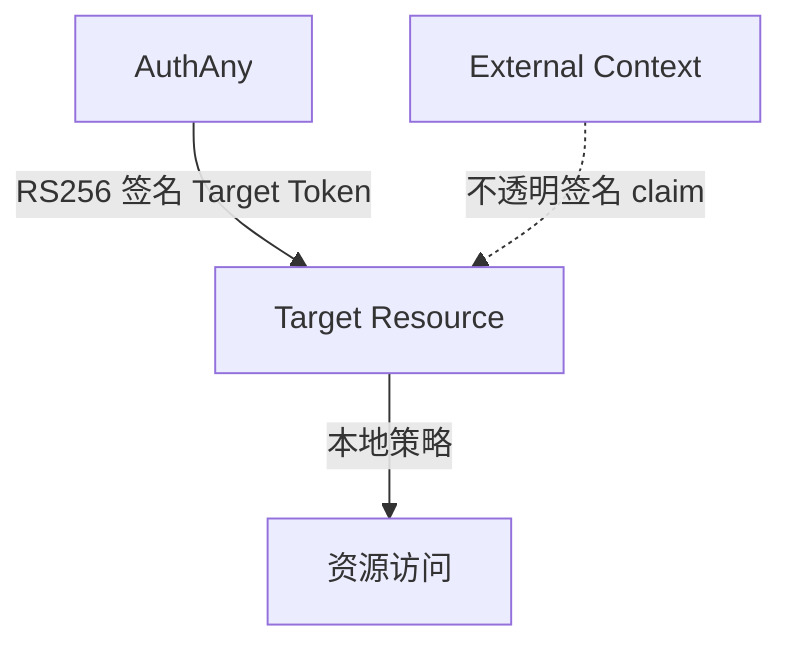
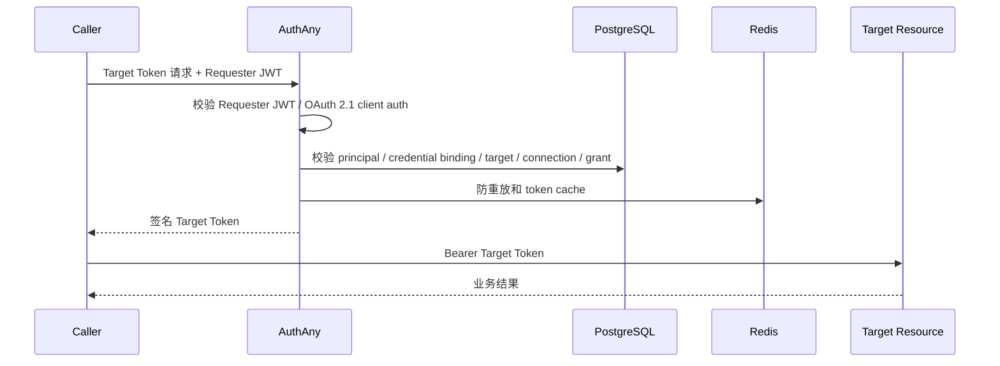

# 01 - 架构设计

> AuthAny 是用于 Target Resource 访问控制的模块化单体控制平面。

---

## 1. 分层架构

---

## 2. 职责边界

入口层：

- 收集用户输入、任务输入或外部事件。
- 向 Runtime 提供可选外部上下文。
- 除非入口层本身也是可信 Runtime，否则不能持有 AuthAny Caller Credential。

Runtime 层：

- 持有 Agent Caller Credential。
- 构造或获取 Requester JWT。
- 使用 Requester JWT 向 AuthAny 换取 Target Token。
- 使用 Target Token 调用 Target Resource。
- 不信任未签名的用户 ID、sender ID 或 runtime ID。

Application：

- 持有 App ID 和 App Secret。
- 构造 Requester JWT，或使用 OAuth 2.1 confidential client authentication。
- 在已配置 Target Connection 和 Access Grant 时，向 AuthAny 换取 Application Target Token。
- App Secret 只能保存在服务端。

AuthAny Core：

- 管理 Application、Agent、Runtime、Credential、Target Resource、Target Connection 和 Access Grant。
- 签发短期 Target Token。
- 执行防重放、限流、审计和密钥管理。

Target Resource：

- 验证 AuthAny 签发的 token。
- 如有需要，在本地解释 `external_context`。
- 执行本地资源授权。

---

## 3. 信任边界

规则：

- AuthAny 被信任用于证明调用方身份和 token 完整性。
- Target Resource 被信任用于最终业务授权。
- `external_context` 会被签名，但 AuthAny 不解释其业务含义。

---

## 4. 核心请求路径

---

## 5. 架构约束

- Core 不能依赖 OpenClaw、Claude Code、Lark、EBFX 或任何具体产品。
- Core 不能存储 Target Resource 的业务用户或业务权限。
- Core 不能包含旧 User Binding 语义的兼容代码。
- Runtime 不能保存长期 Target Resource 用户密钥。
- Target Resource 不能把本地资源权限判断反向委托给 AuthAny。
- Target Resource 只能接收 Target Token，不能接收 App Secret、Caller Credential 或裸 sender ID。
- Chat、Web、CLI、MCP、Webhook、Workflow、IoT、RPA 等入口都归一化为已签名 requester context，不会产生新的 Core principal 类型。
