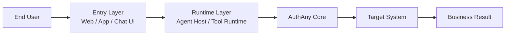
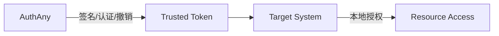
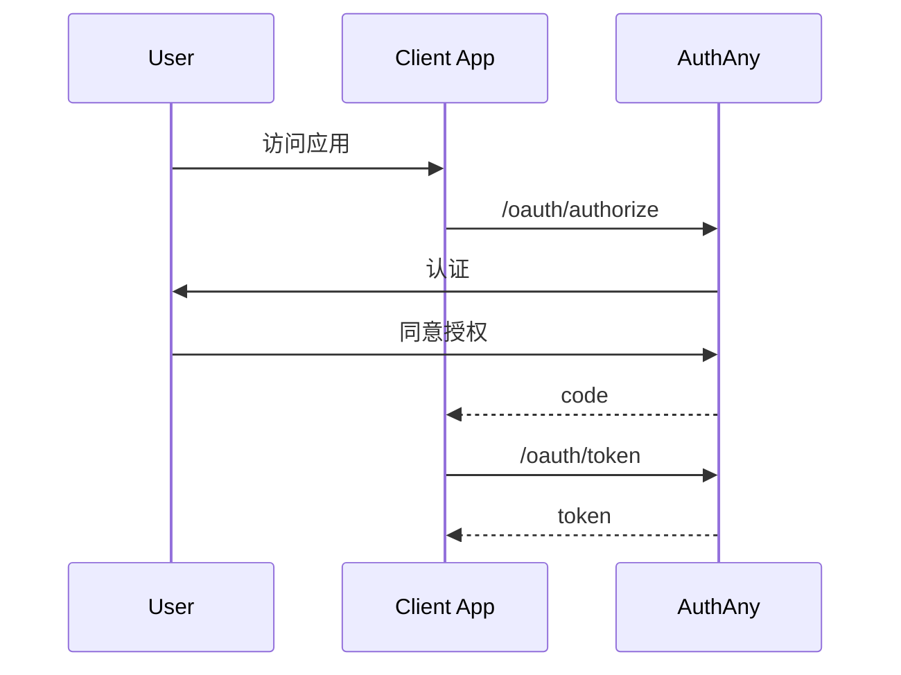
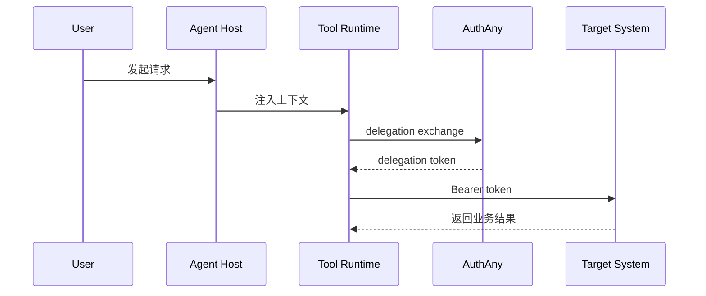
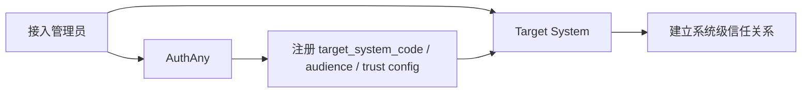

# 01 - 架构设计

> 本文档定义 AuthAny 的系统分层、信任边界、运行时角色和核心交互关系。

---

## 1. 文档目标

回答：

- AuthAny 在系统里处于什么位置
- 调用方、平台、目标系统分别做什么
- 平台与目标系统之间的信任关系如何建立

不回答：

- 每张表具体字段
- 每个接口的完整契约

---

## 2. 背景与上下文

AuthAny 不是某个业务系统的登录模块，也不是某个 Agent 平台的插件。

它需要处于多个系统之间：

- 上游身份源
- 多种 Agent Host
- 多种 Tool Runtime
- 多个 Target System

---

## 3. 分层架构

---

## 4. 分层职责

## 4.1 Entry Layer

负责：

- 承接用户交互
- 组织请求上下文
- 将请求交给 Runtime

## 4.2 Runtime Layer

负责：

- 持有 Agent 运行时状态
- 读取 caller credential
- 调 AuthAny 申请 delegation token
- 调用目标系统

## 4.3 AuthAny Core

负责：

- 用户认证
- token 签发与验签基础设施
- binding / grant 校验
- target system trust 校验
- 审计

## 4.4 Target System

负责：

- 消费 delegation token
- 本地验签
- 本地主体映射
- 本地资源授权
- 本地业务审计

---

## 5. 信任边界

说明：

- AuthAny 对 token 可信性负责
- Target System 对资源访问是否允许负责

---

## 6. 核心交互链路

### 6.1 标准登录链路

### 6.2 Agent delegation 链路

---

## 7. Target System 与 AuthAny 的关系

Target System 不是动态“临时绑定”的，而是：

**在接入阶段完成系统注册与信任配置。**

---

## 8. 架构约束

- 平台核心不得绑定特定业务系统
- 平台核心不得绑定特定聊天平台
- Runtime 不得持有长期业务用户秘密
- Target System 不得将本地权限判断委托回平台

---

## 9. 关联文档

- [02-DOMAIN-MODEL.md](/Users/wrr/work/authany/specs/02-DOMAIN-MODEL.md)
- [03-PROTOCOLS-AND-TOKENS.md](/Users/wrr/work/authany/specs/03-PROTOCOLS-AND-TOKENS.md)
- [08-TARGET-SYSTEM-INTEGRATION.md](/Users/wrr/work/authany/specs/08-TARGET-SYSTEM-INTEGRATION.md)
