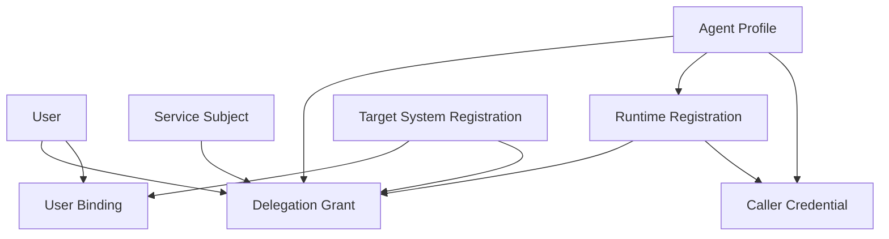
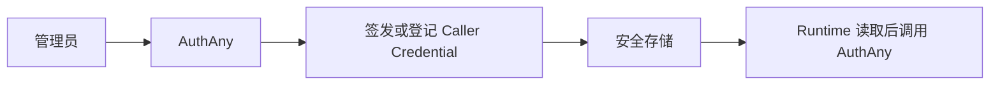
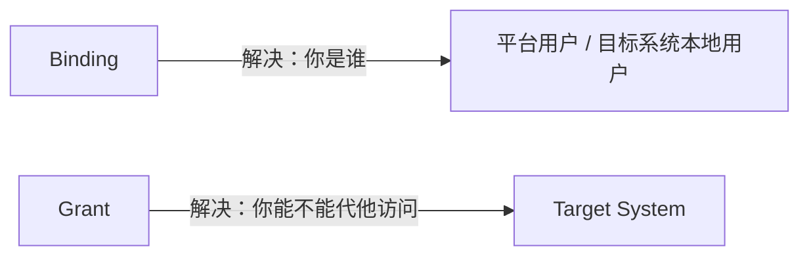

# 02 - 领域模型

> 本文档定义 AuthAny 的核心对象、职责边界和对象关系。

---

## 1. 文档目标

回答：

- 平台里有哪些核心对象
- 它们分别承担什么职责
- 它们之间如何关联

---

## 2. 核心对象总览

---

## 3. User

表示企业中的“人”。

职责：

- 平台统一身份主体
- OIDC `sub` 的基础来源
- delegation token 中最终被代表对象

不负责：

- 代替目标系统本地用户

关键字段建议：

- `user_id`
- `tenant_id`
- `username`
- `display_name`
- `email`
- `mobile`
- `status`

---

## 4. Identity Source

表示用户身份来源。

例如：

- local
- enterprise_sso
- ldap
- conversation_channel

职责：

- 标识用户身份来源类型
- 支撑多来源身份接入

---

## 5. OAuth Client

表示标准 OAuth 协议接入方。

适用场景：

- 标准 Web / App / Service 登录接入

职责：

- 参与标准 OAuth 协议
- 声明 grant type
- 持有 client 凭证

说明：

- 在 Agent delegation 场景中，它不是强制业务对象

---

## 6. Agent Profile

表示业务执行身份。

职责：

- 表达“谁在执行”
- 参与 delegation 场景
- 与用户、目标系统之间形成 grant 关系

关键字段建议：

- `agent_id`
- `agent_code`
- `name`
- `status`
- `trust_level`
- `description`

---

## 7. Caller Credential

表示 Agent Runtime 调用 AuthAny 时使用的机器凭证。

职责：

- 证明调用方就是这个 Agent
- 参与 delegation exchange 身份校验

可能形式：

- `agent_secret`
- API Key
- private key
- mTLS cert

---

## 8. Runtime Registration

表示一个具体 Runtime 在 AuthAny 中的注册信息和运行能力档案。

适用场景：

- OpenClaw 调 CLI
- 常驻 MCP Server
- 常驻内部 Worker
- 其他可长期或短期运行的 Tool Runtime

职责：

- 把 Runtime 从 Agent 中独立出来
- 声明 Runtime 是 `stateless` 还是 `stateful`
- 声明是否允许 delegation refresh
- 声明是否允许远程缓存复用

关键字段建议：

- `runtime_id`
- `agent_id`
- `runtime_type`
- `runtime_mode`
- `status`
- `allows_delegation_refresh`
- `allows_remote_cache_reuse`

说明：

- Runtime Registration 不是 Caller Credential
- 同一个 Agent 可以有多个 Runtime Registration
- 是否允许 delegation refresh，不能由 Runtime 自己声明，必须由平台注册配置决定

---

## 9. User Binding

表示用户与外部上下文或目标系统身份之间的绑定关系。

职责：

- 把外部上下文身份映射到平台用户或目标系统用户

关键字段建议：

- `provider`
- `subject_type`
- `subject_value`
- `platform_user_id`
- `target_system`
- `target_user_id`
- `status`

说明：

- Binding 是身份映射
- 不是授权关系

---

## 10. Delegation Grant

表示某个 Agent 是否允许代表某个主体访问某个目标系统。

职责：

- 表达企业授权关系
- 是 delegation token 签发的核心判断条件之一

关键字段建议：

- `agent_id`
- `subject_kind`
- `subject_id`
- `target_system`
- `grant_mode`
- `status`
- `expires_at`

说明：

- Grant 是授权关系
- 不是单纯身份映射
- `subject_kind` 至少支持 `user` 和 `service_subject`

---

## 11. Service Subject

表示没有最终用户参与时，平台认可的非人类执行主体。

适用场景：

- 定时任务
- 自动巡检
- 长期后台作业

职责：

- 在系统任务场景中作为 token 的最终 `sub`
- 与 Agent、Target System 形成正式授权关系

关键字段建议：

- `service_subject_id`
- `subject_code`
- `name`
- `status`
- `description`

说明：

- Service Subject 不是 Agent 本身
- Agent 表达“谁在执行”
- Service Subject 表达“这次请求最终代表哪个非人类主体”

---

## 12. Target System Registration

表示目标系统在 AuthAny 中的注册与信任配置。

职责：

- 让平台知道“这个目标系统是谁”
- 让平台知道给它签什么 audience
- 让平台知道它是否 active

关键字段建议：

- `target_system_code`
- `display_name`
- `audience`
- `status`
- `trust_config`

---

## 13. Audit Event

表示平台级审计事件。

职责：

- 记录认证、授权、委托、治理事件
- 支撑风控、审计、排障

---

## 14. Binding 与 Grant 的区别

一句话：

- Binding 回答“身份对应关系”
- Grant 回答“授权是否成立”
- Service Subject 场景通常只需要 Grant，不需要 User Binding

---

## 15. 关联文档

- [03-PROTOCOLS-AND-TOKENS.md](/Users/wrr/work/authany/specs/03-PROTOCOLS-AND-TOKENS.md)
- [04-STATE-MACHINES.md](/Users/wrr/work/authany/specs/04-STATE-MACHINES.md)
- [10-DATA-MODEL.md](/Users/wrr/work/authany/specs/10-DATA-MODEL.md)
