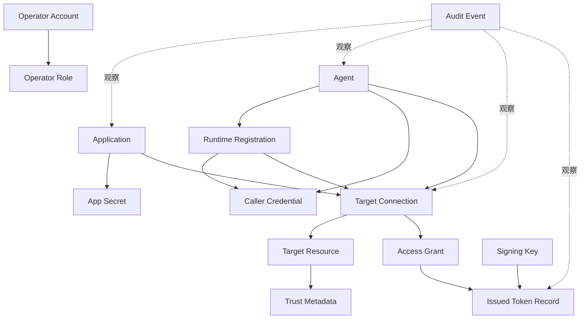

# 02 - 领域模型

> 本文档定义 AuthAny V1 在移除业务用户所有权后的领域模型。

---

## 1. 模型总览



---

## 2. Operator Account

Operator Account 表示管理 AuthAny 的人类管理员。

规则：

- Operator 只用于 AuthAny Admin UI 和 Admin API。
- Operator 不是业务用户。
- Operator ID 不能作为 Target Resource 的业务主体。

---

## 3. Application

Application 表示调用 AuthAny 的服务端软件客户端，必要时也可以参与 OAuth 风格协议流程。

职责：

- 持有系统生成的 App ID。
- 持有一个或多个 App Secret。
- 通过 Target Connection 连接 Target Resource。
- 在被允许时获取 application-level Target Token。
- App Secret 只能保存在服务端。
- 在 Target Token exchange 前构造 Requester JWT，或使用 OAuth 2.1 confidential client authentication。

Application token subject：

```text
sub = app:<app_id>
```

---

## 4. Agent

Agent 表示 AI 或自动化执行身份。

示例：

- OpenClaw finance agent
- Claude Code workspace agent
- MCP automation agent
- 内部搜索 agent

职责：

- 拥有 Runtime Registration。
- 拥有 Caller Credential。
- 通过 Target Connection 连接 Target Resource。
- 在被允许时获取 agent-level Target Token。

Agent token subject：

```text
sub = agent:<agent_id>
```

---

## 5. Runtime Registration

Runtime Registration 表示 Agent 在哪里运行。

示例：

- `openclaw-lark-prod`
- `claude-code-local`
- `mcp-finance-prod`

重要字段：

- `runtime_id`
- `agent_id`
- `runtime_type`
- `runtime_mode`: `stateless` 或 `stateful`
- `status`
- `allows_remote_cache_reuse`
- `allows_delegation_refresh`

规则：

- Runtime 只能属于一个 Agent。
- Runtime 策略由 AuthAny 配置，不能由调用方自声明。
- Stateless Runtime 不能启用 refresh 能力。

---

## 6. Caller Credential

Caller Credential 用于证明 Agent / Runtime 调用方身份。

规则：

- 只保存 hash 或公钥引用。
- 不发送给 Target Resource。
- 撤销后必须立即阻止新的 token exchange。
- 如果绑定到 Runtime，不能被其他 Runtime 使用。
- 用于产生或认证 Requester JWT。
- 不能发送给用户、聊天平台、浏览器、CLI stdout、URL 或普通日志。

---

## 7. Target Resource

Target Resource 是被访问的业务资源服务。

职责：

- 注册 `target_resource_code`。
- 注册期望的 token `audience`。
- 消费 AuthAny issuer 和 JWKS。
- 验证 token 签名、issuer、audience、过期时间和必要 claims。
- 执行最终本地授权。

AuthAny 不保存 Target Resource 角色或资源权限。

---

## 8. Target Connection

Target Connection 替代旧的、有歧义的 `Bindings` 概念。

含义：

```text
principal -> may connect to -> target resource
```

Principal 类型：

- `application`
- `agent`
- `runtime`

推荐字段：

- `connection_id`
- `principal_type`
- `principal_id`
- `target_resource`
- `status`
- `allowed_context_providers`
- `external_context_mode`: `none`、`optional`、`required`
- `max_token_ttl_seconds`

规则：

- Target Connection 是平台连接关系，不是业务用户绑定。
- 不能包含 `target_user_id`。
- 不能把 Lark、微信、Web 用户映射成业务用户。

---

## 9. Access Grant

Access Grant 对 Target Connection 进行授权。

推荐字段：

- `grant_id`
- `connection_id`
- `grant_type`: `target_access`
- `effect`: `allow`
- `status`
- `constraints_json`
- `expires_at`

规则：

- Access Grant 在 Target Connection active 后评估。
- Access Grant 可以约束 runtime mode、token TTL、external context provider 和环境。
- Access Grant 不能表达 `deal.approve`、`branch.finance.read` 这类业务资源权限。

---

## 10. External Context

External Context 是可选的签名透传数据。

示例：

```json
{
  "provider": "lark",
  "subject_type": "open_id",
  "subject_value": "ou_xxx",
  "message_id": "om_xxx",
  "conversation_id": "oc_xxx"
}
```

规则：

- AuthAny 校验形状和 provider 策略。
- AuthAny 把 context 签进 token。
- AuthAny 不把它映射为 AuthAny 用户。
- Target Resource 决定如何映射或拒绝。

---

## 11. 已移除概念

以下概念不属于 AuthAny Core：

- Business User
- User Binding
- Target User ID
- 最终用户授权门户
- `binding_required`
- `agent_on_behalf_of_user` 平台授权模式

如果 Target Resource 需要用户绑定，应该在本地拥有绑定表，或接入自己的企业 IdP。
