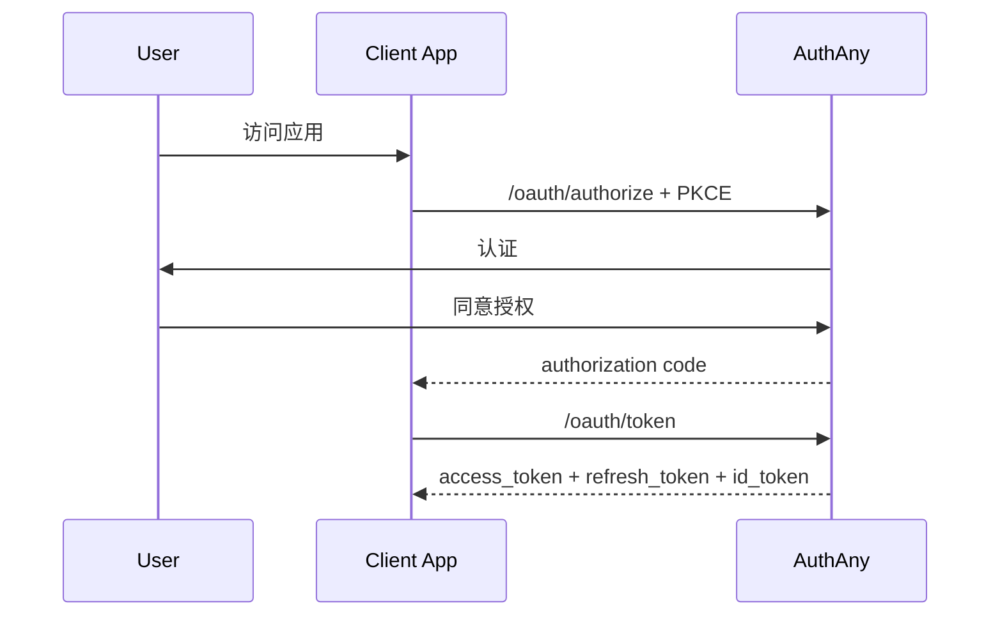
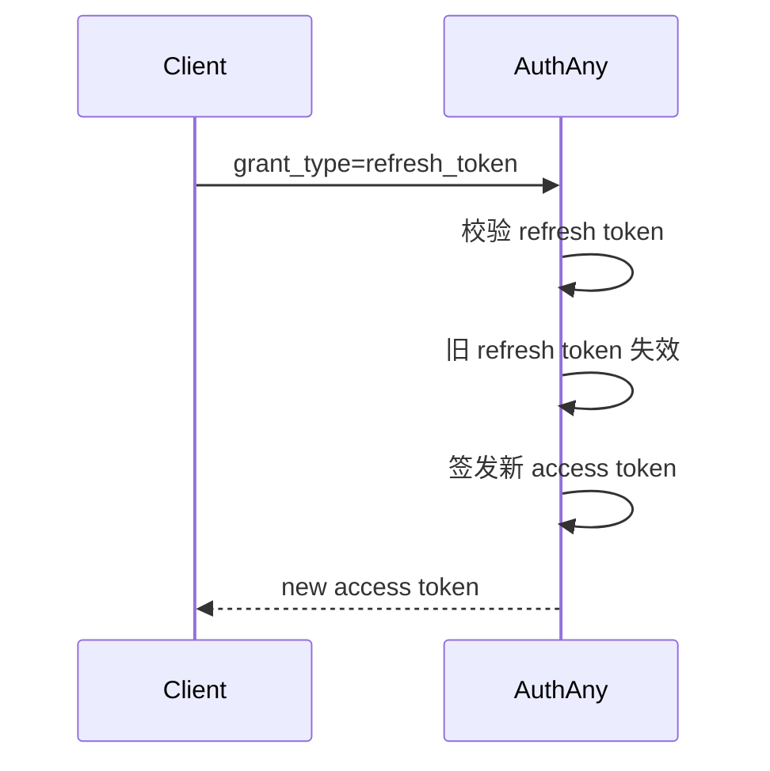
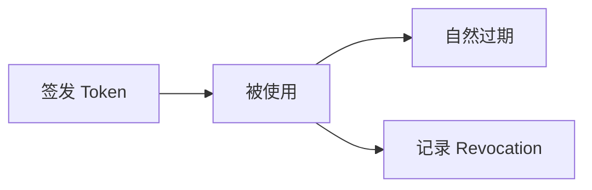
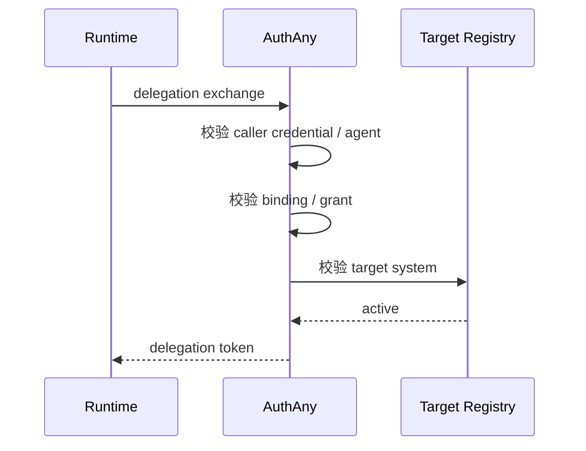
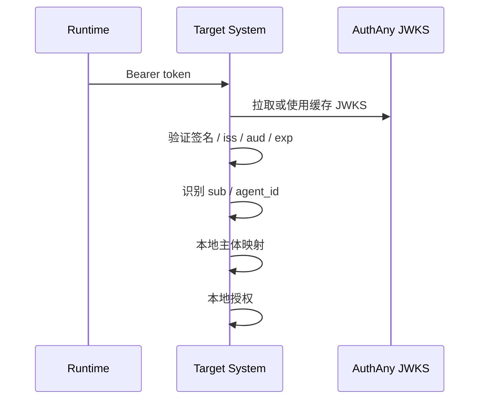

# 03 - 协议与 Token 设计

> 本文档定义 AuthAny 的 OAuth / OIDC 范围、delegation 协议、token 语义和 claim 约定。

---

## 1. 协议目标

AuthAny V1 同时服务两类场景：

1. 标准 Web / App 登录
2. Agent delegation

因此协议层分两块：

- 标准 OAuth 2.0 / OIDC
- 平台内部 delegation 协议

---

## 2. 标准协议范围

V1 必须支持：

- Authorization Code + PKCE
- Refresh Token
- Refresh Rotation
- Client Credentials
- Revocation
- Introspection
- JWKS
- OIDC Discovery
- UserInfo

V1 不支持：

- Implicit
- Password Grant
- Device Code

---

## 3. 标准登录流程



---

## 4. Token 类型

### 4.1 Access Token

用于标准 OAuth 访问。

### 4.2 Refresh Token

用于续期标准 OAuth access token。

正确语义：

- refresh 不是修改旧 token
- refresh 是签发新的 access token



### 4.3 ID Token

用于 OIDC 身份声明。

### 4.4 Delegation Access Token

用于 Agent 代表用户访问目标系统。

当前推荐策略：

- delegation token 默认不配套 refresh token
- 对于 OpenClaw、CLI 这类无状态 Runtime，按次 re-exchange 更合适
- 如果存在性能需求，可在远程缓存层缓存短期 delegation token
- token 失效后优先重新 exchange，不优先设计 delegation refresh
- 只有被注册为 `stateful` 的可信 Runtime，才允许申请 delegation refresh token

---

## 5. Token 不可变模型

Token 本体按不可变对象处理。

也就是说：

- token 只会被创建
- refresh 会签发新 token
- revoke 会记录提前失效事实
- 不更新 token 本体内容



---

## 6. Delegation Token 语义

delegation token 表达的是：

**平台确认某个 Agent 可以在当前上下文下代表某个用户访问某个目标系统。**

不表达：

- 该用户对具体业务资源的最终权限已被平台裁定

补充：

- 在系统任务场景中，delegation token 也可以表达“某个 Agent 以某个 Service Subject 身份访问目标系统”

---

## 7. 建议 Claim

### 7.1 人类用户场景

```json
{
  "iss": "https://authany.company.com",
  "sub": "user:1288912691548817920",
  "aud": "target_system_code",
  "azp": "client_runtime_prod",
  "jti": "uuid",
  "iat": 1760000000,
  "exp": 1760003600,
  "tenant_id": "default",
  "agent_id": "agent_finance_report_v2",
  "delegation_type": "agent_on_behalf_of_user",
  "source": "conversation_channel",
  "actor": {
    "type": "agent",
    "id": "agent_finance_report_v2"
  },
  "context": {
    "channel_user_id": "subject_xxx"
  }
}
```

### 7.2 系统任务场景

```json
{
  "iss": "https://authany.company.com",
  "sub": "service:nightly_report_runner",
  "aud": "target_system_code",
  "jti": "uuid",
  "iat": 1760000000,
  "exp": 1760001800,
  "agent_id": "agent_finance_report_v2",
  "delegation_type": "agent_as_service_subject",
  "actor": {
    "type": "agent",
    "id": "agent_finance_report_v2"
  }
}
```

---

## 8. Scope 原则

平台只管理：

- 协议 scope
- 粗粒度接入 scope

目标系统自己管理：

- 业务资源权限
- 业务 scope

例如：

- 平台：`openid`、`delegation`、`system:target_system`
- 目标系统：`deal:approve`、`finance.export`

---

## 9. Delegation Exchange



必须校验：

- caller credential
- agent
- binding 或 service subject
- grant
- target system
- replay

---

## 10. 目标系统消费 token



---

## 11. 关联文档

- [04-STATE-MACHINES.md](/Users/wrr/work/authany/specs/04-STATE-MACHINES.md)
- [09-API-CONTRACTS.md](/Users/wrr/work/authany/specs/09-API-CONTRACTS.md)
- [11-SECURITY-REQUIREMENTS.md](/Users/wrr/work/authany/specs/11-SECURITY-REQUIREMENTS.md)
