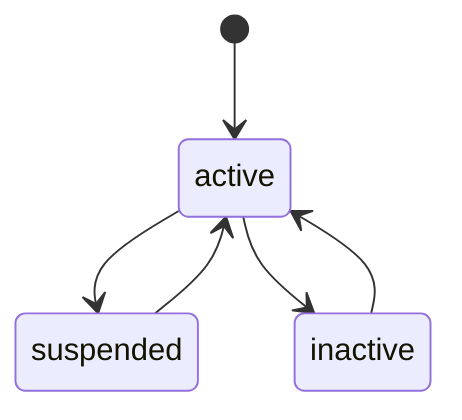
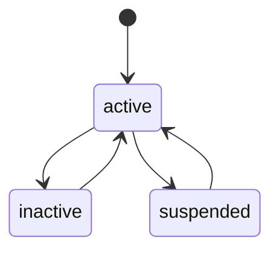
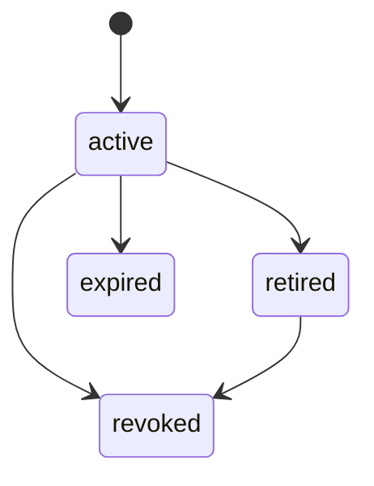
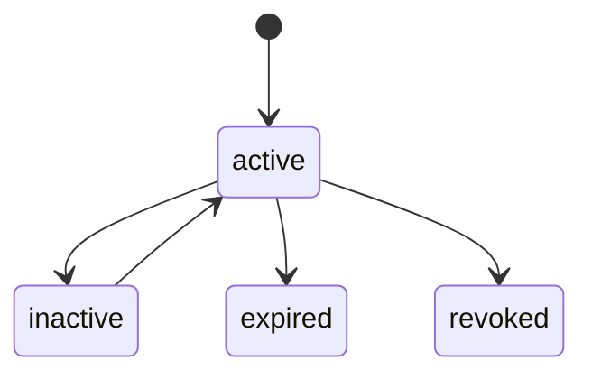
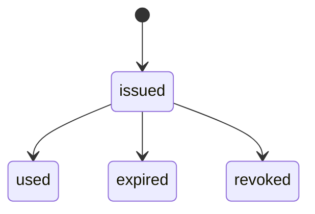
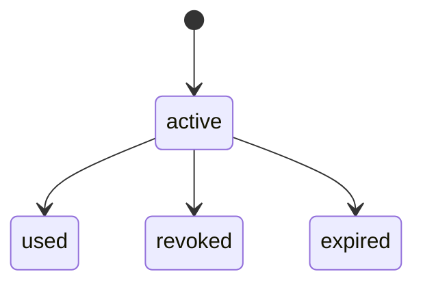
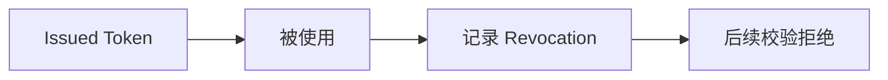

# 04 - 状态机

> 本文档定义 AuthAny 核心对象的状态流转、进入条件、退出条件和非法状态。

---

## 1. User

### 状态

- `active`
- `inactive`
- `suspended`

### 流转图

### 规则

- `suspended` 用户不可完成认证
- `inactive` 用户不可获得新 token

---

## 2. Agent Profile

### 状态

- `active`
- `inactive`
- `suspended`

规则：

- 非 `active` Agent 不可申请 delegation token

---

## 3. Caller Credential

### 状态

- `active`
- `retired`
- `revoked`
- `expired`

规则：

- `retired` 可用于轮换过渡窗口
- `revoked` 立即不可用

---

## 4. Runtime Registration

### 状态

- `active`
- `inactive`
- `suspended`

规则：

- 非 `active` Runtime Registration 不可参与 delegation exchange
- `stateless` Runtime 不可申请 delegation refresh
- `stateful` Runtime 是否允许 delegation refresh，仍需额外受平台配置控制

---

## 5. User Binding

### 状态

- `active`
- `inactive`
- `expired`
- `revoked`

规则：

- 非 `active` binding 不可参与 delegation 放行

---

## 6. Delegation Grant

### 状态

- `active`
- `inactive`
- `expired`
- `revoked`

规则：

- grant 解决的是授权关系，不是身份映射

---

## 7. Service Subject

### 状态

- `active`
- `inactive`
- `suspended`

规则：

- 非 `active` Service Subject 不可参与系统任务 token 签发

---

## 8. Authorization Code

### 状态

- `issued`
- `used`
- `expired`
- `revoked`

规则：

- code 一次性使用

---

## 9. Refresh Token

### 状态

- `active`
- `used`
- `revoked`
- `expired`

规则：

- refresh 触发 rotation 时，旧 refresh token 变为不可再用

---

## 10. Revocation 事件语义

Revocation 不是 token 状态更新的主模型，而是：

- 记录某个 token 已提前失效

---

## 11. 非法状态规则

- `suspended` user 不可获取新 token
- `revoked` credential 不可继续参与 delegation exchange
- `inactive/suspended` runtime registration 不可参与 delegation exchange
- `inactive/expired/revoked` binding 不可用于建立 delegation
- `inactive/expired/revoked` grant 不可用于放行 delegation
- `inactive/suspended` service subject 不可用于系统任务 delegation
