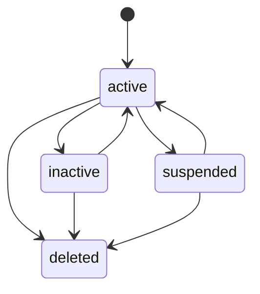
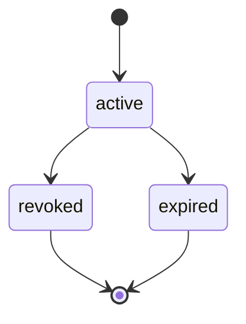
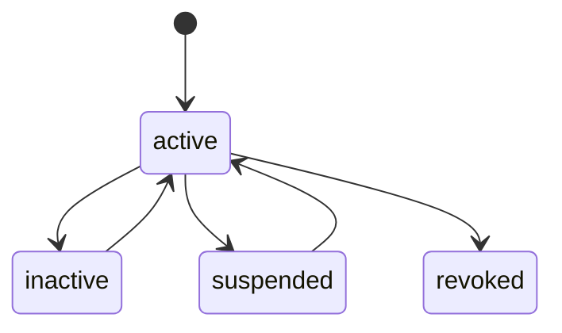
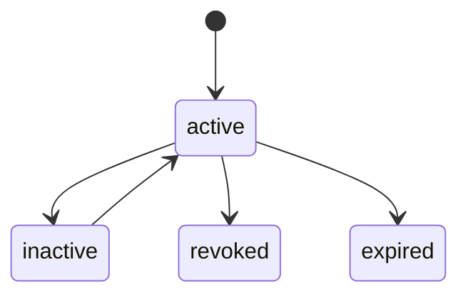

# 04 - 状态机

> 本文档定义 AuthAny 控制面实体的生命周期规则。

---

## 1. 通用状态

大多数治理实体使用以下状态：

规则：

- `active` 表示可用于新的 Token 签发。
- `inactive` 表示被管理员临时停用。
- `suspended` 表示因为风险控制被挂起。
- `deleted` 表示逻辑删除；关联 Secret 和 Credential 必须撤销。
- 逻辑删除不能物理清除审计所需的历史记录。

---

## 2. Application

阻断规则：

- `inactive`、`suspended` 或 `deleted` 的 Application 不能获取新的 Target Token。
- 删除 Application 必须撤销仍然有效的 App Secret。
- Application 历史 Token 记录和审计记录必须保留。

---

## 3. Agent

阻断规则：

- `inactive`、`suspended` 或 `deleted` 的 Agent 不能获取新的 Target Token。
- 删除 Agent 必须撤销仍然有效的 Caller Credential。
- Runtime、Target Connection 和审计记录在 Agent 删除后仍需可追溯。

---

## 4. Runtime Registration

Runtime 使用通用状态，`deleted` 可按产品需要启用。

规则：

- 非 `active` Runtime 不能参与 Token Exchange。
- `stateless` Runtime 不能启用 refresh 能力。
- Runtime 不能在不同 Agent 之间直接移动；需要重新注册。
- Runtime 状态不能绕过 Agent 状态校验。

---

## 5. Caller Credential / App Secret

规则：

- `revoked` 或 `expired` 的凭证不能用于新的 Token Exchange。
- Secret 明文只能按产品安全策略展示。
- 在撤销或过期前，系统必须保留足够的 hash 或加密材料用于校验和审计。
- 撤销是逻辑动作，不能删除审计链路。

---

## 6. Target Resource

规则：

- 非 `active` Target Resource 会阻断该目标系统的全部新 Token 签发。
- Target Resource 删除必须是逻辑删除，并保留审计历史。
- 密钥轮换不能改变 Target Resource 身份。

---

## 7. Target Connection

规则：

- 非 `active` Target Connection 会阻断 Token 签发。
- Target Connection 不能覆盖 Application、Agent、Runtime 或 Target Resource 的非活跃状态。
- `external_context` provider 策略来自当前有效的 Target Connection。
- `revoked` 连接不能重新启用，若需恢复应创建新的连接并留下审计。

---

## 8. Access Grant

规则：

- `revoked` 或 `expired` 的 Access Grant 不能在没有新审计事件的情况下恢复。
- Grant 过期后，下一次 exchange 重新校验时必须阻断缓存复用。
- V1 只支持 allow grant。
- Access Grant 不表达 Target Resource 的业务资源权限。

---

## 9. Issued Token

Issued Token 记录只追加，不覆盖。

规则：

- Token 可以处于 `active`、`expired` 或 `revoked`。
- Access Token 必须短期有效。
- 除高风险 API 要求 introspection 外，Target Resource 可以只依赖本地 JWT 验签和过期时间。

---

## 10. 验收标准

| ID | 要求 |
|----|------|
| SM-01 | 非活跃 Application、Agent、Runtime、Target Resource、Target Connection 或 Access Grant 会阻断新 Token 签发。 |
| SM-02 | 删除 Application 或 Agent 会撤销关联高敏凭证。 |
| SM-03 | 逻辑删除保留审计链路。 |
| SM-04 | Access Grant 过期或撤销后不能复用缓存 Token。 |
