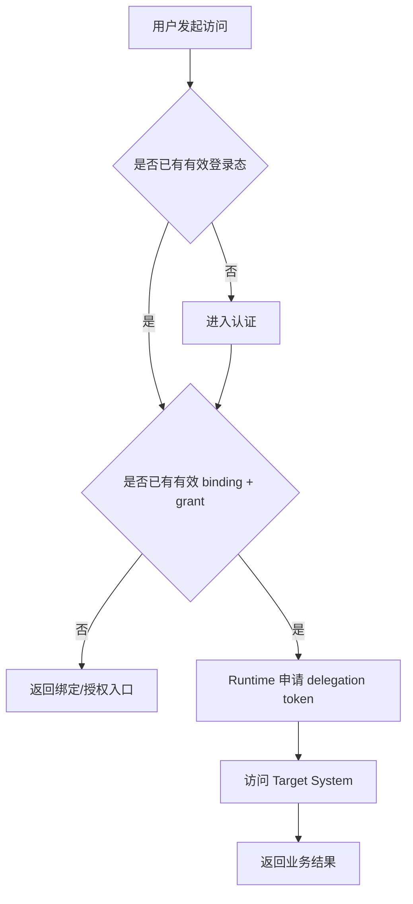
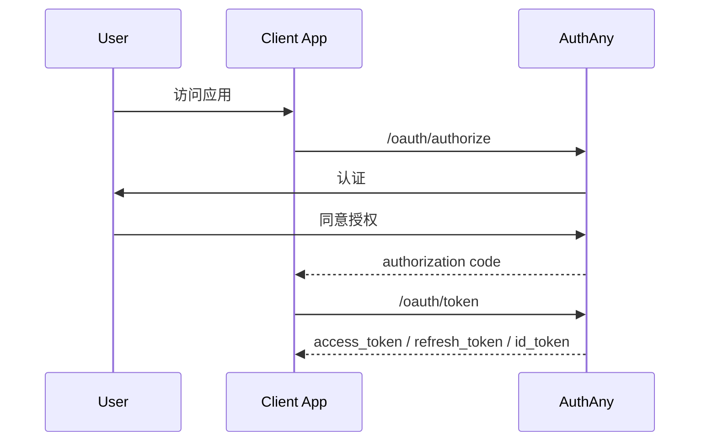
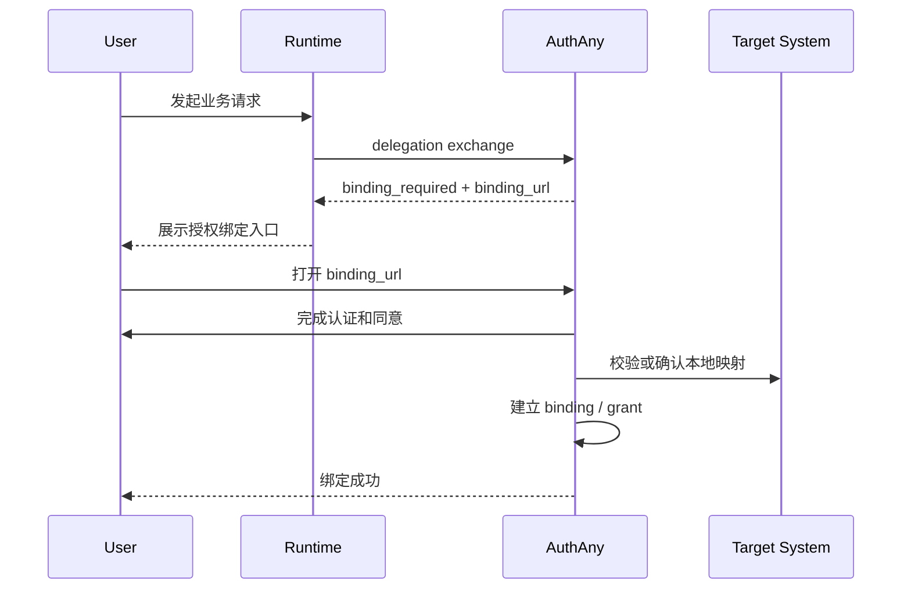
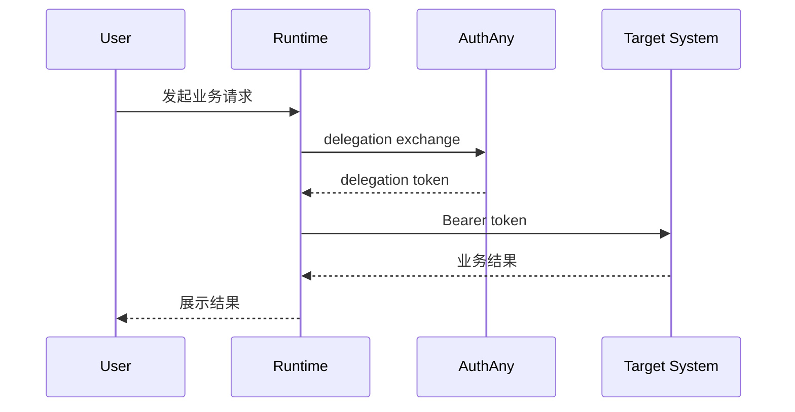
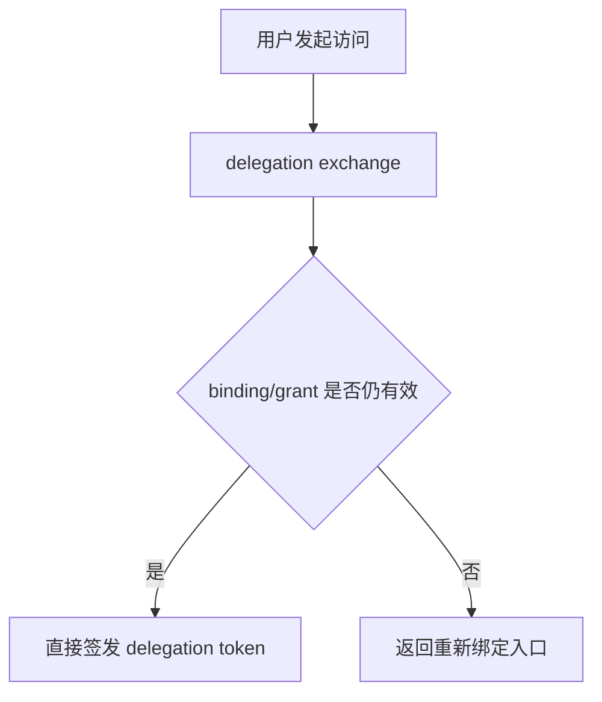

# 06 - 最终用户流程规格

> 本文档定义最终用户在 AuthAny V1 中会经历的认证、授权、绑定和异常处理流程。

---

## 1. 文档目标

回答：

- 用户第一次使用会发生什么
- 用户已经授权后再次使用会发生什么
- 用户什么时候会看到绑定入口
- 什么叫“重新授权”，什么情况下不应该反复弹授权

---

## 2. 用户流程边界

AuthAny 只负责以下用户级流程：

- 认证
- 授权同意
- 首次绑定
- 绑定失效后的重新绑定
- 查看基础授权状态

AuthAny 不负责：

- 业务系统内的功能教学
- 业务系统权限申请流
- 聊天平台自身的会话产品体验

---

## 3. 用户主流程总览

---

## 4. 标准登录流程

### 4.1 目标

让最终用户在 Web / App 中完成统一身份认证，并获得标准登录态。

### 4.2 输入

- 用户访问客户端应用
- 客户端跳转 AuthAny

### 4.3 输出

- 登录成功：返回标准 OAuth/OIDC token
- 登录失败：返回清晰错误或中断原因

### 4.4 规则

- 必须使用 Authorization Code + PKCE
- 必须校验 `state`
- 用户被挂起时，不允许继续登录

### 4.5 流程图

---

## 5. 首次绑定流程

### 5.1 适用场景

- 用户第一次通过 Agent 访问某个 Target System
- 平台尚无可用 binding
- 或者 binding 已失效

### 5.2 目标

让平台建立：

- 用户身份确认
- 用户与目标系统或外部上下文的 binding
- 可选的 delegation grant

### 5.3 关键原则

- 这叫“授权绑定”，不是每次都要重新登录
- 只要 binding 和 grant 仍有效，后续应直接走 delegation
- 不应把每次 token 过期都解释成“用户需要重新授权”
- 首次 binding 页面或入口属于 V1 P0，不允许只有口头说明而没有正式入口

### 5.4 流程图

### 5.5 失败路径

- 用户取消授权：binding 不建立
- 用户已登录但不满足目标系统接入条件：返回明确失败原因
- 目标系统映射失败：返回“需联系管理员”而不是无限重试

---

## 6. 已授权用户再次访问流程

### 6.1 目标

已完成绑定的用户再次访问时，不再重复打断用户做授权。

### 6.2 放行条件

必须同时满足：

- 用户状态有效
- Agent 状态有效
- caller credential 有效
- binding 有效
- grant 有效
- target system 有效

### 6.3 流程图

### 6.4 结果要求

- 用户不应感知到内部 token 交换细节
- 用户只看到业务结果或业务错误

---

## 7. 绑定失效后的重新授权

### 7.1 会触发重新绑定的情况

- binding 被撤销
- grant 被撤销
- 目标系统管理员要求重新确认身份
- 用户与目标系统的本地映射失效

### 7.2 不应触发重新绑定的情况

- 仅仅是短期 delegation token 过期
- Runtime 重启
- 客户端刷新页面

### 7.3 流程图

---

## 8. 用户自助查看状态

V1 建议至少提供只读能力：

- 当前是否已绑定
- 当前绑定到哪些目标系统
- 最近一次授权时间

V1 不强制要求完整“个人授权中心”页面，但模型必须支持后续扩展。

---

## 9. 用户登出与撤销的边界

### 9.1 用户登出

表示：

- 当前登录会话结束

不一定表示：

- 删除 binding
- 删除 grant

### 9.2 用户撤销授权

表示：

- 对某个 Target System 或某个 Agent 的委托关系被提前终止

结果：

- 后续 delegation exchange 应被拒绝

---

## 10. 多入口一致性

同一个最终用户可能来自：

- Web 页面
- 聊天平台
- CLI 包装界面
- 自研工作台

规则：

- 入口可以不同
- 用户统一身份不能分裂
- binding / grant 判定必须基于统一模型，而不是某个入口写死逻辑

---

## 11. 用户可见错误语义

对最终用户返回的信息应区分为三类：

| 类型 | 示例 | 返回原则 |
|------|------|----------|
| 需要操作 | `需要先完成授权绑定` | 给出明确入口 |
| 可恢复失败 | `授权会话已过期，请重试` | 允许用户再次发起 |
| 管理员介入 | `当前账号尚未开通目标系统访问权限` | 明确提示联系管理员 |

禁止把底层错误直接原样暴露给最终用户，例如：

- JWT 校验堆栈
- 数据库错误
- 内部路径信息

---

## 12. 验收标准

| 编号 | 验收项 | 通过标准 |
|------|--------|----------|
| EU-01 | 标准登录 | 用户可通过 Authorization Code + PKCE 完成登录 |
| EU-02 | 首次绑定 | 未绑定用户访问 Agent 能收到明确 binding 入口 |
| EU-03 | 绑定成功 | 用户完成一次授权绑定后，可直接再次访问而不重复授权 |
| EU-04 | 再次访问 | binding 与 grant 有效时，平台可直接签发 delegation token |
| EU-05 | 重新授权边界 | 仅当 binding 或 grant 失效时才要求重新绑定 |
| EU-06 | 错误反馈 | 用户能区分“需要授权”“需要重试”“需要联系管理员” |
| EU-07 | 登出边界 | 用户登出不会误删 binding 或 grant |
