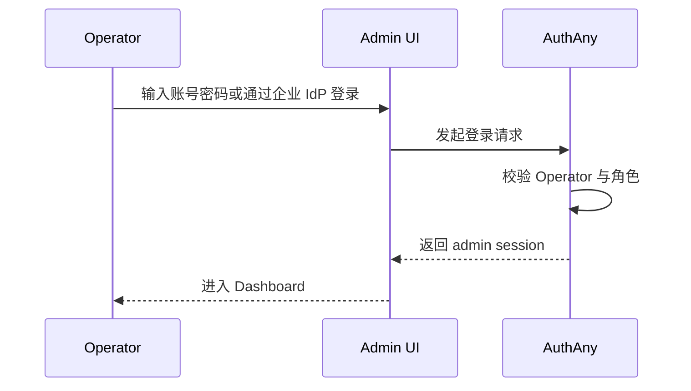
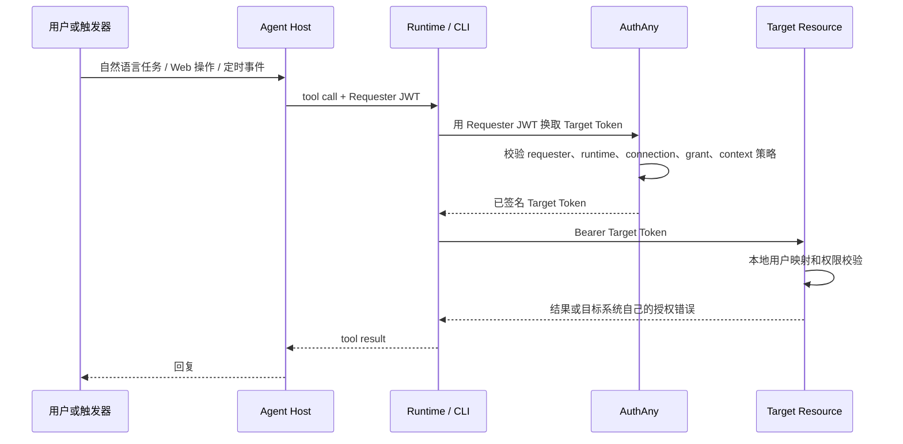

# 06 - 用户与 Operator 流程

> AuthAny V1 不拥有业务终端用户登录或绑定。本文只定义 Operator 管理登录，以及从用户/触发器到 Agent / CLI / Target Resource 的请求上下文透传。

---

## 1. Operator 登录

Operator 登录 AuthAny，用于管理控制面资源。



规则：

- Operator 身份只用于 AuthAny 管理。
- Operator 的 `sub` 不能作为 Target Resource 的业务主体。
- Admin session Token 必须校验管理角色。

---

## 2. 业务用户边界

业务用户可能出现在：

- Lark 消息。
- WeChat 消息。
- Web 应用 session。
- Target Resource 本地 session。
- CLI workspace。
- MCP tool call。
- Webhook event。
- Workflow task。
- IoT / Edge 设备事件。
- RPA / Browser 自动化任务。

AuthAny 的行为：

- 不创建业务用户。
- 不绑定外部用户 ID。
- 不要求业务用户在 AuthAny 授权目标系统访问。
- 不决定业务权限。

Target Resource 的行为：

- 拥有本地用户映射。
- 拥有本地授权登录或 consent 流程。
- 拥有本地资源授权。

如果 Lark 用户没有映射到 EBFX 账号，应该由 EBFX 返回 EBFX 自己的授权链接或业务拒绝结果。AuthAny 不返回 `binding_required`，也不托管 EBFX 授权页面。

---

## 3. AI Agent 入口上下文矩阵

AuthAny 必须支持 AI Agent 时代的多入口场景。很多不同入口都可能触发 Agent 获取 Target Resource 数据。

| 入口 | 谁发起 | Agent 拿到的上下文 | 例子 |
|------|--------|--------------------|------|
| Chat 平台 | 人 | `sender_id`、群/会话 ID、消息 ID | Lark、WeChat、Slack、Discord |
| Web 应用 | 人 | Web session、业务用户 ID | 企业门户、CRM、EBFX Portal |
| CLI | 人或脚本 | 本地用户、workspace、命令参数 | Claude Code、OpenCode、EBFX CLI |
| MCP Client | Agent / 工具客户端 | client identity、tool call context | Claude Desktop、Cursor、内部 Agent |
| 定时任务 | 系统 | job ID、trigger source | 每日财务报表、自动对账 |
| Webhook | 外部系统 | event ID、source system | GitHub、飞书审批、支付回调 |
| API 服务 | 后端服务 | `app_id`、service identity | 风控服务、BI 服务 |
| Workflow 编排器 | 流程系统 | workflow ID、step ID、operator | n8n、Temporal、Airflow |
| IoT / Edge | 设备 | device ID、site ID | 门店设备、采集终端 |
| RPA / Browser 自动化 | 自动化进程 | bot ID、task ID、operator | Selenium、Playwright、桌面机器人 |

统一规则：

```text
Entry Context -> Agent / Runtime -> Requester JWT -> AuthAny -> Target Token -> Target Resource
```

AuthAny 不能硬编码 Lark、OpenClaw、EBFX、CLI 或任何单一入口类型。入口上下文应被归一化为已签名的 `external_context` 或 requester metadata，并由 Target Connection 和 Access Grant 策略治理。

---

## 4. User -> Agent -> CLI -> Resource 流程



如果缺少本地映射，应由 Target Resource 返回可执行的业务错误。

规则：

- Runtime / CLI 不能把裸 `sender_id` 当成可信身份。
- 用户、Agent、Runtime 和 channel 上下文应在 Token Exchange 前签入 Requester JWT。
- AuthAny 将接受的 `external_context` 签入 Target Token。
- Target Resource 决定 `external_context` 是否映射到本地用户，以及是否具有资源权限。
- 入口特定字段必须先归一化为 provider-scoped context object，再进行签名。
- Secret 不能放入 `external_context`。

---

## 5. 验收标准

| ID | 要求 |
|----|------|
| UF-01 | Operator 可以登录并使用 Admin UI。 |
| UF-02 | AuthAny 不展示业务用户绑定页面。 |
| UF-03 | External context 可以通过签名 Token 从 Agent Host 透传到 Target Resource。 |
| UF-04 | 缺少业务用户映射时，由 Target Resource 处理，不由 AuthAny 处理。 |
| UF-05 | CLI 和工具 Runtime 可以在不向用户或聊天平台暴露 Secret 的情况下，用 Requester JWT 换取 Target Token。 |
| UF-06 | Chat、Web、CLI、MCP、Webhook、Workflow、Scheduler、IoT、RPA 入口上下文都能表达，不需要在 AuthAny Core 写产品特定逻辑。 |
