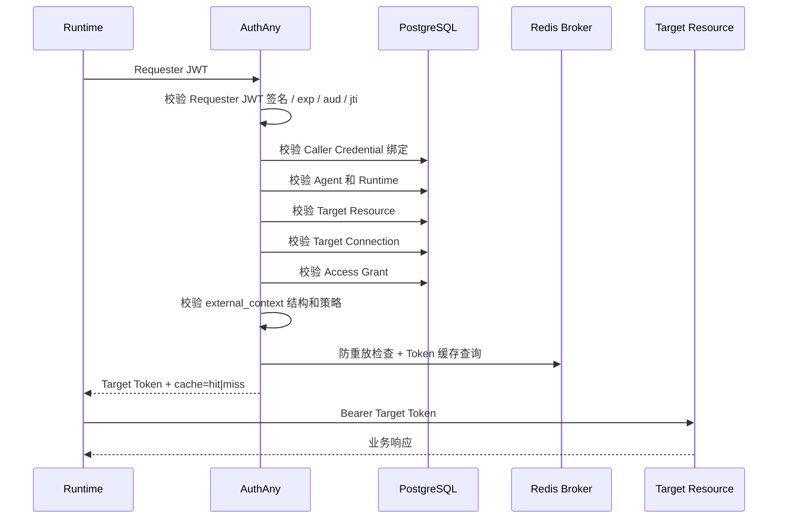

# 07 - Agent Runtime 接入

> 本文定义 OpenClaw、Claude Code、MCP Server、CLI 和企业内部自动化 Runtime 如何从 AuthAny 获取 Target Resource Token。

---

## 1. Runtime 职责

Runtime 必须：

- 知道自己属于哪个 Agent。
- 在安全运行配置中持有 Caller Credential。
- 构造或获取短期 Requester JWT，其中包含 `agent_id`、可选 `runtime_id`、`target_resource`、`request_id`，以及归一化后的 `external_context`。
- 请求 Target Token 时，将 Requester JWT 发送给 AuthAny。
- 拿到 Target Token 后立即调用 Target Resource。

Runtime 不能：

- 保存长期 Target Resource 用户 Token。
- 决定 Target Resource 的业务权限。
- 绑定聊天用户和 Target Resource 用户。
- 编造 Agent 身份或 Runtime 策略。
- 在没有已签名 requester context 的情况下信任裸 `sender_id`、`agent_id` 或 `runtime_id`。

---

## 2. Runtime 类型

| Runtime mode | 含义 | Token 行为 |
|--------------|------|------------|
| `stateless` | CLI、短生命周期 worker、OpenClaw exec 进程 | 每次操作请求 Token，或依赖 AuthAny Broker 远程缓存。 |
| `stateful` | MCP Server、gateway、长期运行服务 | 可以使用远程缓存复用；只有明确启用时才允许 refresh 能力。 |

Runtime mode 来自 Runtime Registration，不能由请求体临时指定。

---

## 3. Requester JWT

最小 Requester JWT claims：

```json
{
  "iss": "agent:agt_live_xxx",
  "sub": "agent:agt_live_xxx",
  "aud": "https://authany.company.com",
  "jti": "uuid",
  "iat": 1770000000,
  "exp": 1770000300,
  "agent_id": "agt_live_xxx",
  "runtime_id": "rt_openclaw_lark_prod",
  "target_resource": "ebfx",
  "request_id": "uuid"
}
```

携带 external context 示例：

```json
{
  "iss": "agent:agt_live_xxx",
  "sub": "agent:agt_live_xxx",
  "aud": "https://authany.company.com",
  "jti": "uuid",
  "iat": 1770000000,
  "exp": 1770000300,
  "agent_id": "agt_live_xxx",
  "runtime_id": "rt_openclaw_lark_prod",
  "target_resource": "ebfx",
  "request_id": "uuid",
  "external_context": {
    "provider": "lark",
    "subject_type": "open_id",
    "subject_value": "ou_xxx",
    "message_id": "om_xxx"
  }
}
```

Token endpoint 请求：

```http
POST /api/target-token
Authorization: Bearer <requester_jwt>
```

规则：

- Caller Credential 由可信 Runtime 使用，用于生成或认证 Requester JWT。
- Caller Credential 不能发送给聊天平台、用户、Target Resource，也不能出现在普通 CLI 输出中。
- Requester JWT 生命周期通常为 1-5 分钟。
- Requester JWT 必须绑定 `aud` 到 AuthAny。

---

## 4. Exchange 流程



---

## 5. External Context 处理

Runtime 可以从 Lark、WeChat、Web、CLI、MCP、Scheduler、Webhook、Workflow、IoT 或 RPA 透传 external context。

AuthAny 行为：

- 校验结构。
- 执行 provider allowlist。
- 执行大小限制。
- 将上下文签入 Token。
- 不绑定或解释业务用户。

Runtime 行为：

- 将每种入口归一化为 provider-scoped entry context object。
- 不能在 external context 中转发 Secret、refresh token 或不透明长期凭证。
- 尽可能保留稳定 ID，例如 `message_id`、`session_id`、`workflow_id`、`event_id`、`device_id` 或 `tool_call_id`。
- 增加 `provider`，方便 Target Resource 使用自己的映射规则。

Target Resource 行为：

- 决定外部身份是否已知。
- 必要时映射为本地用户。
- 应用本地业务权限。
- 返回业务系统自己的授权错误。

---

## 6. 错误处理

Runtime 必须处理：

| 错误 | 含义 | Runtime 行为 |
|------|------|--------------|
| `invalid_requester_jwt` | Requester JWT 缺失、无效、过期、受众错误，或不是可信请求方签发。 | 停止执行并告警 Operator。 |
| `invalid_caller_credential` | Caller Credential 绑定缺失、过期或已撤销。 | 停止执行并告警 Operator。 |
| `invalid_agent` | Agent 不存在或非活跃。 | 停止执行并告警 Operator。 |
| `invalid_runtime` | Runtime 非活跃，或不属于该 Agent。 | 停止执行并告警 Operator。 |
| `invalid_target_resource` | Target Resource 非活跃或未知。 | 停止执行并告警 Operator。 |
| `connection_not_allowed` | 没有有效 Target Connection。 | 提示管理员配置连接。 |
| `access_not_allowed` | 没有有效 Access Grant，或约束校验失败。 | 提示管理员配置 Grant。 |
| `invalid_external_context` | 上下文结构、provider 或大小被拒绝。 | 返回可执行的 channel 错误。 |
| `request_replayed` | 请求 ID 重复。 | 只有在业务安全时才使用新的 request ID 重试。 |

AuthAny Core 不存在 `binding_required` 错误。

---

## 7. 验收标准

| ID | 要求 |
|----|------|
| RT-01 | OpenClaw、Claude Code、MCP、CLI 和 HTTP gateway 可以使用同一套 Token 请求契约。 |
| RT-02 | `stateless` Runtime 可以不保存本地 Token 缓存。 |
| RT-03 | `stateful` Runtime 的能力来自 Runtime Registration。 |
| RT-04 | Caller Credential 永远不会到达 Target Resource。 |
| RT-05 | External context 可以被透传和签名，但 AuthAny 不做用户绑定。 |
| RT-06 | 禁用的 Agent、Runtime、Target Connection 或 Access Grant 会阻断 Token 签发。 |
| RT-07 | 裸 sender/user context 不能被信任，除非它包含在已签名的 Requester JWT 或等价可信断言中。 |
