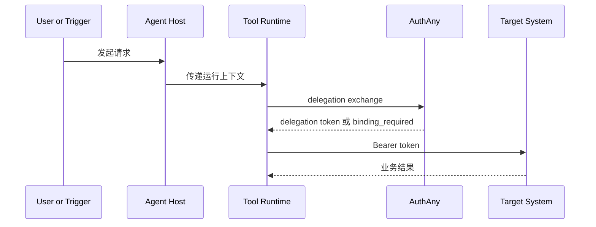
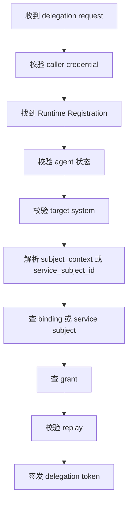

# 07 - Agent Runtime 接入规格

> 本文档定义任意 Agent Host / Tool Runtime 如何与 AuthAny 集成，以安全方式完成 delegation token 申请与目标系统访问。

---

## 1. 文档目标

回答：

- Agent Runtime 到底要传什么给 AuthAny
- AuthAny 怎么知道“谁在调用、代表谁、要访问谁”
- 人工触发、定时任务、系统任务有什么区别
- Runtime 本地可以存什么，不可以存什么

---

## 2. 适用对象

本文适用于所有运行时形态，包括但不限于：

- CLI
- MCP Server
- HTTP Gateway
- 内部 Worker
- Agent 平台插件

本文不绑定：

- OpenClaw
- Claude Code
- 任意特定聊天平台

---

## 3. Runtime 分类原则

AuthAny 不按“产品名”判断 Runtime 能力，而按注册能力判断。

正式分类：

- `stateless`
- `stateful`

### 3.1 `stateless` Runtime

特征：

- 一次性执行
- 无稳定受控存储
- 不适合持有 refresh token

典型示例：

- OpenClaw 调 CLI
- 临时 shell exec
- 单次 HTTP 调用适配器

### 3.2 `stateful` Runtime

特征：

- 长生命周期进程
- 具备受控服务端存储
- 可接受撤销、轮换、过期治理

典型示例：

- 常驻 MCP Server
- 常驻内部 Worker
- 企业内部长生命周期 Gateway

### 3.3 判定规则

- 是否为 `stateful`，不能由 Runtime 自报即生效
- 必须以 Runtime Registration 配置为准

---

## 4. 运行时职责边界

Runtime 负责：

- 识别自己属于哪个 Agent
- 持有 caller credential
- 组织 subject context
- 向 AuthAny 请求 delegation token
- 携带 delegation token 调用 Target System

Runtime 不负责：

- 保存最终用户的长期业务密码
- 自己决定某用户是否有访问目标系统的权限
- 自己伪造 binding 或 grant
- 自己伪造 service subject 身份

---

## 5. 运行时接入总图



---

## 6. Runtime 必须具备的输入

一次 delegation exchange 至少需要 4 类信息：

1. 调用主体
2. 被代表主体
3. 目标系统
4. 调用证明

对应到字段上，至少应有：

- `agent_id`
- `target_system`
- `subject_context`
- `caller_credential`

系统任务场景补充：

- `service_subject_id`

---

## 7. subject_context 模型

### 7.1 设计目的

AuthAny 不能假设“用户一定来自某个聊天平台”，因此 Runtime 只能传通用上下文模型。

### 7.2 最小结构

```json
{
  "source": "conversation_channel",
  "subject_type": "channel_user_id",
  "subject_value": "subject_xxx"
}
```

### 7.3 可扩展字段

- `session_id`
- `conversation_id`
- `message_id`
- `organization_hint`
- `metadata`

### 7.4 规则

- `subject_context` 是查找 binding 的输入
- `subject_context` 不是最终用户主身份本身
- 不同入口来源允许有不同 `subject_type`

---

## 8. 调用模式分类

### 8.1 模式 A：人类交互触发

示例：

- 聊天平台用户提问
- 页面里点按钮触发 Agent

特点：

- 有明确最终用户
- 应传 `subject_context`
- 成功后 token 的 `sub` 应落到最终用户

### 8.2 模式 B：系统调度触发

示例：

- 定时日报
- 自动巡检

特点：

- 可能没有明确最终用户
- 需要使用 Service Subject + grant 的正式授权模型
- 不应伪造一个不存在的人类 subject

### 8.3 模式 C：半人工半自动触发

示例：

- 某用户创建了一个长期自动化任务

特点：

- 初始创建时有人类主体
- 后续执行可能由系统调度触发
- 后续是否仍代表原用户，必须由 grant 模型显式定义

---

## 9. caller credential 处理规则

### 9.1 V1 允许的形式

- `agent_secret`
- `api_key`

### 9.2 存储要求

- 只允许存放在 Runtime 的安全配置中
- 不得硬编码进源码仓库
- 不得回显到普通日志

### 9.3 使用要求

- caller credential 仅用于 Runtime 向 AuthAny 证明“我是这个 Agent”
- caller credential 不应直接发给 Target System 当业务访问凭证

---

## 10. delegation exchange 请求要求

### 10.1 目标

Runtime 用自己的机器身份，向 AuthAny 请求一个短期 delegation token。

### 10.2 请求字段

V1 最小请求体：

```json
{
  "grant_type": "urn:authany:params:oauth:grant-type:delegation",
  "agent_id": "agent_finance_report_v2",
  "target_system": "ebfx",
  "subject_context": {
    "source": "conversation_channel",
    "subject_type": "channel_user_id",
    "subject_value": "subject_xxx"
  }
}
```

caller credential 建议通过：

- `Authorization` 头
- 或专用认证头

传递，而不是放到 JSON body 原文里。

系统任务场景最小请求体：

```json
{
  "grant_type": "urn:authany:params:oauth:grant-type:delegation",
  "agent_id": "agent_finance_report_v2",
  "target_system": "ebfx",
  "service_subject_id": "nightly_report_runner"
}
```

规则：

- 人类用户场景必须传 `subject_context`
- 系统任务场景必须传 `service_subject_id`
- 两者不得同时缺失

### 10.3 平台校验顺序



---

## 11. Runtime 对返回结果的处理

### 11.1 成功

Runtime 应：

- 只在内存中短暂持有 delegation token
- 立刻用它调用 Target System

### 11.2 `binding_required`

Runtime 应：

- 原样拿到 binding URL
- 通过合适入口返回给最终用户

### 11.3 其他失败

Runtime 应：

- 把可理解错误映射给上层
- 不泄露底层敏感配置

---

## 12. Runtime 本地缓存边界

### 12.1 允许缓存

- 短期 delegation token
- 短期 target metadata
- 短期 JWKS 元信息
- 远程缓存中的短期 delegation token

### 12.2 不允许缓存

- 最终用户长期业务密码
- AuthAny 私钥
- 业务系统长期用户 token

### 12.3 缓存规则

- delegation token 缓存仅用于减少重复换取
- 缓存命中不得绕过 revoke 或过期判断
- token 过期后应重新 exchange，而不是要求用户重新绑定
- 对 OpenClaw、CLI 这类无状态调用，推荐按次 exchange；是否命中远程缓存由服务端决定
- 当前推荐 V1 不为 delegation token 设计 refresh token
- 只有 Runtime Registration 标记为 `stateful` 且允许 delegation refresh 时，才可申请 delegation refresh token

---

## 13. Runtime Registration 规则

### 13.1 为什么需要单独注册

同一个 Agent 可能同时存在：

- 一个 `stateless` CLI Runtime
- 一个 `stateful` MCP Runtime

因此是否允许 delegation refresh，不能只挂在 Agent 上。

### 13.2 最小配置建议

```json
{
  "runtime_id": "runtime_mcp_finance_prod",
  "agent_id": "agent_finance_report_v2",
  "runtime_type": "mcp_server",
  "runtime_mode": "stateful",
  "allows_delegation_refresh": true,
  "allows_remote_cache_reuse": true
}
```

### 13.3 平台判定原则

- `stateless` Runtime：只允许短期 delegation access token
- `stateful` Runtime：可按平台配置决定是否允许 delegation refresh token

---

## 14. 与 Agent Host 的上下文边界

Agent Host 可以提供：

- 当前是哪个 Agent
- 当前会话或任务上下文
- 外部用户标识

Agent Host 不应直接决定：

- binding 是否成立
- grant 是否有效
- delegation token 内容

---

## 15. CLI / MCP / 服务适配差异

### CLI

- 常见于一次性命令执行
- 适合启动时读取 caller credential
- 更适合按次 exchange，而不是维护本地 refresh token

### MCP Server

- 常见于长连接或长生命周期进程
- 需要更重视内存缓存隔离和凭证热更新
- 如果被注册为 `stateful`，可以开放 delegation refresh

### 内部服务

- 常见于定时任务或系统集成
- 更适合 Service Subject + grant，而不是人类聊天上下文

结论：

- 运行形态不同
- 接入协议模型应保持一致

---

## 16. 不做的事

V1 Runtime 集成层不做：

- 把业务授权逻辑塞进 Runtime
- Runtime 自己存一套业务系统用户长期 token 仓库
- 为每个具体命令定义一套独立身份协议

---

## 17. 验收标准

| 编号 | 验收项 | 通过标准 |
|------|--------|----------|
| RT-01 | 通用接入 | CLI、MCP、HTTP Runtime 均可按统一字段发起 delegation exchange |
| RT-02 | 主体识别 | Runtime 能表达 `agent_id`、`target_system`，并按场景提交 `subject_context` 或 `service_subject_id` |
| RT-03 | Runtime 分类 | Runtime 能被注册为 `stateless` 或 `stateful`，且平台按此裁定 refresh 能力 |
| RT-04 | 凭证安全 | caller credential 不写入源码，不出现在普通日志 |
| RT-05 | 失败处理 | binding_required 能返回上层入口，其他错误能分类处理 |
| RT-06 | 缓存边界 | Runtime 只缓存短期 delegation token，不保存长期业务用户秘密 |
| RT-07 | 触发模式区分 | 人类触发和系统调度触发可使用不同主体模型，且不混淆 |
| RT-08 | Stateless 运行时策略 | OpenClaw/CLI 等无状态 Runtime 可按次 exchange 获取 delegation token |
| RT-09 | Stateful 准入 | 只有 Runtime Registration 明确允许时，stateful Runtime 才可使用 delegation refresh |
