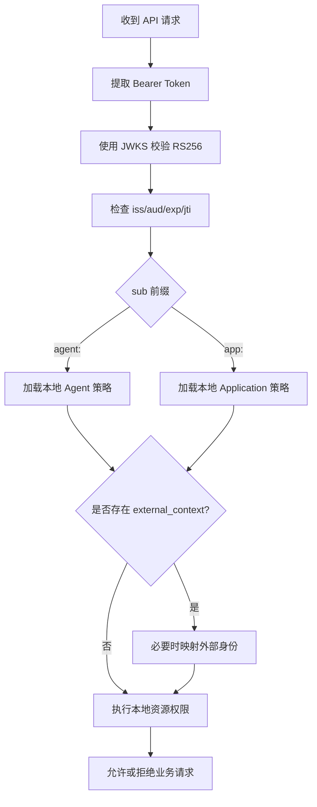

# 08 - Target Resource 接入

> Target Resource 信任 AuthAny 签发的 Token，但仍然保留自己的用户映射、角色、资源权限和业务授权。

---

## 1. Target Resource 职责

Target Resource 必须：

- 在 AuthAny 注册自身。
- 配置期望的 `audience`。
- 获取 AuthAny JWKS。
- 校验 JWT 签名、issuer、audience、过期时间和必需 claims。
- 将 `sub` 解释为 Application 或 Agent 身份。
- 可选解释 `external_context`。
- 执行本地业务授权。
- 拒绝只携带 App Secret、Caller Credential、裸 Agent ID、裸 Runtime ID 或裸 sender ID 的请求。

Target Resource 不能依赖 AuthAny 完成：

- 业务用户绑定。
- 本地角色分配。
- 资源级权限。
- 分支、dealer、部门或数据范围判断。
- Secret 校验。Secret 只用于向 AuthAny 证明身份，不能用于访问资源服务。

---

## 2. 信任配置

Target Resource 注册信息包含：

- `target_resource_code`
- `display_name`
- `audience`
- `token_validation_mode`
- `trust_config_json`
- `status`

AuthAny 对外提供：

- issuer。
- JWKS URI。
- 当前签名密钥 ID。
- 可选 introspection endpoint。

---

## 3. Token 校验

Target Resource 必须要求：

- `iss`
- `aud`
- `exp`
- `jti`
- `sub`
- `agent_id` 或 `app_id`
- `target_resource`

本地决策示例：



---

## 4. External Context

Target Resource 拥有 external context 的解释权。

示例：

- EBFX 将 `lark/open_id/ou_xxx` 映射到 EBFX 用户。
- CRM 将 `wechat/open_id/wx_xxx` 映射到 CRM 员工记录。
- 报表系统对每晚仅 Agent 触发的报表任务忽略 external context。

规则：

- 缺少或未知 external context 是 Target Resource 的业务决策。
- AuthAny 不能为 Target Resource 创建业务用户映射。
- Target Resource 应记录本地映射决策，便于审计。
- External context 是已签名输入，不等于业务授权证明。

---

## 5. 本地授权示例

AuthAny 只判断平台连接是否允许：

```text
agent finance-agent -> target ebfx
```

EBFX 自己判断：

```text
这个 Agent 是否可以读取 dashboard pending？
如果存在 external_context，它映射到哪个 EBFX 用户？
这个本地用户能否查看对应 branch 或 dealer 数据？
```

---

## 6. 验收标准

| ID | 要求 |
|----|------|
| TS-01 | Target Resource 可以通过 JWKS 校验 AuthAny RS256 Token。 |
| TS-02 | Target Resource 会拒绝错误 issuer、audience、过期 Token、缺失 subject 和缺失调用方身份的请求。 |
| TS-03 | Target Resource 可以区分 `agent:*` 和 `app:*` subject。 |
| TS-04 | Target Resource 可以接收已签名 `external_context`。 |
| TS-05 | Target Resource 保留本地用户映射和本地资源权限。 |
| TS-06 | AuthAny 不需要 Target Resource 用户表也能签发 Token。 |
| TS-07 | Target Resource 拒绝 Secret 和裸身份参数；资源访问必须使用 Bearer Target Token。 |
