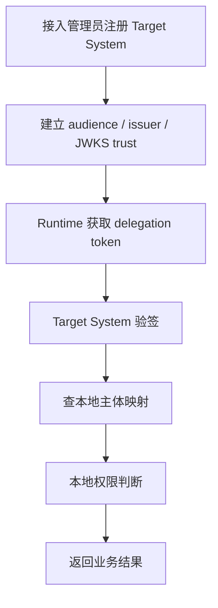
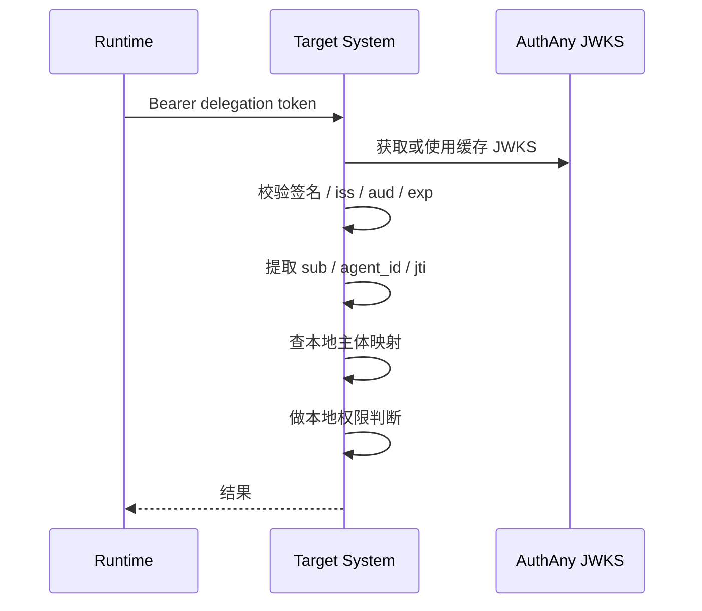

# 08 - Target System 接入规格

> 本文档定义任意目标系统如何与 AuthAny 建立信任、消费 token、完成本地映射和本地授权。

---

## 1. 文档目标

回答：

- Target System 到底怎么接进来
- 接入时需要在平台和目标系统两边分别做什么
- token 到了目标系统以后，谁负责验签，谁负责资源权限

---

## 2. Target System 定位

Target System 是：

- Resource Server
- 本地业务权限决策方
- 业务数据最终提供方

Target System 不是：

- AuthAny 的子模块
- 统一身份平台本身
- delegation grant 的最终签发方

---

## 3. 接入总原则

AuthAny 负责：

- 用户与 Agent 身份可信
- delegation token 可信
- 目标系统 trust 元数据可信

Target System 负责：

- JWT 验签
- 平台主体到本地主体映射
- 本地资源授权
- 本地业务审计

---

## 4. 接入总流程

---

## 5. 接入前置条件

在目标系统真正接受流量前，必须完成以下前置工作：

1. 获得 `target_system_code`
2. 获得 `audience`
3. 确认信任的 `issuer`
4. 确认 JWKS 地址或公钥获取方式
5. 明确本地主体映射策略
6. 明确本地权限模型仍由目标系统自己维护

---

## 6. 平台侧必须实现的接入动作

### 6.1 注册 Target System

必须记录：

- `target_system_code`
- `display_name`
- `audience`
- `status`
- `token_validation_mode`

### 6.2 配置 trust metadata

至少包括：

- `issuer`
- `jwks_uri`
- 签名算法约定

### 6.3 配置允许访问的 Agent 范围

平台需要知道：

- 哪些 Agent 可以请求以该系统为 `aud` 的 delegation token

---

## 7. 目标系统侧必须实现的接入动作

### 7.1 token 验签

必须校验：

- 签名
- `iss`
- `aud`
- `exp`
- `nbf` 如存在
- `kid`

### 7.2 主体识别

必须能识别：

- `sub`
- `agent_id` 或 `actor.id`
- `jti`

补充：

- `sub` 既可能是 `user:*`，也可能是 `service:*`

### 7.3 本地主体映射

至少要能把：

- 平台用户标识或服务主体标识

映射到：

- 目标系统本地用户或本地服务主体

### 7.4 本地授权

必须继续使用目标系统自己的：

- 角色模型
- 菜单权限
- 数据权限
- 业务流程权限

---

## 8. 推荐的本地映射策略

### 8.1 推荐模式

在目标系统维护一张平台主体映射表，例如：

- `platform_subject_kind`
- `platform_subject_id`
- `local_subject_id`
- `status`
- `last_verified_at`

### 8.2 不推荐模式

- 每次请求都临时创建本地用户
- 把平台 claim 直接当成业务权限

---

## 9. 目标系统消费 token 流程

---

## 10. 目标系统拒绝请求的场景

即使 AuthAny 已签发 delegation token，Target System 仍应在以下情况下拒绝：

- 本地主体映射缺失
- 本地 service subject 允许关系缺失
- 本地主体已停用
- 本地角色不允许访问目标资源
- 本地业务风控拒绝

这不是平台错误，而是目标系统自治的一部分。

---

## 11. 与 Introspection 的关系

V1 推荐默认模式：

- 本地 JWT 验签为主

Introspection 作为补充能力，可用于：

- 高敏感资源二次校验
- 调试或过渡期接入

不建议把每次请求都强依赖在线 introspection，否则会放大平台耦合和延迟。

---

## 12. 与绑定、grant 的边界

Target System 不负责主判定：

- binding 是否存在
- delegation grant 是否成立

这些在平台侧完成。

Target System 负责判定：

- 本地主体是否存在
- 本地资源是否允许当前主体访问

---

## 13. 接入失败路径

### 13.1 注册阶段失败

- `target_system_code` 冲突
- `audience` 配置错误
- trust metadata 不完整

### 13.2 运行时失败

- JWT 验签失败
- `aud` 不匹配
- 本地主体映射缺失
- 本地授权失败

### 13.3 处理原则

- 平台配置错误，应由接入管理员处理
- 本地映射和本地权限错误，应由目标系统管理员处理

---

## 14. 接入清单

目标系统上线前，必须完成以下 checklist：

| 项目 | 必须完成 |
|------|----------|
| 已在 AuthAny 注册 Target System | 是 |
| 已确认 audience | 是 |
| 已确认 issuer | 是 |
| 已接入 JWKS | 是 |
| 已实现 token 验签 | 是 |
| 已实现平台主体到本地主体映射 | 是 |
| 已明确本地权限规则不迁移到平台 | 是 |
| 已完成联调与异常场景验证 | 是 |

---

## 15. 不做的事

V1 不要求目标系统：

- 把菜单权限迁到 AuthAny
- 把数据权限迁到 AuthAny
- 实现平台专属 SDK 才能接入

---

## 16. 验收标准

| 编号 | 验收项 | 通过标准 |
|------|--------|----------|
| TS-01 | 注册接入 | 可完成 Target System 注册并形成 trust 配置 |
| TS-02 | 验签能力 | 目标系统可校验签名、iss、aud、exp、kid |
| TS-03 | 主体识别 | 目标系统可识别 `sub` 和 `agent_id` |
| TS-04 | 本地映射 | 目标系统可将平台用户或服务主体映射为本地主体 |
| TS-05 | 本地授权自治 | 目标系统仍使用自己的权限体系裁定资源访问 |
| TS-06 | 异常处理 | 无映射、无权限、aud 错误等场景可明确拒绝 |
