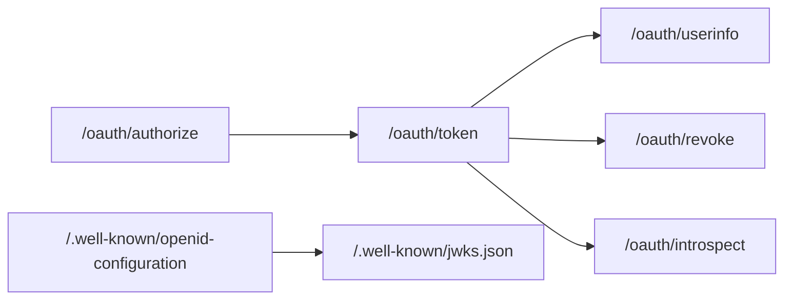
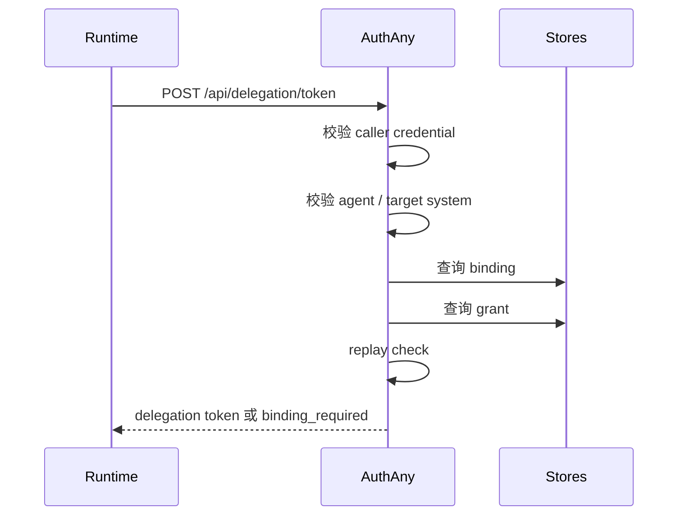

# 09 - API 契约

> 本文档定义 AuthAny V1 需要提供的协议 API、delegation API 和管理 API 的契约边界、输入输出和错误语义。

---

## 1. 文档目标

回答：

- AuthAny V1 至少需要哪些接口
- 每类接口面向谁
- 哪些字段是正式契约
- 哪些错误语义必须稳定

不回答：

- 每个框架的 controller 怎么写
- 每个字段最终数据库列名

---

## 2. API 分类

AuthAny V1 的接口分三层：

1. 标准协议 API
2. delegation API
3. 管理 API


---

## 3. 通用接口约定

### 3.1 响应格式

标准 OAuth/OIDC 端点遵循对应协议格式。

平台自定义 API 建议统一返回：

```json
{
  "code": "ok",
  "message": "success",
  "data": {}
}
```

失败时建议返回：

```json
{
  "code": "binding_required",
  "message": "User binding is required before delegation can be issued.",
  "data": {
    "binding_url": "https://authany.company.com/bind/xxx"
  },
  "request_id": "req_xxx"
}
```

### 3.2 安全要求

- 所有写接口必须走 HTTPS
- 所有管理接口必须要求管理身份
- 所有高危写接口必须审计

### 3.3 幂等性要求

- 创建类接口如需支持重试，应支持幂等键或唯一业务键
- revoke 类接口重复调用应返回可接受的幂等结果

---

## 4. 标准协议 API



### 4.1 必须提供的端点

- `GET /.well-known/openid-configuration`
- `GET /.well-known/jwks.json`
- `GET /oauth/authorize`
- `POST /oauth/token`
- `POST /oauth/revoke`
- `POST /oauth/introspect`
- `GET /oauth/userinfo`

### 4.2 `/oauth/authorize`

用途：

- 标准 Authorization Code + PKCE 登录入口

必须支持：

- `response_type=code`
- `client_id`
- `redirect_uri`
- `scope`
- `state`
- `code_challenge`
- `code_challenge_method`

规则：

- `redirect_uri` 必须严格匹配
- `state` 必须原样回传
- authorization code 必须一次性使用

### 4.3 `/oauth/token`

V1 必须支持的 `grant_type`：

- `authorization_code`
- `refresh_token`
- `client_credentials`

V1 不支持：

- `password`
- `implicit`

规则：

- refresh 必须遵循 rotation 语义
- 刷新成功应签发新 token，而不是更新旧 token

### 4.4 `/oauth/revoke`

用途：

- 提前结束 access token 或 refresh token 的可用性

规则：

- revoke 是记录提前失效，不是删除 token 记录
- 重复 revoke 不应报错为系统异常

### 4.5 `/oauth/introspect`

用途：

- 提供在线 token 有效性查询能力

说明：

- V1 支持该接口
- 但 Target System 默认不应强依赖每次请求都走 introspection

---

## 5. delegation API

### 5.1 设计定位

这是 AuthAny V1 最重要的扩展能力。

它用于：

- Agent Runtime 用自己的机器身份
- 代表某个最终用户或 Service Subject
- 访问某个指定 Target System

### 5.2 建议端点

- `POST /api/delegation/token`

### 5.3 请求认证方式

caller credential 建议通过以下方式之一传递：

- `Authorization: Bearer <caller-credential>`
- `Authorization: Basic ...`
- 专用认证头

不建议把原始 caller credential 明文放进 JSON body。

### 5.4 最小请求体

```json
{
  "grant_type": "urn:authany:params:oauth:grant-type:delegation",
  "agent_id": "agent_finance_report_v2",
  "target_system": "ebfx",
  "subject_context": {
    "source": "conversation_channel",
    "subject_type": "channel_user_id",
    "subject_value": "subject_xxx"
  }
}
```

### 5.5 可选扩展字段

- `request_id`
- `session_id`
- `conversation_id`
- `metadata`
- `service_subject_id`

规则：

- 人类用户场景：必须传 `subject_context`
- 系统任务场景：必须传 `service_subject_id`
- 同一请求至少要能确定一个最终 subject

### 5.6 处理流程



### 5.7 成功响应

```json
{
  "access_token": "jwt",
  "token_type": "Bearer",
  "expires_in": 3600,
  "issued_token_type": "urn:ietf:params:oauth:token-type:access_token"
}
```

### 5.8 绑定缺失响应

```json
{
  "error": "binding_required",
  "error_description": "User binding is required before delegation can be issued.",
  "binding_url": "https://authany.company.com/bind/xxx"
}
```

### 5.9 失败错误码

| 场景 | HTTP | 错误码 | 说明 |
|------|------|--------|------|
| 调用凭证无效 | 401 | `invalid_caller_credential` | caller credential 不存在、过期或被撤销 |
| runtime 无效 | 403 | `invalid_runtime` | runtime registration 不存在、停用或与 caller credential 不匹配 |
| agent 无效 | 403 | `invalid_agent` | agent 不存在或非 active |
| service subject 无效 | 403 | `invalid_service_subject` | service subject 不存在或非 active |
| target system 无效 | 403 | `invalid_target_system` | target system 不存在、停用或不允许 |
| binding 不存在 | 403 | `binding_required` | 用户需要先完成授权绑定 |
| grant 不存在 | 403 | `delegation_not_allowed` | 已识别用户，但该 agent 不被允许代其访问 |
| 请求重放 | 401 | `request_replayed` | request_id 或幂等因子被重复使用 |
| subject 不合法 | 400 | `invalid_subject_context` | 上下文字段缺失或格式错误 |

### 5.10 规则

- 成功响应必须是短期 token
- `binding_required` 必须带用户可操作入口
- 失败响应必须可区分“用户要操作”和“管理员要处理”

---

## 6. 管理 API

V1 建议统一放在：

- `/api/admin/*`

是否采用这个路径前缀不是强制，但能力集合是强制的。

### 6.1 用户管理 API

最少需要：

- `GET /api/admin/users`
- `GET /api/admin/users/:id`
- `POST /api/admin/users`
- `PATCH /api/admin/users/:id`

### 6.2 身份源管理 API

最少需要：

- `GET /api/admin/identity-sources`
- `POST /api/admin/identity-sources`
- `PATCH /api/admin/identity-sources/:id`

### 6.3 OAuth Client 管理 API

最少需要：

- `GET /api/admin/oauth-clients`
- `POST /api/admin/oauth-clients`
- `PATCH /api/admin/oauth-clients/:id`
- `POST /api/admin/oauth-clients/:id/secrets`
- `POST /api/admin/oauth-clients/:id/secrets/:secretId/revoke`

### 6.4 Agent 管理 API

最少需要：

- `GET /api/admin/agents`
- `POST /api/admin/agents`
- `PATCH /api/admin/agents/:id`

### 6.5 Caller Credential 管理 API

最少需要：

- `GET /api/admin/agents/:id/credentials`
- `POST /api/admin/agents/:id/credentials`
- `POST /api/admin/credentials/:id/revoke`

### 6.6 Service Subject 管理 API

最少需要：

- `GET /api/admin/service-subjects`
- `POST /api/admin/service-subjects`
- `PATCH /api/admin/service-subjects/:id`

### 6.7 Runtime Registration 管理 API

最少需要：

- `GET /api/admin/runtimes`
- `POST /api/admin/runtimes`
- `PATCH /api/admin/runtimes/:id`

### 6.8 Target System 管理 API

最少需要：

- `GET /api/admin/target-systems`
- `POST /api/admin/target-systems`
- `PATCH /api/admin/target-systems/:id`

### 6.9 Binding 管理 API

最少需要：

- `GET /api/admin/bindings`
- `POST /api/admin/bindings`
- `PATCH /api/admin/bindings/:id`

### 6.10 Grant 管理 API

最少需要：

- `GET /api/admin/grants`
- `POST /api/admin/grants`
- `PATCH /api/admin/grants/:id`

### 6.11 审计 API

最少需要：

- `GET /api/admin/audit-events`
- 支持按时间、user、agent、target_system、event_type 检索

---

## 7. API 版本策略

V1 必须明确一条版本策略：

- 路径版本化
- 头版本化
- 或平台级稳定版本约定

当前推荐：

- 对管理 API 使用路径版本化，例如 `/api/v1/admin/...`

标准 OAuth/OIDC 端点通常不额外加版本路径。

---

## 8. 不做的事

V1 API 契约层不做：

- 业务系统细粒度权限接口
- 为某个特定聊天平台单独发明主协议
- 为每个命令定义一套不同 delegation 协议

---

## 9. 验收标准

| 编号 | 验收项 | 通过标准 |
|------|--------|----------|
| API-01 | 标准协议端点 | Discovery、JWKS、authorize、token、revoke、introspect、userinfo 全部存在 |
| API-02 | Delegation 端点 | Runtime 可通过统一接口申请 delegation token |
| API-03 | 错误语义 | `binding_required`、`invalid_caller_credential`、`delegation_not_allowed` 等错误语义稳定 |
| API-04 | 管理能力 | 用户、Agent、Credential、Target System、Binding、Grant、Audit 具备最小管理 API |
| API-05 | 契约边界 | API 不承载业务系统细粒度权限配置语义 |
