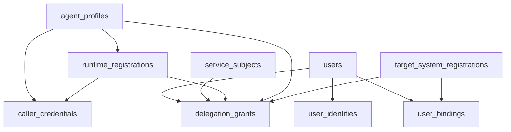
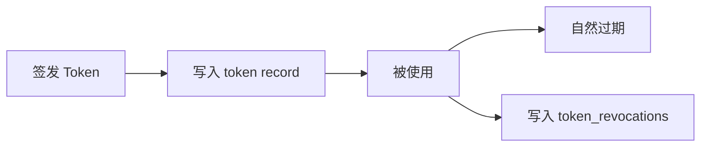

# 10 - 数据模型

> 本文档定义 AuthAny V1 的数据存储边界、核心实体、唯一约束、索引、保留策略和不允许的建模方式。

---

## 1. 文档目标

回答：

- 平台最少要存哪些数据
- 哪些实体是核心实体
- 唯一约束和索引应该怎么定
- 什么样的建模方式会把平台带偏

---

## 2. 设计原则

### 2.1 核心模型必须通用

平台数据模型不能绑定特定产品或业务系统。

禁止核心表直接写成：

- `lark_bindings`
- `openclaw_agents`
- `ebfx_tokens`

### 2.2 token 按不可变对象建模

token 记录表达的是“签发事实”，不是“当前状态可随便改的会话对象”。

### 2.3 身份映射与授权关系必须分离

- binding 是身份映射
- grant 是授权关系

不能混成一张语义模糊的大表。

---

## 3. 核心实体表

V1 至少需要以下实体：

### 3.1 用户与身份

- `users`
- `identity_sources`
- `user_identities`

### 3.2 标准 OAuth / OIDC

- `oauth_clients`
- `oauth_client_secrets`
- `oauth_redirect_uris`
- `oauth_authorization_codes`
- `oauth_access_token_records`
- `oauth_refresh_tokens`
- `token_revocations`

### 3.3 Agent / delegation

- `agent_profiles`
- `runtime_registrations`
- `service_subjects`
- `caller_credentials`
- `user_bindings`
- `delegation_grants`

### 3.4 Target System / 运维治理

- `target_system_registrations`
- `audit_events`
- `key_rotation_records`

---

## 4. 核心实体说明

### 4.1 `users`

表示平台统一用户。

最小字段建议：

- `id`
- `tenant_id`
- `username`
- `display_name`
- `email`
- `mobile`
- `status`
- `primary_identity_source`
- `created_at`
- `updated_at`

### 4.2 `identity_sources`

表示身份源配置。

最小字段建议：

- `id`
- `tenant_id`
- `source_code`
- `source_type`
- `status`
- `config_json`

### 4.3 `user_identities`

表示用户与外部身份之间的映射。

最小字段建议：

- `id`
- `tenant_id`
- `user_id`
- `source_id`
- `subject_type`
- `subject_value`
- `status`
- `metadata_json`

### 4.4 `oauth_clients`

表示标准 OAuth 客户端。

最小字段建议：

- `id`
- `tenant_id`
- `client_id`
- `client_type`
- `name`
- `status`
- `allowed_grant_types`
- `allowed_scopes`
- `owner_type`
- `owner_id`

### 4.5 `oauth_client_secrets`

表示 client secret 生命周期。

最小字段建议：

- `id`
- `tenant_id`
- `client_id`
- `secret_hash`
- `status`
- `issued_at`
- `expires_at`
- `revoked_at`

### 4.6 `oauth_authorization_codes`

表示授权码。

最小字段建议：

- `id`
- `tenant_id`
- `client_id`
- `user_id`
- `redirect_uri`
- `scope`
- `code_challenge`
- `code_challenge_method`
- `status`
- `expires_at`

### 4.7 `oauth_access_token_records`

表示 access token 的签发记录。

最小字段建议：

- `id`
- `tenant_id`
- `jti`
- `token_type`
- `subject_type`
- `subject_id`
- `client_id`
- `audience`
- `scope`
- `issued_at`
- `expires_at`

### 4.8 `oauth_refresh_tokens`

表示 refresh token 的签发记录。

最小字段建议：

- `id`
- `tenant_id`
- `jti`
- `client_id`
- `user_id`
- `status`
- `issued_at`
- `expires_at`
- `replaced_by_token_id`

### 4.9 `token_revocations`

表示提前失效事实。

最小字段建议：

- `id`
- `tenant_id`
- `token_jti`
- `token_type`
- `reason`
- `revoked_at`

### 4.10 `agent_profiles`

表示 Agent 主体。

最小字段建议：

- `id`
- `tenant_id`
- `agent_id`
- `agent_code`
- `name`
- `status`
- `trust_level`
- `description`

### 4.11 `caller_credentials`

表示 Runtime 调 AuthAny 的机器凭证。

最小字段建议：

- `id`
- `tenant_id`
- `agent_id`
- `credential_type`
- `credential_hint`
- `secret_hash_or_public_key_ref`
- `status`
- `issued_at`
- `expires_at`

### 4.12 `runtime_registrations`

表示一个具体 Runtime 的注册信息和能力档案。

最小字段建议：

- `id`
- `tenant_id`
- `runtime_id`
- `agent_id`
- `runtime_type`
- `runtime_mode`
- `status`
- `credential_delivery_mode`
- `allows_delegation_refresh`
- `allows_remote_cache_reuse`
- `created_at`
- `updated_at`

### 4.13 `service_subjects`

表示系统任务使用的非人类主体。

最小字段建议：

- `id`
- `tenant_id`
- `service_subject_id`
- `subject_code`
- `name`
- `status`
- `description`
- `created_at`
- `updated_at`

### 4.14 `user_bindings`

表示身份映射关系。

最小字段建议：

- `id`
- `tenant_id`
- `provider`
- `subject_type`
- `subject_value`
- `platform_user_id`
- `target_system`
- `target_user_id`
- `status`
- `source_type`
- `created_at`
- `expires_at`

### 4.15 `delegation_grants`

表示授权关系。

最小字段建议：

- `id`
- `tenant_id`
- `agent_id`
- `subject_kind`
- `subject_id`
- `target_system`
- `grant_mode`
- `status`
- `created_at`
- `expires_at`

说明：

- `subject_kind` 至少支持 `user` 和 `service_subject`
- 人类用户场景下，`subject_id` 指向平台用户
- 系统任务场景下，`subject_id` 指向 service subject

### 4.16 `target_system_registrations`

表示 Target System 注册与 trust 配置。

最小字段建议：

- `id`
- `tenant_id`
- `target_system_code`
- `display_name`
- `audience`
- `status`
- `token_validation_mode`
- `trust_config_json`

### 4.17 `audit_events`

表示平台审计事件。

最小字段建议：

- `id`
- `tenant_id`
- `event_type`
- `user_id`
- `client_id`
- `agent_id`
- `target_system`
- `result`
- `error_code`
- `request_id`
- `occurred_at`
- `payload_json`

---

## 5. 核心关系

---

## 6. Token 不可变建模

规则：

- token 本体只记录签发事实
- refresh 会生成新的 token 记录
- revoke 会新增撤销事实
- 不通过 `update token set status='revoked'` 作为唯一主模型

---

## 7. 唯一约束

至少应有以下唯一约束：

- `oauth_clients.client_id`
- `agent_profiles.agent_id`
- `runtime_registrations.runtime_id`
- `service_subjects.service_subject_id`
- `target_system_registrations(target_system_code, tenant_id)`
- `identity_sources(source_code, tenant_id)`
- `user_identities(source_id, subject_type, subject_value, tenant_id)`
- `user_bindings(provider, subject_type, subject_value, target_system, tenant_id)`

说明：

- binding 的唯一性维度允许后续按具体策略收紧
- 但必须防止同一上下文被无约束重复绑定

---

## 8. 索引要求

必须索引：

- `client_id`
- `agent_id`
- `runtime_id`
- `subject_id`
- `target_system`
- `subject_value`
- `user_id`
- `jti`
- `status`
- `expires_at`
- `occurred_at`

建议组合索引：

- `delegation_grants(agent_id, subject_kind, subject_id, target_system, status)`
- `runtime_registrations(agent_id, runtime_mode, status)`
- `user_bindings(provider, subject_type, subject_value, target_system, status)`
- `token_revocations(token_jti, token_type)`
- `audit_events(event_type, occurred_at)`

---

## 9. 数据保留策略

V1 建议：

- authorization code：至少保留到过期后一段审计窗口
- access token record：保留固定审计窗口
- refresh token：保留到过期后固定窗口
- revocation record：至少覆盖 token 最大生命周期
- audit event：按平台合规策略归档

具体保留时长可以部署时配置，但必须有明确策略，不能无上限增长。

---

## 10. 脱敏与加密要求

不得明文长期存储：

- client secret
- caller credential 原始值
- refresh token 原始值

允许存储：

- 哈希
- 脱敏 hint
- 安全引用

---

## 11. 不允许的建模方式

- 直接建 `lark_bindings`
- 直接建 `ebfx_bindings`
- 在平台核心表写业务专用字段
- 用一个大表混合 binding 和 grant
- 通过 update token 本体表达 revoke 的全部语义

---

## 12. 验收标准

| 编号 | 验收项 | 通过标准 |
|------|--------|----------|
| DM-01 | 核心实体齐备 | 用户、Client、Agent、Credential、Binding、Grant、Target System、Audit 等核心表完整 |
| DM-02 | 语义分离 | binding 与 grant 已分表建模，token 与 revocation 已分离建模 |
| DM-03 | 唯一约束 | 关键业务主键、上下文身份、系统编码具备唯一约束 |
| DM-04 | 索引 | 主查询路径具备必要索引 |
| DM-05 | 敏感数据 | 长期凭证与 refresh token 不以明文长期存储 |
