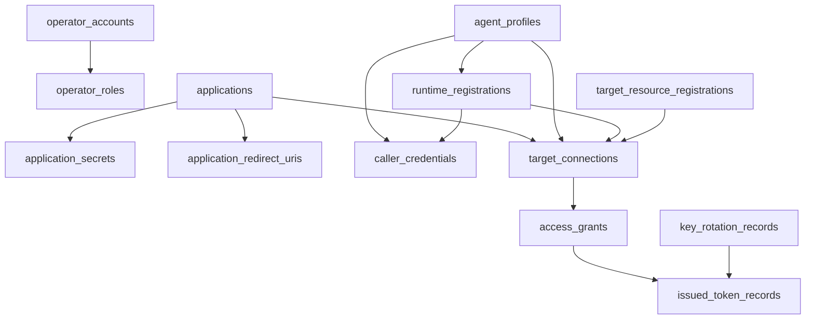

# 10 - 数据模型

> 本文档定义 AuthAny V1 授权控制面的数据模型。

---

## 1. 核心表

Operator：

- `operator_accounts`
- `operator_roles`

Application：

- `applications`
- `application_secrets`
- `application_redirect_uris`

Agent：

- `agent_profiles`
- `runtime_registrations`
- `caller_credentials`

Target access：

- `target_resource_registrations`
- `target_connections`
- `access_grants`
- `issued_token_records`
- `token_revocations`

安全与运维：

- `key_rotation_records`
- `audit_events`
- `rate_limit_events`
- `metrics_snapshots`

---

## 2. 移除的表

这些表不属于 AuthAny Core：

- 作为业务用户表的 `users`。
- `user_identities`。
- `user_bindings`。
- Target Resource 用户映射表。

如果 Admin UI 需要本地登录，应使用 `operator_accounts`，不能复用业务 `users`。

---

## 3. `target_connections`

推荐字段：

- `id`
- `tenant_id`
- `connection_id`
- `principal_type`
- `principal_id`
- `runtime_id`
- `target_resource`
- `external_context_mode`
- `allowed_context_providers_json`
- `max_token_ttl_seconds`
- `status`
- `created_at`
- `updated_at`
- `expires_at`

索引：

- unique `(tenant_id, connection_id)`
- index `(principal_type, principal_id, target_resource, status)`
- index `(runtime_id, target_resource, status)`

规则：

- `principal_type` 表达 Application、Agent 或 Runtime。
- `principal_id` 不能是显示名称。
- `runtime_id` 只用于进一步约束 Agent 的运行环境。
- 表内不能保存 Target Resource 的业务用户 ID。

---

## 4. `access_grants`

推荐字段：

- `id`
- `tenant_id`
- `grant_id`
- `connection_id`
- `grant_type`
- `effect`
- `constraints_json`
- `status`
- `created_at`
- `updated_at`
- `expires_at`

索引：

- unique `(tenant_id, grant_id)`
- index `(connection_id, status, expires_at)`

规则：

- V1 只支持 `effect=allow`。
- `constraints_json` 存平台级约束，不存业务资源 scope。
- 过期、撤销和停用必须可审计。

---

## 5. 关系图

---

## 6. 迁移原则

这次是破坏性模型清理，不做旧模型兼容。

实现时应：

- 删除旧业务用户 Binding 代码，而不是包一层兼容。
- 将旧 `delegation_grants` 重命名或替换为 `access_grants`。
- 用 Target Connection 校验替换 `UserBinding` 依赖。
- 将 Operator 登录与业务用户概念彻底分离。
- 避免保留会静默接受旧 `subject_context` 授权语义的 fallback。

---

## 7. 验收标准

| ID | 要求 |
|----|------|
| DM-01 | 数据模型不包含 AuthAny 业务用户绑定主流程。 |
| DM-02 | Operator 与业务用户分表、分概念。 |
| DM-03 | Target Connection 和 Access Grant 可以完整表达平台连接与放行关系。 |
| DM-04 | Token、Secret、Credential、Grant、Connection 生命周期都有审计所需数据。 |
