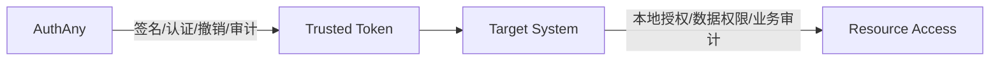
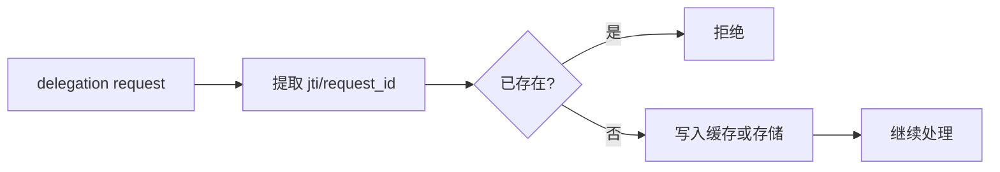

# 11 - 安全要求

> 本文档定义 AuthAny V1 的签名、凭证、防重放、撤销、限流、审计和敏感数据保护要求。

---

## 1. 文档目标

回答：

- V1 至少要满足哪些底线安全要求
- 哪些是必须实现，哪些是后续增强
- 哪些设计如果做错，会直接把平台方向带偏

---

## 2. 安全责任边界

AuthAny 负责：

- 用户认证安全
- 客户端认证安全
- Agent 机器身份真实性
- token 签发可信性
- revoke、rotation、防重放
- delegation 校验正确性
- 平台级审计

Target System 负责：

- 本地资源授权
- 本地业务风控
- 本地业务审计

安全边界图：

---

## 3. 签名与密钥

### 3.1 必须要求

- 默认使用 `RS256`
- 所有 JWT 必须带 `kid`
- 公钥必须通过 JWKS 分发
- 必须支持 key rotation

### 3.2 规则

- 私钥不得进入源码仓库
- 不同环境必须使用不同签名材料
- 历史公钥必须保留到对应 token 不再需要验证为止

### 3.3 禁止事项

- V1 不允许默认用 `HS256`
- 不允许没有 `kid`
- 不允许手工替换密钥但无历史兼容策略

---

## 4. Caller Credential 安全

### 4.1 必须要求

- caller credential 必须安全存储
- 不得硬编码进源码
- 不得打印到普通日志
- revoke 后必须立即不可用

### 4.2 轮换要求

- 轮换不应破坏 agent 身份
- 允许短暂双凭证过渡窗口
- 旧凭证结束后必须彻底不可用

### 4.3 Runtime 准入要求

- 只有被平台注册为 `stateful` 的 Runtime，才允许申请 delegation refresh token
- `stateless` Runtime 不得持有 delegation refresh token
- Runtime 的 `stateful/stateless` 判定必须来自 Runtime Registration，而不是客户端自报

---

## 5. Token 生命周期安全

### 5.1 生命周期原则

- Access Token：短期
- Refresh Token：中期
- Delegation Token：更短期

### 5.2 核心语义

- token 本体不可变
- refresh 是签发新 token
- revoke 是记录提前失效

补充：

- 标准 OAuth access token 可以配套 refresh token
- delegation token 默认不配套 refresh token
- delegation refresh 仅对少数可信 `stateful` Runtime 开放

### 5.3 风险提醒

如果把 token 当“可随便 update 的状态对象”，会同时破坏：

- 审计
- 追踪
- rotation 语义
- 兼容标准协议的能力

---

## 6. 防重放

delegation 相关请求必须具备防重放能力。

### 6.1 最低要求

- 支持 `request_id`、`jti` 或等价幂等因子
- 在有效窗口内可识别重复请求

### 6.2 失败行为

- 命中重放后，应拒绝请求
- 必须审计该事件

---

## 7. Revocation

### 7.1 适用对象

- access token
- refresh token
- caller credential
- grant
- binding

### 7.2 语义要求

- revoke 不等于 delete
- revoke 后新请求必须被拒绝
- 已发 token 的消费端应能通过验证逻辑识别其已失效

### 7.3 设计要求

- revocation 记录必须可查询
- revocation 不应破坏原始签发记录的审计价值

---

## 8. 限流

至少按以下维度限流：

- IP
- client_id
- agent_id
- subject

重点端点：

- `/oauth/token`
- `/api/delegation/token`
- `/oauth/introspect`

规则：

- 限流命中必须可观测
- 不同端点允许不同阈值

---

## 9. 审计

必须记录：

- 认证事件
- token 签发、刷新、撤销
- delegation 放行、拒绝、binding_required
- credential 管理事件
- target system 注册事件
- 高危后台管理操作

要求：

- 敏感字段脱敏
- 审计不可静默丢失
- 至少支持追溯关键鉴权链路

---

## 10. 敏感数据保护

不得明文长期存储：

- client secret
- caller credential 原始值
- refresh token 原始值

不得明文暴露：

- JWT 私钥
- 数据库账号口令
- 第三方密钥材料

日志中不得输出：

- 完整 Authorization 头
- 原始 refresh token
- 原始 caller credential
- Runtime Registration 的敏感策略字段原始配置快照

---

## 11. 传输安全

### 11.1 必须要求

- 生产环境所有认证和 delegation 接口必须走 HTTPS
- 管理接口不得允许明文 HTTP

### 11.2 内网说明

即使部署在企业内网，也不应把“内网”当成替代 TLS 的理由。

---

## 12. 最小安全基线

AuthAny V1 至少要达到以下基线：

1. 非对称签名
2. JWKS 分发
3. refresh rotation
4. delegation 防重放
5. caller credential 可轮换、可撤销
6. 只有可信 `stateful` Runtime 才可持有 delegation refresh 能力
7. 敏感数据不明文长期存储
8. 审计链路可追溯

---

## 13. 后续增强方向

以下能力不是 V1 硬门槛，但架构上要预留：

- mTLS
- 私钥托管到 HSM/KMS
- 风险评分
- 异常行为检测
- 更细的管理权限分级

---

## 14. 验收标准

| 编号 | 验收项 | 通过标准 |
|------|--------|----------|
| SEC-01 | JWT 签名 | 所有 JWT 使用 RS256 且带 `kid` |
| SEC-02 | JWKS | 公钥可通过 JWKS 分发并支持消费端缓存 |
| SEC-03 | Rotation | key rotation 和 credential rotation 均具备明确流程 |
| SEC-04 | Replay | delegation 请求具备防重放能力 |
| SEC-05 | Runtime 准入 | 只有 Runtime Registration 明确允许的 `stateful` Runtime 才可申请 delegation refresh |
| SEC-06 | Revocation | revoke 是提前失效记录，不是删除数据 |
| SEC-07 | 敏感数据保护 | secret、refresh token、caller credential 不明文长期存储 |
| SEC-08 | 审计 | 核心认证、delegation 和高危管理动作全部有审计 |
