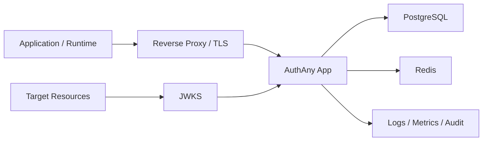

# 12 - 运维与部署

> 本文档定义 AuthAny V1 的运行、部署和可观测性要求。

---

## 1. 参考技术栈

- 核心服务：NestJS + Fastify。
- 数据库：PostgreSQL。
- 缓存 / 防重放 / Token Broker：Redis。
- ORM：Prisma。
- JWT / JWKS：jose。
- Admin UI：Next.js。

V1 是模块化单体，不拆微服务。

---

## 2. 部署拓扑

---

## 3. 环境

必须支持的环境：

- local。
- dev。
- staging。
- production。

规则：

- 不同环境使用不同签名密钥。
- 不同环境使用不同数据库。
- 生产 Secret 不能在其他环境复用。
- local/dev 可以允许不安全回调地址，但 production 默认禁止。

---

## 4. 必要配置

- Database URL。
- Redis URL。
- issuer / base URL。
- 默认 Token TTL。
- 签名密钥来源。
- admin bootstrap operator。
- 限流阈值。
- Secret 加密密钥。

---

## 5. Health 与 Readiness

必须提供 endpoint：

- `/health`
- `/ready`

Readiness 检查：

- 数据库可连接。
- 启用 Redis 时 Redis 可连接。
- 签名密钥可用。
- 必要配置存在。

---

## 6. 指标

必须记录指标：

- Target Token 签发成功 / 失败。
- Application Token 签发成功 / 失败。
- Broker cache hit / miss。
- 防重放拒绝。
- 限流拒绝。
- Credential 已撤销。
- Connection 拒绝。
- Grant 拒绝。
- 密钥轮换次数。
- 请求延迟。

移除的指标：

- End-user binding 指标属于 Target Resource，不属于 AuthAny Core。

---

## 7. Redis 故障策略

允许：

- 完整数据库授权校验后，重新签发短期 Token。
- 对高风险 Target Resource fail closed。

不允许：

- 未重新校验就返回缓存 Token。
- 在高风险上下文中静默跳过防重放检查。
- 因 Redis 不可用而放宽 Target Connection 或 Access Grant 校验。

---

## 8. 验收标准

| ID | 要求 |
|----|------|
| OPS-01 | 服务可以作为可水平扩展的模块化单体运行。 |
| OPS-02 | DB、Redis、签名密钥和配置健康状态可观测。 |
| OPS-03 | 指标覆盖 Token 签发、拒绝、缓存、防重放和生命周期事件。 |
| OPS-04 | Redis 故障行为不会绕过授权。 |
