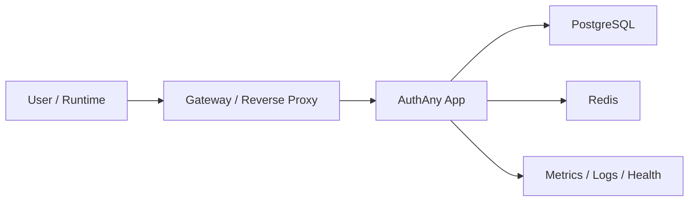

# 12 - 运维与部署

> 本文档定义 AuthAny V1 的部署拓扑、环境划分、运行依赖、监控、告警和降级要求。

---

## 1. 文档目标

回答：

- AuthAny V1 怎么部署最合理
- 最少依赖什么基础设施
- 线上运维需要看哪些指标
- 出现故障时允许怎么降级，不允许怎么降级

---

## 2. 部署原则

V1 采用：

- 单体应用
- 模块化内部边界
- 可水平扩展的无状态服务

原因：

- 当前优先级是把身份、delegation 和 trust 模型做对
- 不是一开始就拆成很多微服务

### 2.1 V1 参考实现技术栈

V1 当前确定采用：

- 核心服务：`NestJS + Fastify`
- 持久化数据库：`PostgreSQL`
- 缓存 / 短期状态 / replay 防护：`Redis`
- ORM：`Prisma`
- JWT / JWKS / OIDC：`jose`
- 管理端：先交付管理 API，后续再补 `Next.js` 后台

约束：

- 这是一套正式选型，不再把 `MySQL` 作为 V1 默认实现
- 不要求管理后台 UI 与核心协议服务同一时间上线
- 允许未来替换后台 UI 技术栈，但不应影响协议层和管理 API 契约

---

## 3. 推荐部署拓扑

说明：

- `Gateway` 负责 TLS、基础流量治理、可选限流前置
- `App` 负责协议、delegation、管理能力
- `PostgreSQL` 负责持久化
- `Redis` 负责缓存、防重放、短期状态

---

## 4. 环境划分

至少区分：

- `local`
- `dev`
- `staging`
- `production`

规则：

- 各环境必须使用独立配置
- 各环境必须使用独立签名材料
- 非生产环境不得复用生产数据和生产密钥

---

## 5. 配置管理

### 5.1 必须配置项

- 数据库连接
- Redis 连接
- issuer
- JWKS / key 配置
- token 生命周期
- 管理员初始化配置
- 限流阈值

### 5.2 规则

- 配置必须可审计来源
- 不能把密钥直接写死在代码
- 配置变更应有明确发布流程

---

## 6. 健康检查

至少提供：

- `app health`
- `db health`
- `redis health`
- `readiness`
- `liveness`

规则：

- 健康检查只回答“服务是否可用”
- 不代替业务授权正确性判断

---

## 7. 监控指标

### 7.1 协议指标

- token issue total
- token refresh total
- token revoke total
- authorize success or failure
- login success or failure

### 7.2 delegation 指标

- delegation exchange success
- delegation exchange failure
- binding_required total
- replay denied total

### 7.3 平台运行指标

- request latency
- error rate
- db query latency
- redis latency
- rate limit hits

### 7.4 审计与治理指标

- key rotation count
- credential revoke count
- admin write operation count

---

## 8. 告警要求

至少应对以下情况告警：

- token 签发错误率异常上升
- delegation 拒绝率异常上升
- replay 命中异常上升
- Redis 不可用
- 数据库不可用
- key rotation 失败

---

## 9. 日志要求

日志必须：

- 结构化
- 可按 request_id 关联
- 对敏感字段脱敏

日志不得包含：

- 明文 secret
- 原始 refresh token
- 原始 caller credential

---

## 10. 降级策略

### 10.1 Redis 不可用

允许：

- 回退数据库查询部分核心数据

不允许：

- 直接关闭所有安全校验继续放行

说明：

- 防重放能力可能下降
- 但不能为了可用性直接绕过授权逻辑

### 10.2 binding 或 grant 缓存失效

允许：

- 重新查库

### 10.3 目标系统不可用

平台可以：

- 正常签发 delegation token

但业务请求最终成功与否由目标系统决定。

### 10.4 JWKS 轮换传播延迟

要求：

- 保留旧 key 到安全窗口结束
- 不允许刚切换 key 就让所有未过期 token 无法验证

---

## 11. 备份与恢复

V1 至少要有：

- 数据库备份策略
- 配置恢复策略
- 密钥恢复与轮换预案

不要求 V1 一次做完整容灾平台，但必须能明确说明恢复路径。

---

## 12. 部署约束

V1 不做：

- 一开始拆成多微服务
- 把业务系统一起部署进 AuthAny
- 把管理端和核心协议完全拆成两个独立产品

---

## 13. 验收标准

| 编号 | 验收项 | 通过标准 |
|------|--------|----------|
| OPS-01 | 部署模型 | 单体模块化架构可独立部署，依赖边界清晰 |
| OPS-02 | 环境隔离 | local、dev、staging、production 配置和密钥隔离 |
| OPS-03 | 健康检查 | app、db、redis、readiness、liveness 可用 |
| OPS-04 | 监控 | 协议、delegation、运行状态核心指标可观测 |
| OPS-05 | 告警 | 核心失败场景具备告警能力 |
| OPS-06 | 降级 | Redis 故障等场景有明确降级策略，且不绕过核心安全校验 |
