# 15 - 全量流程图

> 本文档汇总 AuthAny V1 的关键流程图，供产品、架构、研发、安全、接入方快速对齐全局链路。

---

## 1. 使用说明

这份文档是“全景图集合”，不是替代正文的简版说明。

阅读方式建议：

- 先看本文件把全局过一遍
- 再回到各专题文档看规则、失败路径和验收标准

---

## 2. 总体架构流

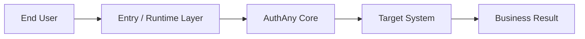

说明：

- 上层负责发起
- 平台负责身份和 token
- 目标系统负责本地授权

---

## 3. 标准登录流

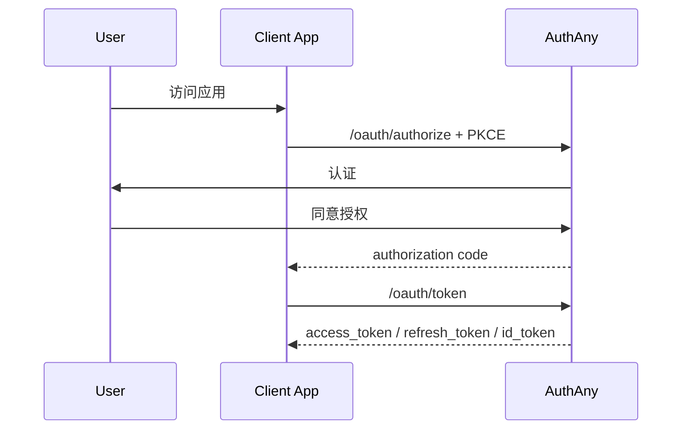

---

## 4. Refresh Rotation 流

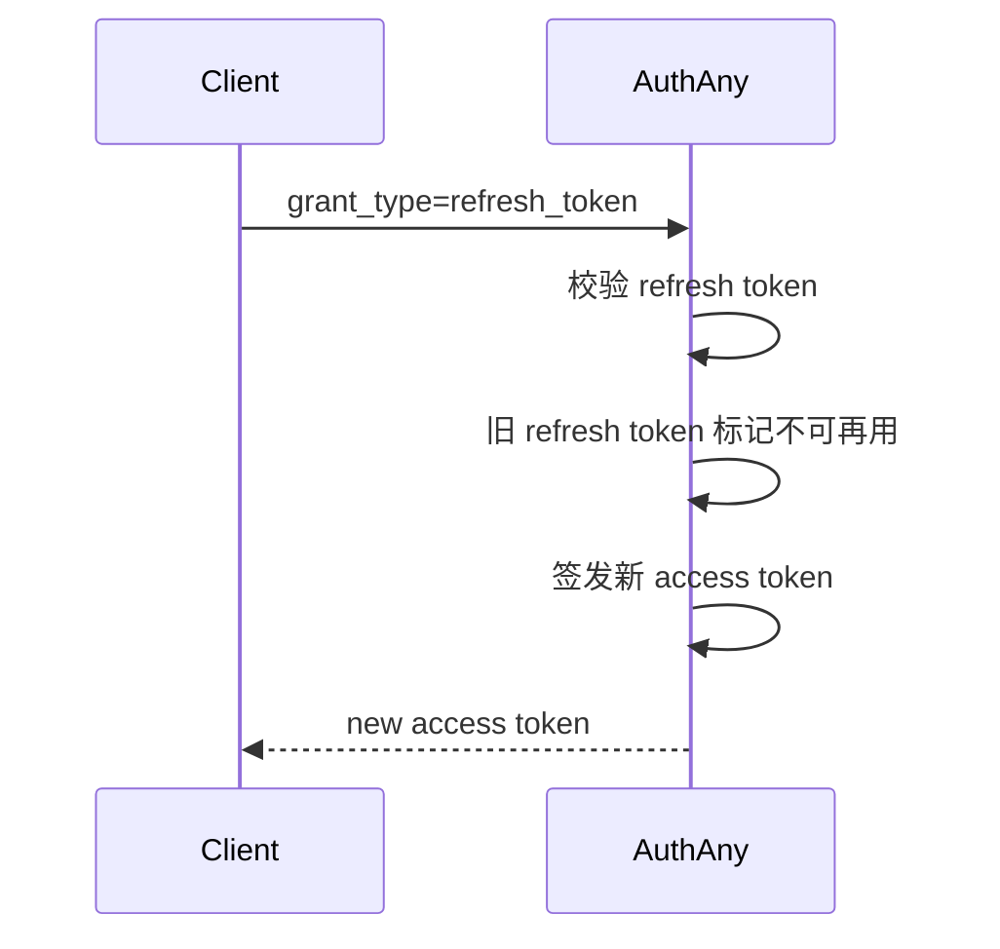

---

## 5. Agent 注册与凭证下发流

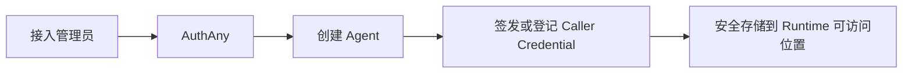

---

## 6. Target System 注册流

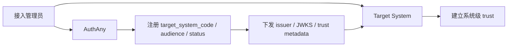

---

## 7. Runtime Registration 流

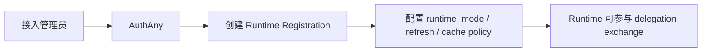

---

## 8. 首次 binding 流

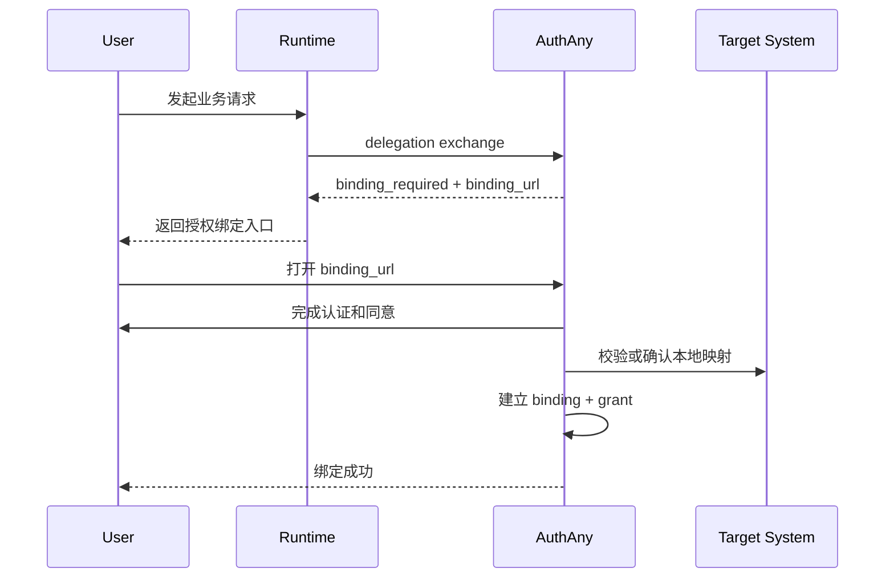

---

## 9. 已绑定用户 delegation 流

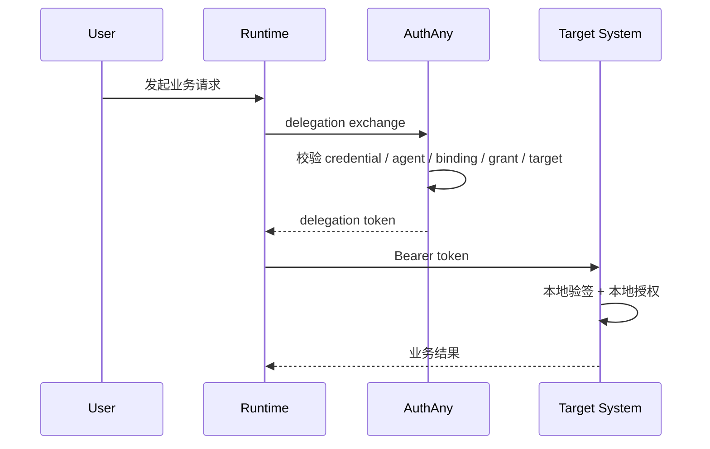

---

## 10. Runtime delegation 校验流

```mermaid
flowchart TD
    A["收到 delegation request"] --> B["校验 caller credential"]
    B --> C["找到 Runtime Registration"]
    C --> D["校验 agent 状态"]
    D --> E["校验 target system 状态"]
    E --> F["解析 subject_context 或 service_subject_id"]
    F --> G["查询 binding 或 service subject"]
    G --> H["查询 grant"]
    H --> I["replay 检查"]
    I --> J["签发 delegation token"]
```

---

## 11. 无用户系统任务流

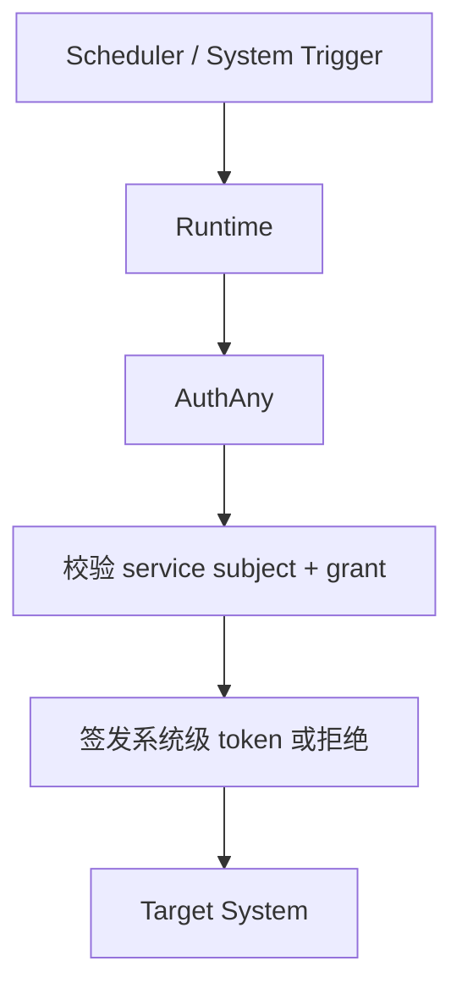

说明：

- 该流程不应伪造人类用户
- V1 正式支持 service subject 模型

---

## 12. Target System 消费 token 流

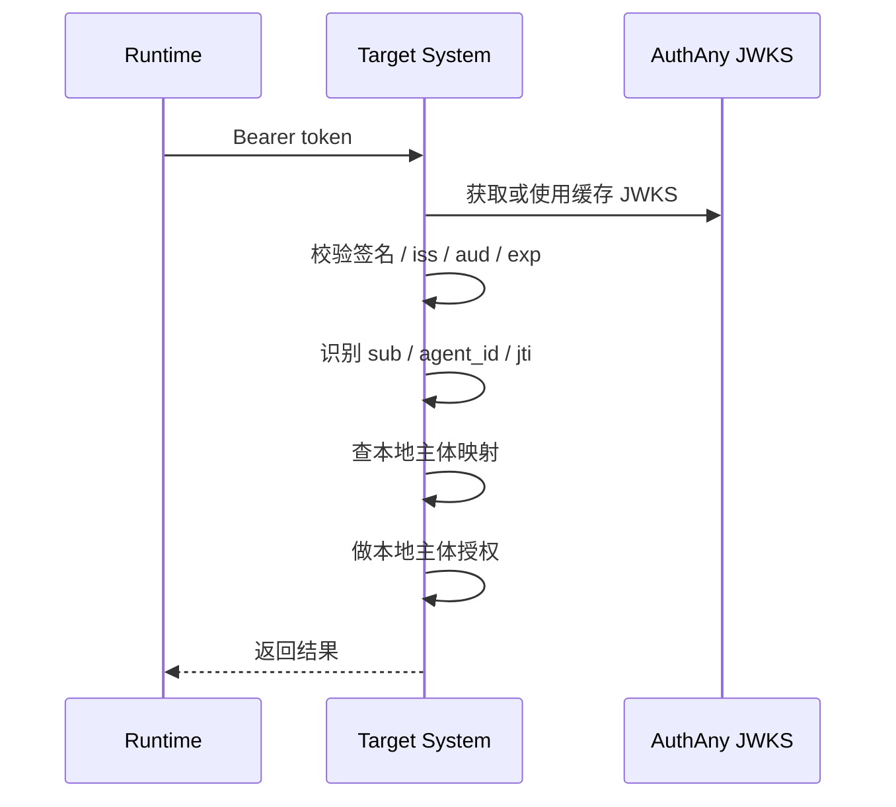

---

## 13. Revocation 判定流

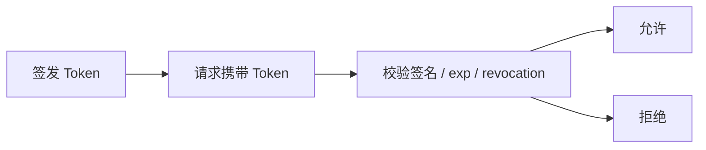

---

## 14. Key Rotation 流

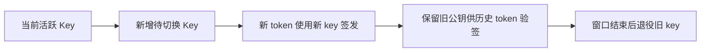

---

## 15. 审计流

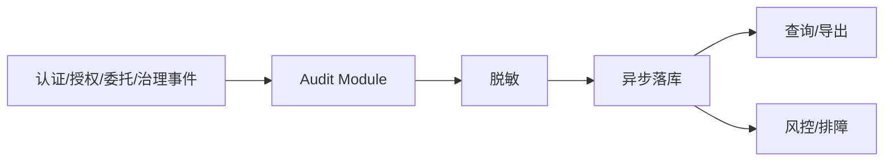

---

## 16. 失败路径总览

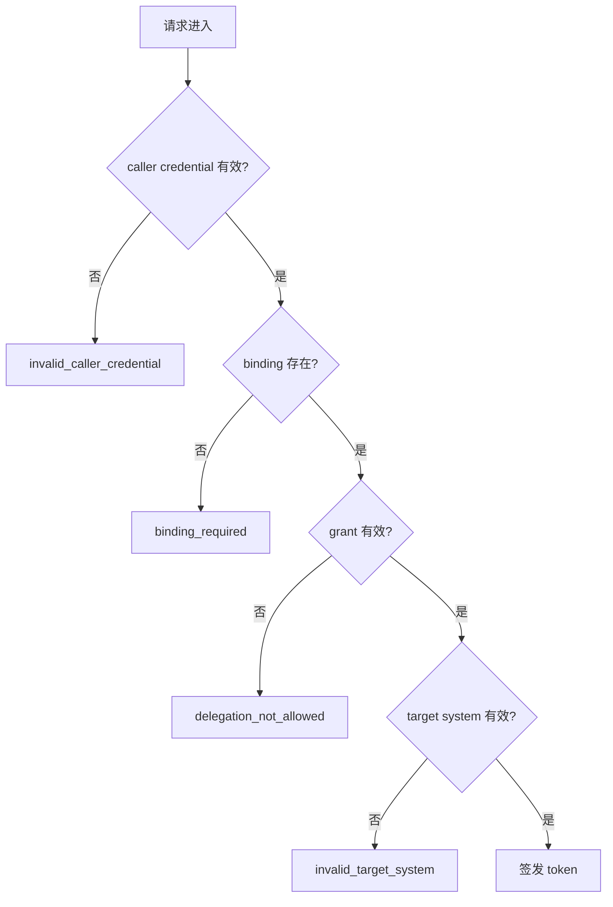
