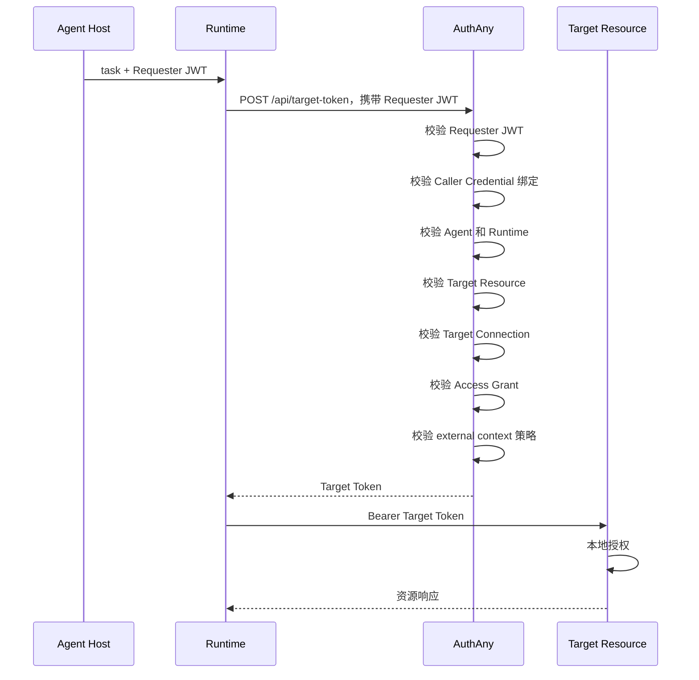
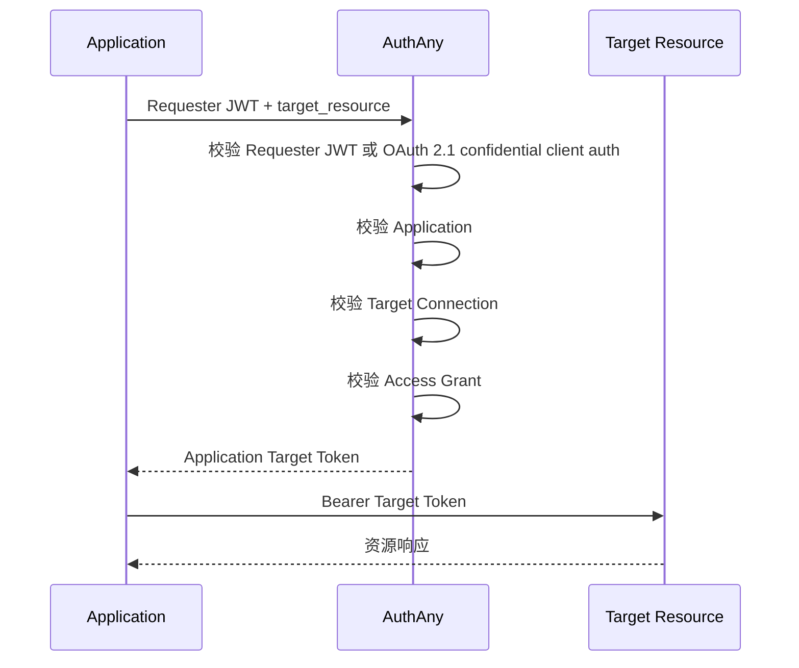
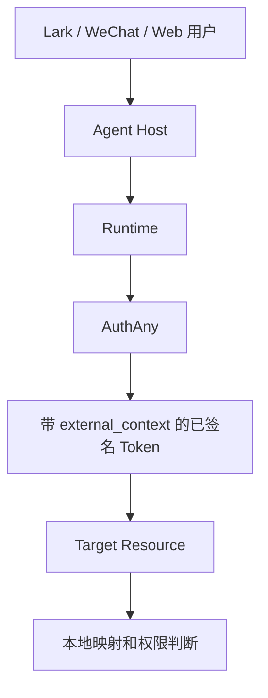
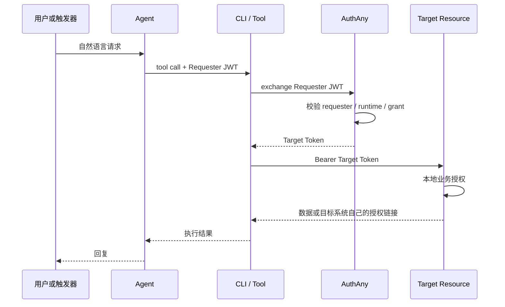
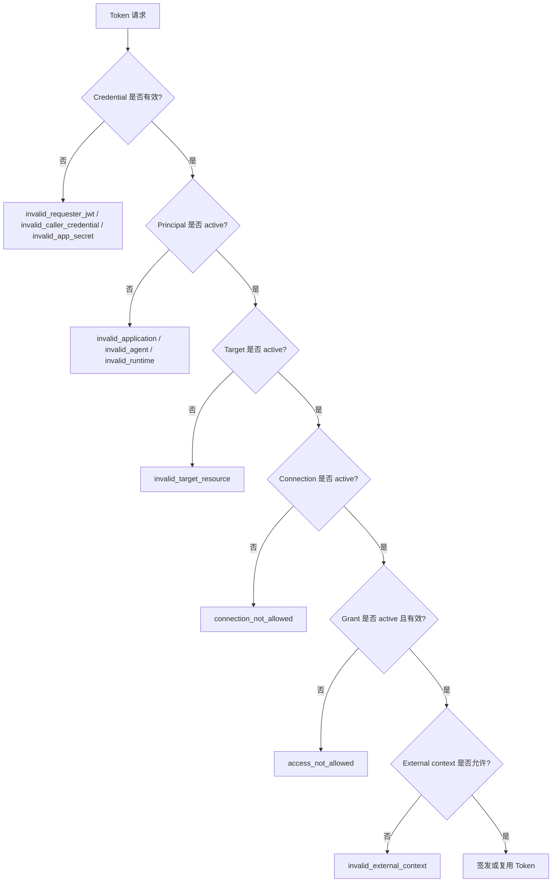
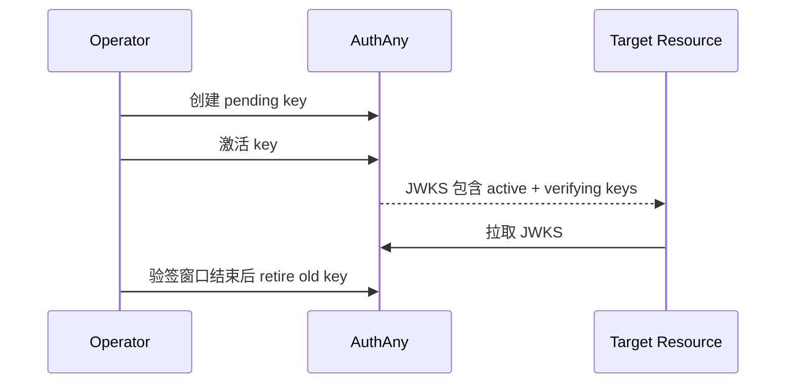

# 15 - 全流程

> 本文档定义 AuthAny V1 移除业务用户绑定后的端到端流程。

---

## 1. Agent / Runtime 访问 Target

---

## 2. Application 访问 Target

---

## 3. External Context 透传

AuthAny 负责签名上下文，Target Resource 负责解释上下文。

---

## 4. User -> Agent -> CLI -> Resource

入口来源可以是 Chat、Web、CLI、MCP、Webhook、Workflow、Scheduler、IoT 或 RPA。只要入口被归一化为已签名 requester context，后续流程保持一致。

---

## 5. 拒绝流程

---

## 6. 密钥轮换流程

---

## 7. 已移除流程

AuthAny V1 不再包含：

- End-user binding。
- `binding_required`。
- AuthAny 拥有的 Target User mapping。
- `sub=user:<id>` 的 User OBO Token。

---

## 8. 验收标准

| ID | 要求 |
|----|------|
| FLOW-01 | Agent / Runtime 到 Target Resource 的完整链路可以走通。 |
| FLOW-02 | Application 到 Target Resource 的完整链路可以走通。 |
| FLOW-03 | External context 可以透传，但不触发 AuthAny 用户绑定。 |
| FLOW-04 | 拒绝流程返回稳定错误码。 |
| FLOW-05 | 密钥轮换不影响仍未过期 Token 的验签。 |
