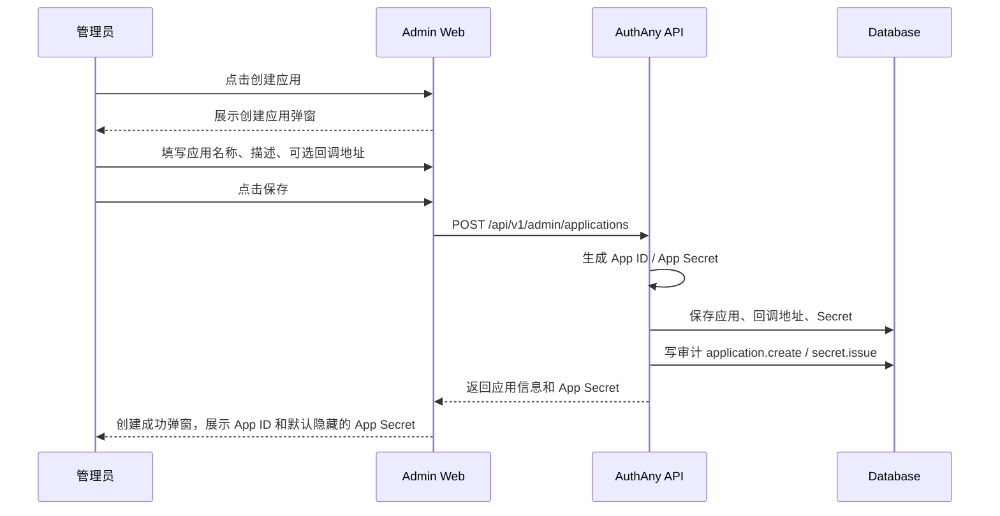
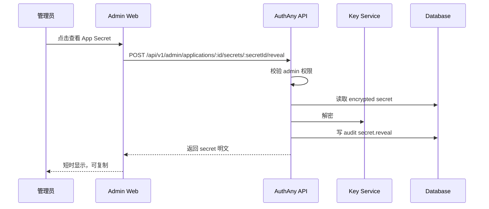
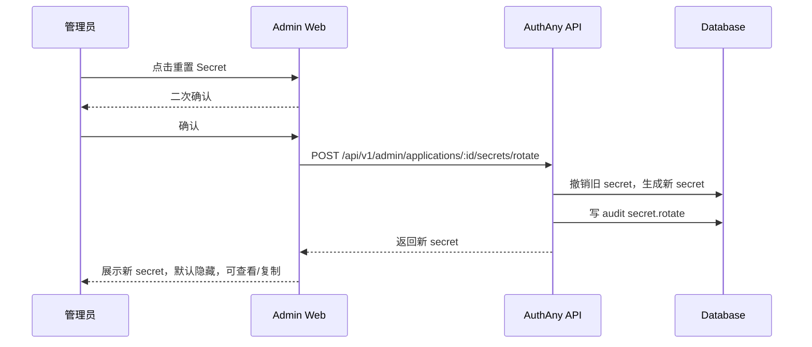

# 18 - 应用管理模块

> 本文档定义 AuthAny Admin Web 中“应用管理”的正式产品与技术规格。该模块面向接入 AuthAny 的业务应用，底层对象是 OAuth Client，但产品表达统一使用“应用 / App”。

---

## 1. 背景

旧方案如果把 OAuth Client 直接暴露成 `/oauth-clients` 通用 CRUD 表单，会有三个问题：

- 产品心智不对：管理员理解的是“创建应用”，不是“创建 OAuth Client 记录”。
- 安全交互不完整：`App ID`、`App Secret`、回调地址、删除、停用、密钥查看/复制/轮换都需要明确流程。
- 组件复用不足：后续 Agent、Target Resource、Runtime 都会需要类似的“列表 + 搜索 + 创建 + 详情 + 凭证卡片 + 危险操作”布局。

因此 Admin UI 和 Admin API 必须使用“应用管理模块”，对外路由统一为 `/applications`。

---

## 2. 模块定位

应用管理模块负责管理接入 AuthAny 的服务端业务应用。应用通过 `App ID + App Secret` 或由服务端生成的 Requester JWT 证明自身身份，再向 AuthAny 换取访问目标系统的短期 Target Token。

它回答：

- 哪些业务应用可以接入 AuthAny
- 每个应用的 `App ID` 是什么
- 每个应用的 `App Secret` 如何查看、复制、轮换、删除
- 每个应用允许哪些服务端回调地址或协议回调地址
- 应用是否启用、停用或逻辑删除
- 谁在什么时候修改过应用配置

它不负责：

- 业务系统内部资源权限
- Agent delegation 授权
- Runtime caller credential
- Target Resource 本地权限模型

术语映射：

| 产品术语 | OAuth 标准术语 | 数据字段 |
|----------|----------------|----------|
| 应用 | OAuth Client | `oauth_clients` |
| App ID | Client ID | `client_id` |
| App Secret | Client Secret | `oauth_client_secrets` |
| 回调地址 | Redirect URI（仅交互式协议需要） | `oauth_redirect_uris` |
| 授权范围 | Scope | `allowed_scopes` |

---

## 3. 用户角色

V1 允许 `platform_admin` 管理应用。

后续可拆分：

| 角色 | 权限 |
|------|------|
| `platform_admin` | 全部应用管理能力 |
| `integration_admin` | 创建、编辑、启停应用，管理 secret |
| `audit_admin` | 只读查看应用与审计记录 |

规则：

- 查看或复制 App Secret 属于高敏操作，必须审计。
- 删除应用属于高危操作，必须二次确认。
- 后续如果支持细分角色，Secret 查看和删除应单独授权。

---

## 4. 信息架构

```text
/applications
  应用列表
  搜索栏
  创建应用按钮

/applications/:id
  应用详情
  基础信息
  应用凭证
  回调地址
  授权配置
  危险操作
  审计记录
```

导航中仍可以放在 `OAuth` 分组下，但页面标题应显示为“应用管理”或“应用”。

---

## 5. 页面一：应用列表

### 5.1 页面目标

让管理员快速找到应用、查看应用状态、创建新应用，并进入应用详情。

### 5.2 页面结构

```text
顶部区域：
  标题：应用管理
  描述：管理接入 AuthAny 的服务端业务应用、App ID、App Secret 和目标系统访问配置
  创建应用按钮

工具栏：
  搜索框
  状态筛选
  刷新按钮

列表：
  应用名称
  App ID
  状态
  回调地址数量
  最近更新时间
  操作：查看详情 / 停用 / 删除
```

### 5.3 搜索规则

搜索支持：

- 应用名称
- `App ID`
- 回调地址关键词

V1 可先前端过滤当前页数据。

当应用数量增长后，应升级为服务端搜索：

```text
GET /api/v1/admin/applications?q=ebfx&status=active
```

### 5.4 空状态

当没有应用时显示：

```text
还没有应用。
创建第一个应用后，业务系统即可通过 AuthAny 换取目标系统访问 Token。
```

操作按钮：

```text
创建应用
```

---

## 6. 页面二：创建应用

### 6.1 创建入口

应用列表页点击“创建应用”打开弹窗或独立页面。

V1 推荐弹窗。

### 6.2 管理员需要填写

| 字段 | 必填 | 说明 |
|------|------|------|
| 应用名称 | 是 | 给人看的名称，例如 `EBFX Dashboard` |
| 应用描述 | 否 | 应用用途说明 |
| 回调地址 | 否 | 仅当应用使用交互式 OAuth/OIDC 登录流程时需要 |
| 授权范围 | 否 | V1 可用默认值，后续可配置 |

### 6.3 系统自动生成

创建时系统自动生成：

| 字段 | 示例 |
|------|------|
| `App ID` | `app_live_01hx7m9q2k...` |
| `App Secret` | `sk_live_xxx` 或 `sk_test_xxx` |

规则：

- 管理员不手填 `App ID`。
- 管理员不手填 `App Secret`。
- `App ID` 必须由系统生成，格式为 `app_live_<random>`，不得由应用名称、slug 或业务编码派生。
- `App ID` 必须全局唯一。
- `App Secret` 必须使用密码学安全随机数生成。
- `App ID` 是公开标识，不是 secret。
- `App Secret` 是高敏凭证，只能保存到服务端或受控密钥系统。
- `App Secret` 不得出现在浏览器、URL、聊天消息、日志、Target Resource 请求或本地不加密存储。

### 6.4 创建流程



### 6.5 创建成功弹窗

创建成功后必须展示：

- 应用名称
- `App ID`
- `App Secret`
- 复制 `App ID`
- 复制 `App Secret`
- “我已保存”按钮

`App Secret` 默认隐藏。

管理员点击“查看”后才显示明文。

文案：

```text
App Secret 是高敏凭证。请只保存到受控的服务端配置或密钥管理系统中，不要提交到代码仓库。
```

---

## 7. 页面三：应用详情

### 7.1 页面目标

让管理员维护一个应用的完整接入配置。

### 7.2 顶部信息

展示：

- 应用名称
- 状态 Badge
- `App ID`
- 复制 `App ID`
- 返回列表

### 7.3 基础信息卡片

可编辑字段：

- 应用名称
- 应用描述
- 状态：`active` / `inactive`

操作：

- 保存
- 取消

规则：

- 修改必须点击保存后才生效。
- 保存成功后刷新详情。
- 保存失败时保留表单输入并展示错误。

### 7.4 应用凭证卡片

展示：

- `App ID`：默认可见，可复制，不可编辑
- `App Secret`：默认隐藏，可点击查看，可复制
- Secret 状态
- Secret 创建时间
- Secret 最近查看时间
- Secret 最近轮换时间

操作：

- 查看 / 隐藏 Secret
- 复制 Secret
- 重置 Secret
- 删除 Secret

### 7.5 回调地址卡片

展示当前允许的 redirect URI 列表。只有使用交互式 OAuth/OIDC 登录能力的应用才需要配置回调地址；纯服务端目标系统访问应用可以不配置。

支持：

- 新增回调地址
- 删除回调地址
- 保存回调地址变更

规则：

- redirect URI 必须严格匹配。
- 不允许空字符串。
- 生产环境不允许不安全的 `http://`，除非明确配置为 local/dev 环境。
- 不允许通配符回调地址。

### 7.6 授权配置卡片

V1 可先使用默认配置：

```json
{
  "allowed_grant_types": ["authorization_code", "refresh_token"],
  "allowed_scopes": ["openid", "profile", "offline_access"]
}
```

后续支持页面配置：

- grant types
- scopes
- token TTL policy
- PKCE 是否强制

应用访问 Target Resource 的平台授权不在这里配置，应通过 Target Connection 和 Access Grant 配置。

### 7.7 危险操作卡片

支持：

- 停用应用
- 删除应用

停用：

- 将应用状态改为 `inactive`
- 不允许新的 authorize/token 请求
- 已签发 token 按过期时间自然失效，除非额外执行 revoke

删除：

- 产品上叫“删除”
- 技术上必须是逻辑删除
- 状态建议为 `deleted`
- 默认列表不展示 deleted 应用
- 审计记录和历史 token 记录必须保留

删除确认：

```text
删除后，该应用将无法继续换取 Target Token。
历史审计记录会保留。
请输入应用名称确认删除。
```

---

## 8. Secret 安全模型

### 8.1 设计选择

因为产品要求“App Secret 默认不可见，点击查看才可见，并且可复制”，系统必须支持重新取回明文 Secret。

这意味着不能只保存不可逆 hash。

V1 应采用：

```text
App Secret 明文只在服务端短时存在
数据库保存加密后的 secret
展示时由服务端解密
每次查看都审计
```

### 8.2 存储要求

`oauth_client_secrets` 至少需要：

- `secret_hash`：用于 token exchange 校验
- `secret_ciphertext`：用于管理后台查看
- `secret_hint`：用于列表展示，例如 `sk_live_****abcd`
- `encryption_key_id`：用于密钥轮换
- `viewed_at`
- `last_used_at`
- `revoked_at`

如果 V1 暂时不实现可逆加密，则 UI 不能承诺“查看已有 Secret”，只能支持“重置 Secret 后展示一次”。但本规格目标方案是支持加密后查看。

### 8.3 查看 Secret 流程



规则：

- Secret 默认隐藏。
- 点击查看后才显示。
- UI 必须提供隐藏按钮。
- UI 不得把 Secret 写入 URL、localStorage、sessionStorage。
- API 响应不得被缓存。
- 查看 Secret 必须写审计。
- 复制 Secret 必须在前端记录 UI 行为；如果需要强审计，可调用后端 `copy` 审计接口。

### 8.4 重置 Secret 流程



---

## 9. API 规格

为了让产品语义清晰，Admin Web 可使用新的应用语义 API。

底层仍可映射到 OAuth Client。

### 9.1 应用列表

```http
GET /api/v1/admin/applications?q=&status=
```

响应：

```json
[
  {
    "id": "client_db_id",
    "app_id": "app_live_xxx",
    "name": "EBFX Dashboard",
    "description": "EBFX 内部看板",
    "status": "active",
    "redirect_uri_count": 2,
    "secret_count": 1,
    "created_at": "2026-05-16T00:00:00.000Z",
    "updated_at": "2026-05-16T00:00:00.000Z"
  }
]
```

### 9.2 创建应用

```http
POST /api/v1/admin/applications
```

请求：

```json
{
  "name": "EBFX Dashboard",
  "description": "内部业务看板",
  "redirect_uris": ["https://dashboard.ebfx.example/callback"]
}
```

响应：

```json
{
  "id": "client_db_id",
  "app_id": "app_live_xxx",
  "app_secret": "sk_live_xxx",
  "name": "EBFX Dashboard",
  "status": "active",
  "redirect_uris": ["https://dashboard.ebfx.example/callback"]
}
```

### 9.3 应用详情

```http
GET /api/v1/admin/applications/:id
```

### 9.4 修改应用

```http
PATCH /api/v1/admin/applications/:id
```

请求：

```json
{
  "name": "EBFX Dashboard",
  "description": "更新后的描述",
  "status": "active",
  "redirect_uris": ["https://dashboard.ebfx.example/callback"]
}
```

### 9.5 查看 Secret

```http
POST /api/v1/admin/applications/:id/secrets/:secretId/reveal
```

响应：

```json
{
  "app_secret": "sk_live_xxx",
  "expires_at": null
}
```

### 9.6 重置 Secret

```http
POST /api/v1/admin/applications/:id/secrets/rotate
```

响应：

```json
{
  "app_secret": "sk_live_new_xxx",
  "secret_id": "secret_db_id",
  "hint": "sk_live_****abcd"
}
```

如果应用是 Admin Web 自身使用的启动应用，例如默认 `authany-admin-web`，服务端必须拒绝重置 Secret，避免管理后台把自己的 token exchange 凭证换掉后无法再次登录。

错误响应：

```json
{
  "code": "protected_admin_application",
  "message": "不能在管理后台重置 Admin 应用的 Secret。"
}
```

### 9.7 删除应用

```http
POST /api/v1/admin/applications/:id/delete
```

请求：

```json
{
  "confirm_name": "EBFX Dashboard"
}
```

响应：

```json
{
  "id": "client_db_id",
  "status": "deleted"
}
```

如果应用是 Admin Web 自身使用的启动应用，服务端必须拒绝删除、停用、修改回调地址。UI 也必须禁用这些危险操作，只允许修改名称和描述。

---

## 10. 数据模型调整

### 10.1 `oauth_clients`

建议补充：

- `description`
- `deleted_at`
- `updated_at`

`client_id` 仍保留为协议字段，对 UI 显示为 `App ID`。

### 10.2 `oauth_client_secrets`

建议补充：

- `secret_ciphertext`
- `secret_hint`
- `encryption_key_id`
- `viewed_at`
- `last_used_at`

### 10.3 逻辑删除

应用删除不物理删除。

推荐状态：

```text
active
inactive
deleted
```

协议规则：

- `active` 可发起授权和 token exchange
- `inactive` 不可发起新的授权和 token exchange
- `deleted` 不可发起新的授权和 token exchange，默认不出现在列表

---

## 11. 通用组件设计

应用管理不是孤立页面，应沉淀成可组合组件。

### 11.1 页面级组件

```text
ManagementListPage
ManagementDetailPage
ManagementToolbar
ManagementTable
CreateEntityDialog
EditSectionCard
DangerZone
AuditTimeline
```

### 11.2 字段级组件

```text
CopyableField
SecretField
StatusBadge
RedirectUriEditor
ConfirmByNameDialog
SearchInput
EmptyState
LoadingState
ErrorState
```

### 11.3 组合原则

- 通用组件只负责布局、状态和基础交互。
- 业务字段、API、校验规则由 feature 层注入。
- 不要把 OAuth 应用的字段写死到通用组件里。
- 当 Agent、Target Resource、Runtime 也使用同类布局时，再继续抽象公共逻辑。

推荐目录：

```text
apps/admin-web/components/management/
apps/admin-web/components/secret/
apps/admin-web/features/applications/
```

示例：

```text
apps/admin-web/features/applications/application-list-page.tsx
apps/admin-web/features/applications/application-detail-page.tsx
apps/admin-web/features/applications/application-api.ts
apps/admin-web/features/applications/application-form.tsx
apps/admin-web/features/applications/application-secret-card.tsx
apps/admin-web/features/applications/application-danger-zone.tsx
```

---

## 12. 前端状态与交互要求

每个页面必须处理：

- 加载中。
- 空状态。
- 错误状态。
- 未登录。
- 无权限。
- 操作成功。
- 操作失败。

Secret 交互必须处理：

- 已隐藏。
- 查看中。
- 已展示。
- 查看失败。
- 已复制。
- 重置确认。
- 重置成功。
- 重置失败。

删除交互必须处理：

- 确认名称不匹配。
- 删除提交中。
- 删除失败。
- 删除成功并返回列表。

---

## 13. 审计事件

必须记录：

| 事件 | 触发 |
|------|------|
| `admin.application.create` | 创建应用 |
| `admin.application.update` | 修改应用 |
| `admin.application.disable` | 停用应用 |
| `admin.application.delete` | 逻辑删除应用 |
| `admin.application.secret.issue` | 创建 Secret |
| `admin.application.secret.reveal` | 查看 Secret |
| `admin.application.secret.copy` | 可选，复制 Secret |
| `admin.application.secret.rotate` | 重置 Secret |
| `admin.application.secret.revoke` | 删除或撤销 Secret |

审计 payload 不得包含 Secret 明文。

---

## 14. 安全要求

- `App Secret` 不得出现在普通日志。
- `App Secret` 不得进入浏览器持久化存储。
- `App Secret` API 响应必须禁止缓存。
- 查看 Secret 必须需要有效 admin 会话。
- 查看 Secret 必须审计。
- 删除应用必须二次确认。
- 删除应用必须逻辑删除。
- 回调地址必须严格匹配。
- 生产环境默认不允许不安全 redirect URI。
- 应用停用或删除后，不能再通过 AuthAny 签发新的 Target Token。

---

## 15. 应用语义 API

V1 直接使用应用语义接口，不再要求 Admin Web 通过旧 OAuth Client CRUD 接口做兼容包装。

必须提供：

- `GET /api/v1/admin/applications`
- `POST /api/v1/admin/applications`
- `GET /api/v1/admin/applications/:id`
- `PATCH /api/v1/admin/applications/:id`
- `POST /api/v1/admin/applications/:id/delete`
- `POST /api/v1/admin/applications/:id/secrets/:secretId/reveal`
- `POST /api/v1/admin/applications/:id/secrets/rotate`

底层可以复用 OAuth Client 数据模型，但接口和产品语义必须面向“应用管理”。

---

## 16. 验收标准

| 编号 | 验收项 | 通过标准 |
|------|--------|----------|
| APP-01 | 应用列表 | `/applications` 以应用列表形式展示，支持搜索、状态筛选、刷新 |
| APP-02 | 创建应用 | 管理员填写应用名称、描述、可选回调地址并点击保存后，系统生成 App ID 和 App Secret |
| APP-03 | App ID | App ID 系统生成、只读、可复制、不可修改 |
| APP-04 | App Secret | Secret 默认隐藏，点击查看后可见，可复制，查看行为被审计 |
| APP-05 | 修改应用 | 应用名称、描述、状态、回调地址可在详情页修改并保存 |
| APP-06 | 回调地址校验 | 空地址、非法 URL、生产不安全 URL、通配符地址不可提交 |
| APP-07 | 停用应用 | 停用后不允许新的 authorize/token 请求 |
| APP-08 | 删除应用 | 删除为逻辑删除，需要二次确认，历史审计保留 |
| APP-09 | Secret 重置 | 重置后旧 Secret 不可用，新 Secret 可查看和复制 |
| APP-10 | 安全存储 | 支持查看 Secret 时，服务端必须加密保存 Secret，且不得只依赖前端遮罩 |
| APP-11 | 组件复用 | 列表、详情、复制字段、SecretField、危险操作等能力拆成可组合组件 |
| APP-12 | 受保护启动应用 | Admin Web 自身使用的应用不可删除、停用、重置 Secret 或修改回调地址，避免自锁死 |
| APP-13 | 测试 | 覆盖创建、修改、删除、Secret 查看/复制/重置、回调地址校验、权限失败、受保护启动应用 |

---

## 17. 非目标

V1 不要求：

- 动态客户端注册协议
- 多租户应用市场
- 应用审批流
- 应用分组和标签体系
- OAuth consent 文案的完整模板化
- Secret 多版本灰度轮换策略

这些能力可以在后续版本扩展。
