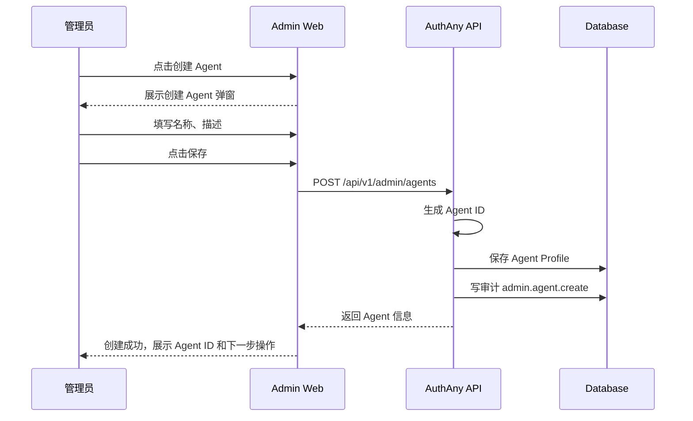
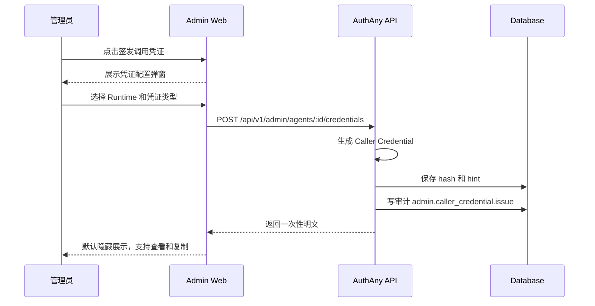
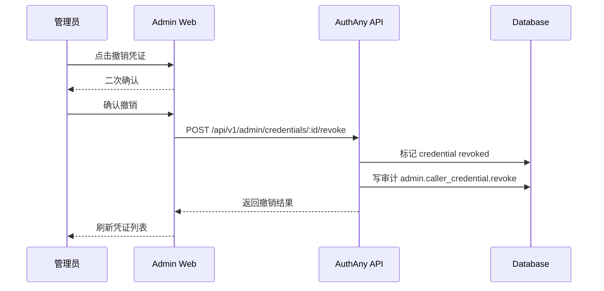

# 19 - Agent 管理模块

> 本文档定义 AuthAny Admin Web 中“Agent 管理”的正式产品与技术规格。该模块面向 AI Agent、自动化执行器、MCP Server、CLI Runtime、内部 Worker 等业务执行身份。

---

## 1. 背景

当前 `/agents` 如果继续做成通用 CRUD 表单，会有三个问题：

- 产品心智不清晰：管理员真正管理的是“AI/自动化执行身份”，不是一条 `agent_profiles` 数据库记录。
- 安全交互不完整：Agent ID、Caller Credential、Runtime 绑定、Target Connection、Access Grant、停用、删除、审计都需要明确流程。
- 后续扩展困难：OpenClaw、Claude Code、MCP Server、自研对话平台、定时任务都会接入，不能把某个运行时形态写死在页面里。

因此 `/agents` 应升级为“Agent 管理模块”。

---

## 2. 模块定位

Agent 管理模块负责管理可代表业务执行动作的非人类执行身份。

它回答：

- 哪些 Agent 可以接入 AuthAny
- 每个 Agent 的 `Agent ID` 是什么
- 每个 Agent 当前是否启用
- 每个 Agent 绑定了哪些 Runtime
- 每个 Agent 有哪些 Caller Credential
- 每个 Agent 被授权访问哪些 Target Resource
- 哪些高危动作被谁操作过

它不负责：

- 标准 OAuth/OIDC 应用登录
- 目标系统内部资源权限
- 业务最终用户身份解析
- 具体聊天平台的消息上下文解析
- CLI、MCP、HTTP Runtime 的业务代码实现

术语映射：

| 产品术语 | 领域对象 | 数据字段 |
|----------|----------|----------|
| Agent | Agent Profile | `agent_profiles` |
| Agent ID | 稳定机器执行身份 ID | `agent_id` |
| 调用凭证 | Caller Credential | `caller_credentials` |
| 运行时 | Runtime Registration | `runtime_registrations` |
| 可访问系统 | Target Connection + Access Grant + Target Resource | `target_connections` / `access_grants` / `target_resource_registrations` |

---

## 3. 与应用管理的区别

| 维度 | 应用管理 | Agent 管理 |
|------|----------|------------|
| 管理对象 | OAuth/OIDC Client | AI/自动化执行身份 |
| 核心 ID | `App ID` / `client_id` | `Agent ID` / `agent_id` |
| 凭证 | `App Secret` | `Caller Credential` |
| 主要用途 | 服务端业务应用请求 Target Token | Agent/Runtime 请求 Target Token |
| 是否携带外部上下文 | 可选，一般为应用自身访问 | 可选，可携带用户/消息/任务上下文 |
| 目标系统访问 | 不直接表达 | 通过 Target Connection + Access Grant 表达 |

规则：

- Agent 不是 OAuth Client。
- Agent 不是 User。
- Agent 不是 Runtime。
- Agent 表达“谁在执行”，Runtime 表达“在哪里执行”，Target Connection 表达“连到哪里”，Access Grant 表达“是否放行”。
- User / Lark / Web / CLI 上下文不改变 Agent 的 `sub`，只能作为 `external_context` 进入 Requester JWT 和 Target Token。

---

## 4. 用户角色

V1 允许 `platform_admin` 管理 Agent。

后续可拆分：

| 角色 | 权限 |
|------|------|
| `platform_admin` | 全部 Agent 管理能力 |
| `integration_admin` | 创建、编辑、启停 Agent，管理 Runtime 和调用凭证 |
| `security_admin` | 管理 Caller Credential、停用高风险 Agent |
| `audit_admin` | 只读查看 Agent 与审计记录 |

规则：

- 签发 Caller Credential 属于高敏操作，必须审计。
- 停用、挂起、删除 Agent 属于高危操作，必须二次确认。
- 后续如果支持细分角色，凭证签发/撤销应单独授权。

---

## 5. 信息架构

```text
/agents
  Agent 列表
  搜索栏
  状态筛选
  创建 Agent 按钮

/agents/:id
  Agent 详情
  基础信息
  Agent 身份
  Runtime 绑定
  Caller Credential
  Target Connection / Access Grant
  危险操作
  审计记录

/agents/:id/credentials
  调用凭证列表
  签发调用凭证
  撤销调用凭证
```

导航中放在 `Agent Runtime` 分组下，页面标题应显示为“Agent 管理”或“Agent”。

---

## 6. 页面一：Agent 列表

### 6.1 页面目标

让管理员快速找到 Agent、查看启用状态、Runtime 数量、调用凭证数量，并进入详情。

### 6.2 页面结构

```text
顶部区域：
  标题：Agent 管理
  描述：管理 AI Agent、自动化执行身份、调用凭证和 Runtime 绑定
  创建 Agent 按钮

工具栏：
  搜索框
  状态筛选
  刷新按钮

列表：
  Agent 名称
  Agent ID
  状态
  Runtime 数量
  调用凭证数量
  最近更新时间
  操作：查看详情 / 调用凭证 / 停用
```

### 6.3 搜索规则

搜索支持：

- Agent 名称
- `Agent ID`
- 描述关键词

V1 可先前端过滤当前页数据。

当 Agent 数量增长后，应升级为服务端搜索：

```text
GET /api/v1/admin/agents?q=finance&status=active
```

### 6.4 空状态

当没有 Agent 时显示：

```text
还没有 Agent。
创建第一个 Agent 后，运行时即可通过 Requester JWT 向 AuthAny 申请 Target Token。
```

操作按钮：

```text
创建 Agent
```

---

## 7. 页面二：创建 Agent

### 7.1 创建入口

Agent 列表页点击“创建 Agent”打开弹窗或独立页面。

V1 推荐弹窗；后续如果 Runtime / Target Connection / Access Grant 初始化流程变复杂，可升级为向导。

### 7.2 管理员需要填写

| 字段 | 必填 | 说明 |
|------|------|------|
| Agent 名称 | 是 | 给人看的名称，例如 `EBFX Finance Assistant` |
| 描述 | 否 | Agent 用途说明 |

### 7.3 系统自动生成

创建时系统自动生成：

| 字段 | 示例 |
|------|------|
| `Agent ID` | `agt_live_01hx7m9q2k...` |
| 状态 | `active` |

规则：

- 管理员不手填 `Agent ID`。
- `Agent ID` 必须由系统生成，格式为 `agt_live_<random>`。
- `Agent ID` 不得由 Agent 名称、业务系统编码或 slug 派生。
- `Agent ID` 必须全局唯一。

### 7.4 创建流程



### 7.5 创建成功后推荐动作

创建 Agent 后，UI 应提示管理员继续完成：

- 注册 Runtime
- 签发 Caller Credential
- 创建 Target Connection 和 Access Grant

文案：

```text
Agent 已创建。它还不能访问目标系统。
请继续注册 Runtime、签发调用凭证，并配置 Target Connection 和 Access Grant。
```

---

## 8. 页面三：Agent 详情

### 8.1 页面目标

让管理员维护一个 Agent 的执行身份、运行时绑定、调用凭证、授权关系和生命周期。

### 8.2 顶部信息

展示：

- Agent 名称
- 状态 Badge
- `Agent ID`
- 复制 `Agent ID`
- 返回列表

### 8.3 基础信息卡片

可编辑字段：

- Agent 名称
- 描述
- 状态：`active` / `inactive` / `suspended`

操作：

- 保存
- 取消

规则：

- 修改必须点击保存后才生效。
- 保存成功后刷新详情。
- 保存失败时保留表单输入并展示错误。
- `Agent ID` 不可编辑。

### 8.4 Agent 身份卡片

展示：

- `Agent ID`：默认可见，可复制，不可编辑
- 创建时间
- 更新时间

说明：

- `Agent ID` 是安全协议字段。
- 业务系统、Runtime、Target Connection 和 Access Grant 应使用 `Agent ID` 建立机器身份关系。

### 8.5 Runtime 绑定卡片

展示当前 Agent 关联的 Runtime Registration：

- Runtime ID
- Runtime 类型
- Runtime 模式：`stateless` / `stateful`
- 状态
- 是否允许 delegation refresh
- 是否允许远程缓存复用

支持：

- 跳转到 Runtime 详情
- 创建 Runtime
- 停用 Runtime

规则：

- Runtime 必须归属于一个 Agent。
- 同一个 Agent 可以有多个 Runtime。
- Runtime ID 由系统生成，创建后展示，不允许手填。
- `stateless` Runtime 不允许开启 delegation refresh。
- `stateful` Runtime 是否允许 refresh 必须由管理员配置。

### 8.6 Caller Credential 卡片

展示当前 Agent 的调用凭证：

- Credential ID
- Credential 类型
- Credential hint
- Runtime 绑定
- 状态
- 签发时间
- 过期时间
- 撤销时间

支持：

- 签发新凭证
- 撤销凭证
- 跳转到 `/agents/:id/credentials`

规则：

- Caller Credential 明文只在签发时展示一次。
- UI 不支持查看已有 Caller Credential 明文。
- 表格只展示 `credential_hint`。
- 撤销后新的 Requester JWT 认证或 Target Token exchange 必须失败。

### 8.7 Target Connection / Access Grant 卡片

展示当前 Agent 相关的授权关系：

- Target Resource
- Connection ID
- External context mode
- Access Grant 模式
- 状态
- 过期时间

支持：

- 跳转到 Target Connections 页面并按 Agent 过滤
- 跳转到 Access Grants 页面并按 Agent 过滤
- 创建 Target Connection
- 创建 Access Grant
- 停用 Connection 或 Grant

规则：

- Target Connection 是连接关系，不是用户身份绑定。
- Access Grant 是授权关系，不是业务资源权限。
- Agent 没有 active Target Connection 和 active Access Grant 时不能访问目标系统。
- Target Resource 的细粒度资源权限仍由目标系统本地管理。

### 8.8 危险操作卡片

支持：

- 停用 Agent
- 挂起 Agent
- 删除 Agent

停用：

- 将 Agent 状态改为 `inactive`
- 不允许新的 Target Token exchange
- 已签发 Target Token 按过期时间自然失效，除非额外执行 revoke

挂起：

- 将 Agent 状态改为 `suspended`
- 用于安全事件、异常行为或临时封禁
- 不允许新的 Target Token exchange
- UI 应显著提示风险状态

删除：

- 产品上叫“删除”
- 技术上必须是逻辑删除或状态归档
- 历史审计记录、credential 记录、grant 记录必须保留
- 默认列表不展示 deleted/archived Agent

删除确认：

```text
删除后，该 Agent 将无法继续申请 Target Token。
历史审计记录、调用凭证记录和授权记录会保留。
请输入 Agent 名称确认删除。
```

---

## 9. 页面四：调用凭证管理

### 9.1 页面目标

让管理员安全签发、复制、轮换、撤销 Runtime 调用 AuthAny 使用的 Caller Credential。

### 9.2 创建凭证字段

管理员需要选择：

| 字段 | 必填 | 说明 |
|------|------|------|
| Runtime | 否 | 可绑定到某个 Runtime Registration |
| 过期时间 | 否 | V1 可后续支持 |

系统自动生成：

| 字段 | 示例 |
|------|------|
| Caller Credential | `cc_live_xxx` 或等价随机凭证 |

规则：

- 管理员不手填 Caller Credential。
- Caller Credential 必须使用密码学安全随机数生成。
- 明文只展示一次。
- 后端只保存 hash / public key ref / 安全引用。
- UI 关闭后不得再次查看明文。

### 9.3 签发流程



### 9.4 撤销流程



---

## 10. Agent ID 与凭证规则

### 10.1 Agent ID

目标格式：

```text
agt_live_<random>
```

规则：

- 由系统生成。
- 不可编辑。
- 不可复用。
- 不应暴露业务含义。
- 不作为 secret 使用。
- 可出现在日志、审计、配置和 token claim 中。

### 10.2 Caller Credential

目标格式：

```text
cc_live_<random>
```

规则：

- 由系统生成。
- 明文只展示一次。
- 不可查看历史明文。
- 只保存 hash 或安全引用。
- 必须支持撤销。
- 后续可扩展 private key、mTLS、硬件密钥引用。
- Caller Credential 只能保存在服务端、可信 Runtime 或密钥系统。
- Caller Credential 用于产生或证明 Requester JWT，不应直接发给 Target Resource。
- CLI、Lark、浏览器和普通日志不得暴露 Caller Credential。

---

## 11. API 规格

为了让产品语义清晰，Admin Web 应使用 Agent 语义 API。

### 11.1 Agent 列表

```http
GET /api/v1/admin/agents?q=&status=
```

响应：

```json
[
  {
    "id": "agent_db_id",
    "agent_id": "agt_live_xxx",
    "name": "EBFX Finance Assistant",
    "description": "财务运营 Agent",
    "status": "active",
    "runtime_count": 2,
    "credential_count": 1,
    "grant_count": 3,
    "created_at": "2026-05-16T00:00:00.000Z",
    "updated_at": "2026-05-16T00:00:00.000Z"
  }
]
```

### 11.2 创建 Agent

```http
POST /api/v1/admin/agents
```

请求：

```json
{
  "name": "EBFX Finance Assistant",
  "description": "财务运营 Agent"
}
```

响应：

```json
{
  "id": "agent_db_id",
  "agent_id": "agt_live_xxx",
  "name": "EBFX Finance Assistant",
  "status": "active",
  "description": "财务运营 Agent"
}
```

### 11.3 Agent 详情

```http
GET /api/v1/admin/agents/:id
```

响应应包含：

- Agent 基础资料
- Runtime 摘要
- Caller Credential 摘要
- Target Connection / Access Grant 摘要

### 11.4 修改 Agent

```http
PATCH /api/v1/admin/agents/:id
```

请求：

```json
{
  "name": "EBFX Finance Assistant",
  "status": "active",
  "description": "更新后的描述"
}
```

### 11.5 删除 Agent

```http
POST /api/v1/admin/agents/:id/delete
```

请求：

```json
{
  "confirm_name": "EBFX Finance Assistant"
}
```

响应：

```json
{
  "id": "agent_db_id",
  "status": "deleted"
}
```

### 11.6 凭证列表

```http
GET /api/v1/admin/agents/:id/credentials
```

### 11.7 签发凭证

```http
POST /api/v1/admin/agents/:id/credentials
```

请求：

```json
{
  "runtime_id": "rt_live_xxx",
  "credential_type": "agent_secret"
}
```

响应：

```json
{
  "credential": {
    "id": "credential_db_id",
    "credential_type": "agent_secret",
    "credential_hint": "cc_live_****abcd",
    "status": "active"
  },
  "caller_credential": "cc_live_xxx"
}
```

### 11.8 撤销凭证

```http
POST /api/v1/admin/credentials/:id/revoke
```

---

## 12. 数据模型调整

### 12.1 `agent_profiles`

建议补充：

- `deleted_at`
- `updated_at`

`agent_id` 仍保留为协议字段，对 UI 显示为 `Agent ID`。

### 12.2 `caller_credentials`

建议补充：

- `credential_hint`
- `expires_at`
- `last_used_at`
- `revoked_at`
- `runtime_registration_id`

### 12.3 逻辑删除

Agent 删除不物理删除。

推荐状态：

```text
active
inactive
suspended
deleted
```

协议规则：

- `active` 可参与 Target Token exchange
- `inactive` 不可参与新的 Target Token exchange
- `suspended` 不可参与新的 Target Token exchange，并应触发安全告警或高亮提示
- `deleted` 不可参与新的 Target Token exchange，默认不出现在列表

---

## 13. 通用组件设计

Agent 管理应复用应用管理沉淀的管理页组件。

### 13.1 页面级组件

```text
ManagementListPage
ManagementDetailPage
ManagementToolbar
ManagementTable
CreateEntityDialog
EditSectionCard
CredentialCard
DangerZone
AuditTimeline
```

### 13.2 字段级组件

```text
CopyableField
OneTimeSecretField
StatusBadge
TrustLevelBadge
ConfirmByNameDialog
SearchInput
EmptyState
LoadingState
ErrorState
```

### 13.3 推荐目录

```text
apps/admin-web/features/agents/
apps/admin-web/features/agents/agent-list-page.tsx
apps/admin-web/features/agents/agent-detail-page.tsx
apps/admin-web/features/agents/agent-create-dialog.tsx
apps/admin-web/features/agents/agent-api.ts
apps/admin-web/features/agents/agent-credential-card.tsx
apps/admin-web/features/agents/agent-runtime-card.tsx
apps/admin-web/features/agents/agent-grant-card.tsx
apps/admin-web/features/agents/agent-danger-zone.tsx
```

规则：

- 通用组件只负责布局、状态和基础交互。
- 业务字段、API、校验规则由 feature 层注入。
- 不要把 Agent 字段写死到通用组件里。
- 文件超过 300 行前必须拆分。

---

## 14. 前端状态与交互要求

每个页面必须处理：

- 加载中。
- 空状态。
- 错误状态。
- 未登录。
- 无权限。
- 操作成功。
- 操作失败。

Caller Credential 交互必须处理：

- 已隐藏。
- 已展示。
- 已复制。
- 签发中。
- 签发成功。
- 签发失败。
- 撤销确认。
- 撤销成功。
- 撤销失败。

删除交互必须处理：

- 确认名称不匹配。
- 删除提交中。
- 删除失败。
- 删除成功并返回列表。

---

## 15. 审计事件

必须记录：

| 事件 | 触发 |
|------|------|
| `admin.agent.create` | 创建 Agent |
| `admin.agent.update` | 修改 Agent |
| `admin.agent.disable` | 停用 Agent |
| `admin.agent.suspend` | 挂起 Agent |
| `admin.agent.delete` | 逻辑删除 Agent |
| `admin.caller_credential.issue` | 签发调用凭证 |
| `admin.caller_credential.revoke` | 撤销调用凭证 |
| `admin.runtime.create` | 创建 Runtime |
| `admin.runtime.update` | 修改 Runtime |
| `admin.access_grant.create` | 创建授权关系 |
| `admin.access_grant.update` | 修改授权关系 |

审计 payload 不得包含 Caller Credential 明文。

---

## 16. 安全要求

- `Agent ID` 不得由名称或编码派生。
- Caller Credential 不得出现在普通日志。
- Caller Credential 不得进入浏览器持久化存储。
- Caller Credential 不得进入 Lark/微信/Slack 消息、URL、CLI stdout 或 Target Resource 请求。
- Caller Credential 明文只展示一次。
- 撤销 Caller Credential 必须需要有效 admin 会话。
- 撤销 Caller Credential 必须审计。
- Agent 停用、挂起、删除必须影响新的 Target Token exchange。
- 删除 Agent 必须二次确认。
- 删除 Agent 必须逻辑删除。
- Agent 的 Target Resource 访问必须通过 Target Connection 和 Access Grant 判断。
- Target Resource 资源权限不得写入 AuthAny Agent 管理模块。
- Agent / Runtime 调用 AuthAny 的主路径应使用 Requester JWT，裸 `sender_id` / `agent_id` / `runtime_id` 不能作为可信身份。

---

## 17. Agent 语义 API

V1 直接使用 Agent 语义接口，不做旧接口兼容包装。`agent_id` 必须由后端生成，UI 不允许管理员手填。

必须提供：

- `GET /api/v1/admin/agents?q=&status=`
- `POST /api/v1/admin/agents`
- `GET /api/v1/admin/agents/:id`
- `PATCH /api/v1/admin/agents/:id`
- `POST /api/v1/admin/agents/:id/delete`
- `GET /api/v1/admin/agents/:id/credentials`
- `POST /api/v1/admin/agents/:id/credentials`
- `POST /api/v1/admin/credentials/:id/revoke`

这些接口是目标方案，不能依赖旧的手填 `agent_id` 流程。

---

## 18. 验收标准

| 编号 | 验收项 | 通过标准 |
|------|--------|----------|
| AGENT-01 | Agent 列表 | `/agents` 以 Agent 列表形式展示，支持搜索、状态筛选、刷新 |
| AGENT-02 | 创建 Agent | 管理员填写名称、描述并点击保存后，系统生成 Agent ID |
| AGENT-03 | Agent ID | Agent ID 系统生成、只读、可复制、不可修改，格式为 `agt_live_<random>` |
| AGENT-04 | Agent 详情 | 可查看基础信息、Runtime、Caller Credential、Target Connection / Access Grant 摘要 |
| AGENT-05 | 修改 Agent | 名称、状态、描述可在详情页修改并保存 |
| AGENT-06 | Runtime 绑定 | 可查看当前 Agent 的 Runtime Registration，并跳转管理 |
| AGENT-07 | 调用凭证 | 可签发和撤销 Caller Credential，明文只展示一次 |
| AGENT-08 | 授权关系 | 可查看当前 Agent 相关 Target Connection / Access Grant，并跳转管理 |
| AGENT-09 | 停用/挂起 | Agent 非 active 后不允许新的 Target Token exchange |
| AGENT-10 | 删除 Agent | 删除为逻辑删除，需要二次确认，历史审计保留 |
| AGENT-11 | 安全存储 | Caller Credential 后端只保存 hash 或安全引用，不能长期明文存储 |
| AGENT-12 | 组件复用 | 列表、详情、复制字段、凭证卡片、危险操作等能力拆成可组合组件 |
| AGENT-13 | 测试 | 覆盖创建、修改、停用、删除、凭证签发/复制/撤销、权限失败 |

---

## 19. 非目标

V1 不要求：

- Agent 市场
- Agent 审批流
- 多租户 Agent 分组和标签
- mTLS Caller Credential
- 私钥托管到 HSM/KMS
- Agent 行为风控评分
- Target Resource 细粒度资源权限配置

这些能力可以在后续版本扩展。
